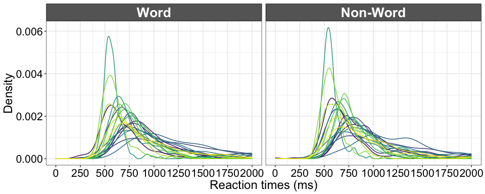
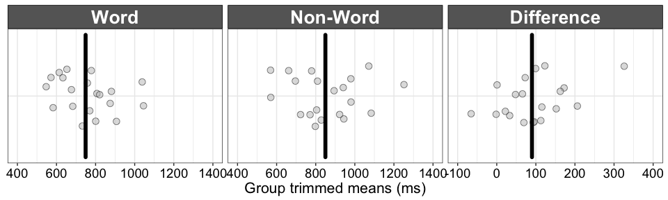
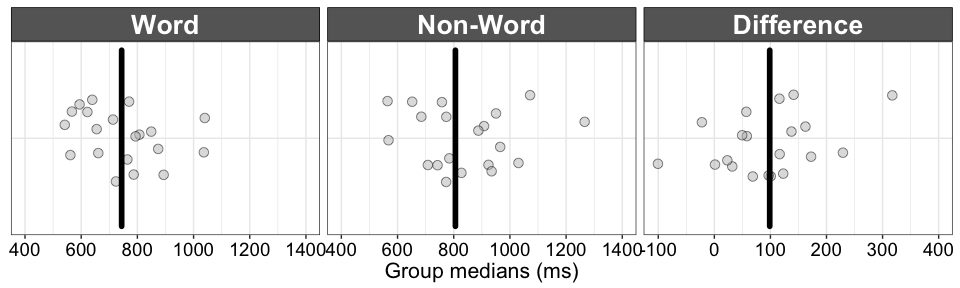
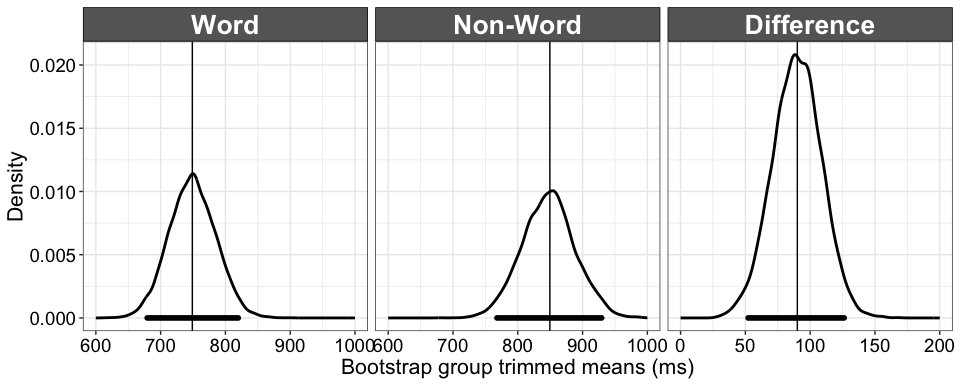
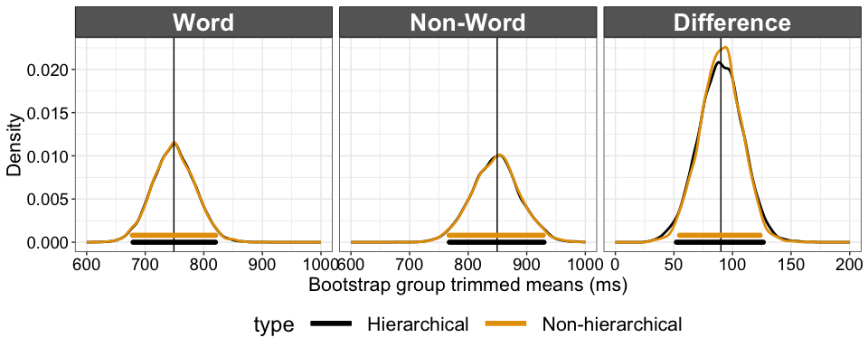
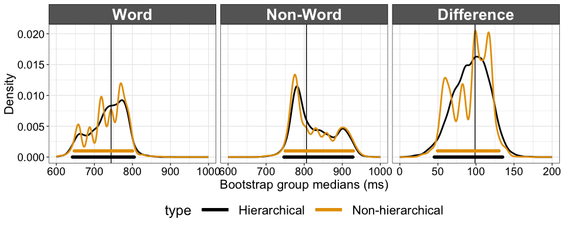

Compare two dependent groups using hierarchical bootstrap sampling
================
Guillaume A. Rousselet
2019-05-25

Dependencies
============

``` r
library(tibble)
library(ggplot2)
source("./functions/theme_gar.txt")
source("./functions/functions.txt")
# source("./functions/Rallfun-v35.txt")
library(beepr)
# install.packages("devtools")
# devtools::install_github("GRousselet/rogme")
library(rogme)
# library(cowplot)
# devtools::install_github("zeehio/facetscales")
library(facetscales) # set different scales for each facet
```

``` r
sessionInfo()
```

    ## R version 3.5.2 (2018-12-20)
    ## Platform: x86_64-apple-darwin15.6.0 (64-bit)
    ## Running under: macOS Mojave 10.14.5
    ## 
    ## Matrix products: default
    ## BLAS: /Library/Frameworks/R.framework/Versions/3.5/Resources/lib/libRblas.0.dylib
    ## LAPACK: /Library/Frameworks/R.framework/Versions/3.5/Resources/lib/libRlapack.dylib
    ## 
    ## locale:
    ## [1] en_GB.UTF-8/en_GB.UTF-8/en_GB.UTF-8/C/en_GB.UTF-8/en_GB.UTF-8
    ## 
    ## attached base packages:
    ## [1] stats     graphics  grDevices utils     datasets  methods   base     
    ## 
    ## other attached packages:
    ## [1] facetscales_0.1.0 rogme_0.2.1       beepr_1.3         ggplot2_3.1.1    
    ## [5] tibble_2.1.1     
    ## 
    ## loaded via a namespace (and not attached):
    ##  [1] Rcpp_1.0.1       knitr_1.21       magrittr_1.5     tidyselect_0.2.5
    ##  [5] munsell_0.5.0    colorspace_1.4-1 R6_2.4.0         rlang_0.3.4     
    ##  [9] stringr_1.4.0    plyr_1.8.4       dplyr_0.8.0.1    tools_3.5.2     
    ## [13] grid_3.5.2       gtable_0.3.0     xfun_0.4         audio_0.1-5.1   
    ## [17] withr_2.1.2      htmltools_0.3.6  yaml_2.2.0       lazyeval_0.2.2  
    ## [21] digest_0.6.18    assertthat_0.2.1 crayon_1.3.4     purrr_0.3.2     
    ## [25] glue_1.3.1       evaluate_0.12    rmarkdown_1.11   stringi_1.4.3   
    ## [29] compiler_3.5.2   pillar_1.3.1     scales_1.0.0     pkgconfig_2.0.2

Rand Wilcox's functions for two dependent groups

``` r
# percentile bootstrap using any estimator
# default to difference scores - dif=TRUE
bootdpci(x,y,est=median)
# to compare two variances
comdvar(x,y,alpha=0.05)

# To use these functions:
# source("./functions/Rallfun-v35.txt")
```

For two dependent groups, an effective approach is to make inferences about the one-sample distribution of the pairwise differences. This case was already covered in the `pb` notebook. Instead, here we consider a hierarchical situation, in which each participant was tested in 2 conditions, with a large number of trials per condition. In this situation, we can build confidence intervals for each participant and at the group level. For each participant, we use the approach for 2 independent groups described in the `2indgps` notebook. At the group level, we apply a hierarchical bootstrap: following the data sampling, first we sample participants with replacement, second for each bootstrap participant, we sample trials with replacements.

We use data from the [French Lexicon Project](https://sites.google.com/site/frenchlexicon/results). Click on "French Lexicon Project trial-level results with R scripts.zip". The `.RData` dataset was created by applying the script `getflprtdata.Rmd` available on [GitHub](https://github.com/GRousselet/rogme/tree/master/data-raw).

``` r
# get data - tibble = `flp`
flp <- rogme::flp
# columns =
#1 = participant
#2 = rt
#3 = acc = accuracy 0/1
#4 = condition = word/non-word
```

N = 959 participants.

Illustrate random sample of 20 participants \* 200 trials
=========================================================

Create data frame
-----------------

``` r
set.seed(7777)
p.list <- as.numeric(as.character(unique(flp$participant)))
np <- 20
nt <- 200
bootid <- sample(p.list, np, replace = FALSE)
resmat <- array(NA, dim = c(2,nt,np))
for(P in 1:np){
  resmat[1,,P] <- sample(flp$rt[flp$participant %in% bootid[P] & flp$condition == "word"],
                    nt, replace = TRUE)
    resmat[2,,P] <- sample(flp$rt[flp$participant %in% bootid[P] & flp$condition == "non-word"],
                    nt, replace = TRUE)
}
```

Make figure
-----------

``` r
df <- tibble(rt = c(as.vector(resmat[1,,]),
                    as.vector(resmat[2,,])),
             condition = factor(rep(c("Word", "Non-Word"), nt*np)),
             participant = factor(rep(rep(1:np, each = nt),2))
             )

df$condition <- as.character(df$condition)
df$condition <- factor(df$condition, levels=unique(df$condition))

p <- ggplot(df, aes(x = rt)) + theme_gar +
  geom_line(stat = "density", aes(colour=participant), size = 0.5) + 
  scale_color_viridis_d() + 
  scale_x_continuous(breaks=seq(0,2000,250), minor_breaks = waiver()) +
  # coord_cartesian(xlim = c(0, 2000)) +
  theme(plot.title = element_text(size=22),
        axis.title.x = element_text(size = 18),
        axis.text = element_text(size = 16, colour = "black"),
        axis.title.y = element_text(size = 18),
        legend.text = element_text(size = 16),
        legend.title = element_text(size = 18),
        legend.key.width = unit(1.5,"cm"),
        legend.position = "none",#c(0.75,0.8),
        strip.text.y = element_text(size = 18, face = "bold", angle = 0)) +
        # legend.position = c(0.25,0.9)) +
  labs(x = "Reaction times (ms)", y = "Density") +
  facet_grid(. ~ condition)
p
```



``` r
p.20 <- p
```

Group 20% trimmed mean
======================

Because there is skewness at the two levels of analysis, we need to consider our estimators carefully at each level. Here for simplicity we compute the 20% trimmed mean for each participant and condition, take the difference between conditions, and finally compute the 20% trimmed mean of these differences. Many other options could be considered, some of which are covered in an other tutorial ([Rousselet & Wilcox, 2019](https://psyarxiv.com/3y54r/)).

Compute trimmed means
---------------------

``` r
# get data: mean RT for every participant
tmres <- apply(resmat, c(1,3), mean, trim = 0.2)
```

Illustrate distributions
------------------------

20% trimmed means for the Word and Non-Word conditions and their differences.

``` r
set.seed(21) # reproducible jitter
df <- tibble(x = c(tmres[1,],tmres[2,],tmres[2,]-tmres[1,]),
              condition = factor(rep(c("Word", "Non-Word", "Difference"), each = np)),
              y = rep(1, 3 * np))

df$condition <- as.character(df$condition)
df$condition <- factor(df$condition, levels=unique(df$condition))

scales_x <- list(
  `Word` = scale_x_continuous(limits=c(400,1400), breaks=seq(0,1600,200)),
  `Non-Word` = scale_x_continuous(limits=c(400,1400), breaks=seq(0,1600,200)),
  `Difference` = scale_x_continuous(limits=c(-100,400), breaks=seq(-100,500,100))
)

# group trimmed means
df.tm <- tibble(y = rep(0.9, 3), 
                yend = rep(1.1, 3),
                x = c(mean(tmres[1,], trim = 0.2),
                      mean(tmres[2,], trim = 0.2),
                      mean(tmres[2,]-tmres[1,], trim = 0.2)), 
                xend = x,
                condition = factor(c("Word", "Non-Word", "Difference"))
                )

p <- ggplot(df, aes(x = x, y = y)) + theme_gar +
  geom_jitter(height = .05, alpha = 0.5, 
                size = 3, shape = 21, fill = "grey", colour = "black") +
  theme(axis.ticks.y = element_blank(),
        axis.text.y = element_blank(),
        axis.title.y = element_blank()) +
  scale_y_continuous(breaks = 1) +
  # Group trimmed means
  geom_segment(data = df.tm, 
               aes(y = y, yend = yend, x = x, xend = xend),
                   size = 2, lineend = 'round') +
  labs(x = "Group trimmed means (ms)") +
  facet_grid_sc(cols = vars(condition), scales = list( x = scales_x))

p.scat <- p
p
```



Group median
============

Compute medians
---------------

``` r
# get data: mean RT for every participant
mdres <- apply(resmat, c(1,3), median)
```

Illustrate distributions
------------------------

20% medians for the Word and Non-Word conditions and their differences.

``` r
set.seed(21) # reproducible jitter
df <- tibble(x = c(mdres[1,],mdres[2,],mdres[2,]-mdres[1,]),
              condition = factor(rep(c("Word", "Non-Word", "Difference"), each = np)),
              y = rep(1, 3 * np))

df$condition <- as.character(df$condition)
df$condition <- factor(df$condition, levels=unique(df$condition))

scales_x <- list(
  `Word` = scale_x_continuous(limits=c(400,1400), breaks=seq(0,1600,200)),
  `Non-Word` = scale_x_continuous(limits=c(400,1400), breaks=seq(0,1600,200)),
  `Difference` = scale_x_continuous(limits=c(-101,400), breaks=seq(-100,500,100))
)

# Group medians
df.tm <- tibble(y = rep(0.9, 3), 
                yend = rep(1.1, 3),
                x = c(median(mdres[1,]),
                      median(mdres[2,]),
                      median(mdres[2,]-mdres[1,])), 
                xend = x,
                condition = factor(c("Word", "Non-Word", "Difference"))
                )

p <- ggplot(df, aes(x = x, y = y)) + theme_gar +
  geom_jitter(height = .05, alpha = 0.5, 
                size = 3, shape = 21, fill = "grey", colour = "black") +
  theme(axis.ticks.y = element_blank(),
        axis.text.y = element_blank(),
        axis.title.y = element_blank()) +
  scale_y_continuous(breaks = 1) +
  # Group medians
  geom_segment(data = df.tm, 
               aes(y = y, yend = yend, x = x, xend = xend),
                   size = 2, lineend = 'round') +
  labs(x = "Group medians (ms)") +
  facet_grid_sc(cols = vars(condition), scales = list( x = scales_x))

p.scat.md <- p
p
```



Hierarchical bootstrap
======================

We perform the standard bootstrap and the hierarchical version on the same data for comparison.

``` r
set.seed(21)

nboot <- 5000
np <- 20
nt <- 200

# sample participants with replacement
bootid <- matrix(sample(np, np*nboot, replace = TRUE), nrow = nboot)

bootres.level1 <- matrix(NA, nrow = nboot, 3)
bootres.hierar <- matrix(NA, nrow = nboot, 3)

for(B in 1:nboot){
# sample participants with replacement
  # level 1 resampling
  bootsamp1 <- resmat[,,bootid[B,]]
  bootres.level1[B,1:2] <- apply(tmres[,bootid[B,]], 1, mean, trim = 0.2)
  bootres.level1[B,3] <- mean(tmres[2,bootid[B,]] - tmres[1,bootid[B,]], trim = 0.2)
  for(P in 1:np){ # for each bootstrap participant
    if(B==1 & P==1){bootsamp2 <- bootsamp1}
    bootsamp2[1,,P] <- sample(bootsamp1[1,,P], nt, replace = TRUE)
    bootsamp2[2,,P] <- sample(bootsamp1[2,,P], nt, replace = TRUE)
  }
  bootres.hierar[B,1] <- mean(apply(bootsamp2[1,,], 2, mean, trim = 0.2), trim = 0.2)
  bootres.hierar[B,2] <- mean(apply(bootsamp2[2,,], 2, mean, trim = 0.2), trim = 0.2)
  bootres.hierar[B,3] <- mean(apply(bootsamp2[2,,], 2, mean, trim = 0.2) -   apply(bootsamp2[1,,], 2, mean, trim = 0.2), trim = 0.2)
}
```

Illustrate results
==================

We illustrate the group confidence intervals for each condition and for the pairwise differences.

``` r
# compute confidence intervals --------------------------
alpha <- 0.05
probs <- c(alpha/2, 1-alpha/2)

ci.hierar <- matrix(NA, nrow = 2, ncol = 3)
ci.hierar[,1] <- quantile(bootres.hierar[,1], type = 6, probs = probs)
ci.hierar[,2] <- quantile(bootres.hierar[,2], type = 6, probs = probs)
ci.hierar[,3] <- quantile(bootres.hierar[,3], type = 6, probs = probs)

ci.level1 <- matrix(NA, nrow = 2, ncol = 3)
ci.level1[,1] <- quantile(bootres.level1[,1], type = 6, probs = probs)
ci.level1[,2] <- quantile(bootres.level1[,2], type = 6, probs = probs)
ci.level1[,3] <- quantile(bootres.level1[,3], type = 6, probs = probs)

# make tibbles --------------------------
df <- tibble(x = as.vector(bootres.hierar),
             cond = factor(rep(c("Word", "Non-Word", "Difference"), each = nboot)))

df$cond <- keeporder(df$cond)

# group trimmed means
df.tm <- tibble(tm = c(mean(tmres[1,], trim = 0.2),
                      mean(tmres[2,], trim = 0.2),
                      mean(tmres[2,]-tmres[1,], trim = 0.2)),
                 cond = factor(c("Word", "Non-Word", "Difference")))

# confidence intervals
df.ci <- tibble(x = c(ci.hierar[1,]),
                xend = c(ci.hierar[2,]),
                y = rep(0, 3),
                yend = rep(0, 3),
                cond = factor(c("Word", "Non-Word", "Difference")))
  
scales_x <- list(`Word` = scale_x_continuous(limits = c(600, 1000)),
                 `Non-Word` = scale_x_continuous(limits = c(600, 1000)),
                 `Difference` = scale_x_continuous(limits = c(0, 200)))

# make figure --------------------------
p <- ggplot(df, aes(x = x)) + theme_gar +
  # density
  geom_line(stat = "density", size = 1) +
  # sample trimmed means: vertical line + label
  geom_vline(data = df.tm, aes(xintercept = tm)) +
  # confidence interval ----------------------
  geom_segment(data = df.ci,
               aes(x = x, xend = xend, y = y, yend = yend, group = cond),
               lineend = "round", size = 2, colour = "black") +
  labs(x = "Bootstrap group trimmed means (ms)",
       y = "Density") +
  facet_grid_sc(cols = vars(cond), scales = list(x = scales_x))
p.boot <- p
p
```

    ## Warning: Removed 1 rows containing non-finite values (stat_density).



New version with the hierarchical and non-hierarchical confidence intervals superimposed.

``` r
# compute confidence intervals --------------------------
alpha <- 0.05
probs <- c(alpha/2, 1-alpha/2)

ci.hierar <- matrix(NA, nrow = 2, ncol = 3)
ci.hierar[,1] <- quantile(bootres.hierar[,1], type = 6, probs = probs)
ci.hierar[,2] <- quantile(bootres.hierar[,2], type = 6, probs = probs)
ci.hierar[,3] <- quantile(bootres.hierar[,3], type = 6, probs = probs)

ci.level1 <- matrix(NA, nrow = 2, ncol = 3)
ci.level1[,1] <- quantile(bootres.level1[,1], type = 6, probs = probs)
ci.level1[,2] <- quantile(bootres.level1[,2], type = 6, probs = probs)
ci.level1[,3] <- quantile(bootres.level1[,3], type = 6, probs = probs)

# make tibbles --------------------------
df <- tibble(x = c(as.vector(bootres.hierar), as.vector(bootres.level1)),
             cond = factor(rep(rep(c("Word", "Non-Word", "Difference"), each = nboot),2)),
             type = factor(rep(c("Hierarchical","Non-hierarchical"), each = nboot * 3))
             )

df$cond <- keeporder(df$cond)

# group trimmed means
df.tm <- tibble(tm = rep(c(mean(tmres[1,], trim = 0.2),
                      mean(tmres[2,], trim = 0.2),
                      mean(tmres[2,] - tmres[1,], trim = 0.2)),2),
                 cond = factor(rep(c("Word", "Non-Word", "Difference"),2)),
                type = factor(rep(c("Hierarchical","Non-hierarchical"), each = 3))
                )

# confidence intervals
df.ci <- tibble(x = c(ci.hierar[1,], ci.level1[1,]),
                xend = c(ci.hierar[2,], ci.level1[2,]),
                y = c(rep(0, 3),rep(0.0008, 3)),
                yend = c(rep(0, 3),rep(0.0008, 3)),
                cond = factor(rep(c("Word", "Non-Word", "Difference"),2)),
                type = factor(rep(c("Hierarchical","Non-hierarchical"), each = 3))
                )
  
scales_x <- list(`Word` = scale_x_continuous(limits = c(600, 1000)),
                 `Non-Word` = scale_x_continuous(limits = c(600, 1000)),
                 `Difference` = scale_x_continuous(limits = c(0, 200)))

# make figure --------------------------
p <- ggplot(df, aes(x = x, colour = type)) + theme_gar +
  # density
  geom_line(stat = "density", size = 1) +
  theme(legend.position = "bottom") +
  # sample trimmed means: vertical line + label
  geom_vline(data = df.tm, aes(xintercept = tm)) +
  # confidence interval ----------------------
  geom_segment(data = df.ci,
               aes(x = x, xend = xend, y = y, yend = yend, 
                   group = cond, colour = type),
               lineend = "round", size = 2) +
  scale_colour_manual(values = c("black", "#E69F00")) + 
  labs(x = "Bootstrap group trimmed means (ms)",
       y = "Density") +
  facet_grid_sc(cols = vars(cond), scales = list(x = scales_x))
p.boot2 <- p
p
```

    ## Warning: Removed 1 rows containing non-finite values (stat_density).



H = hierarchical confidence interval NH = non-hierarchical confidence interval

Hierarchical bootstrap: median
==============================

Previous example shows very similar results for the two types of bootstrap procedures. Because the median can lead to choppy bootstrap distributions, especially in the presence of duplicate values, the hierarchical procedure might help smooth the bootstrap distribution because of the variability introduced by random sampling of trials.

``` r
set.seed(21)

nboot <- 5000
np <- 20
nt <- 200

# sample participants with replacement
bootid <- matrix(sample(np, np*nboot, replace = TRUE), nrow = nboot)

bootres.level1 <- matrix(NA, nrow = nboot, 3)
bootres.hierar <- matrix(NA, nrow = nboot, 3)

for(B in 1:nboot){
# sample participants with replacement
  # level 1 resampling
  bootsamp1 <- resmat[,,bootid[B,]]
  bootres.level1[B,1:2] <- apply(mdres[,bootid[B,]], 1, median)
  bootres.level1[B,3] <- median(mdres[2,bootid[B,]] - mdres[1,bootid[B,]])
  for(P in 1:np){ # for each bootstrap participant
    if(B==1 & P==1){bootsamp2 <- bootsamp1}
    bootsamp2[1,,P] <- sample(bootsamp1[1,,P], nt, replace = TRUE)
    bootsamp2[2,,P] <- sample(bootsamp1[2,,P], nt, replace = TRUE)
  }
  bootres.hierar[B,1] <- median(apply(bootsamp2[1,,], 2, median))
  bootres.hierar[B,2] <- median(apply(bootsamp2[2,,], 2, median))
  bootres.hierar[B,3] <- median(apply(bootsamp2[2,,], 2, median) -   apply(bootsamp2[1,,], 2, median))
}
```

Illustrate results
------------------

We illustrate the group confidence intervals for each condition and for the pairwise differences.

``` r
# compute confidence intervals --------------------------
alpha <- 0.05
probs <- c(alpha/2, 1-alpha/2)

ci.hierar <- matrix(NA, nrow = 2, ncol = 3)
ci.hierar[,1] <- quantile(bootres.hierar[,1], type = 6, probs = probs)
ci.hierar[,2] <- quantile(bootres.hierar[,2], type = 6, probs = probs)
ci.hierar[,3] <- quantile(bootres.hierar[,3], type = 6, probs = probs)

ci.level1 <- matrix(NA, nrow = 2, ncol = 3)
ci.level1[,1] <- quantile(bootres.level1[,1], type = 6, probs = probs)
ci.level1[,2] <- quantile(bootres.level1[,2], type = 6, probs = probs)
ci.level1[,3] <- quantile(bootres.level1[,3], type = 6, probs = probs)

# make tibbles --------------------------
df <- tibble(x = c(as.vector(bootres.hierar), as.vector(bootres.level1)),
             cond = factor(rep(rep(c("Word", "Non-Word", "Difference"), each = nboot),2)),
             type = factor(rep(c("Hierarchical","Non-hierarchical"), each = nboot * 3))
             )

df$cond <- keeporder(df$cond)

# Group medians
df.tm <- tibble(tm = rep(c(median(mdres[1,]),
                      median(mdres[2,]),
                      median(mdres[2,] - mdres[1,])),2),
                 cond = factor(rep(c("Word", "Non-Word", "Difference"),2)),
                type = factor(rep(c("Hierarchical","Non-hierarchical"), each = 3))
                )

# confidence intervals
df.ci <- tibble(x = c(ci.hierar[1,], ci.level1[1,]),
                xend = c(ci.hierar[2,], ci.level1[2,]),
                y = c(rep(0, 3),rep(0.001, 3)),
                yend = c(rep(0, 3),rep(0.001, 3)),
                cond = factor(rep(c("Word", "Non-Word", "Difference"),2)),
                type = factor(rep(c("Hierarchical","Non-hierarchical"), each = 3))
                )
  
scales_x <- list(`Word` = scale_x_continuous(limits = c(600, 1000)),
                 `Non-Word` = scale_x_continuous(limits = c(600, 1000)),
                 `Difference` = scale_x_continuous(limits = c(0, 200)))

# make figure --------------------------
p <- ggplot(df, aes(x = x, colour = type)) + theme_gar +
  # density
  geom_line(stat = "density", size = 1) +
  theme(legend.position = "bottom") +
  # sample trimmed means: vertical line + label
  geom_vline(data = df.tm, aes(xintercept = tm)) +
  # confidence interval ----------------------
  geom_segment(data = df.ci,
               aes(x = x, xend = xend, y = y, yend = yend, 
                   group = cond, colour = type),
               lineend = "round", size = 2) +
  scale_colour_manual(values = c("black", "#E69F00")) + 
  labs(x = "Bootstrap group medians (ms)",
       y = "Density") +
  # facet_grid(cols = vars(cond), scales = "free")
  facet_grid_sc(cols = vars(cond), scales = list(x = scales_x))
p.boot.md <- p
p
```



That's the case: the distributions of the bootstrap medians are very irregular. Bootstrapping at two levels (trials and participants) leads to much smoother distributions and very different confidence intervals.

Summary figure
==============

``` r
legend <- cowplot::get_legend(p.boot2)

cowplot::plot_grid(p.20, 
                   p.scat, 
                   p.boot2 + theme(legend.position = "none"), 
                   p.scat.md,
                   p.boot.md + theme(legend.position = "none"),
                   legend,
                    labels = c("A", "B", "C", "D", "E", NA),
                    ncol = 1,
                    nrow = 6,
                    rel_heights =  c(1, 1/2.5, 1, 1/2.5, 1, 1/5),
                    align = "v",
                    axis = "l",
                    label_size = 20, 
                    hjust = -0.5, 
                    scale=.95)

# save figure
ggsave(filename=('./figures/figure_hpb.pdf'),width=13,height=15)
```
