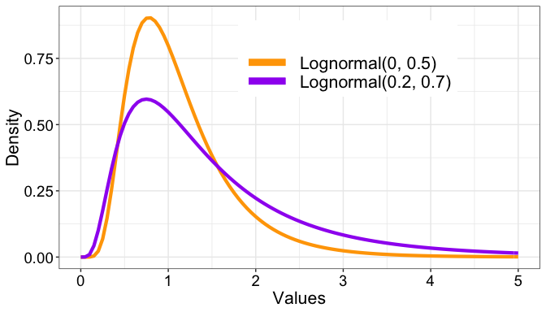
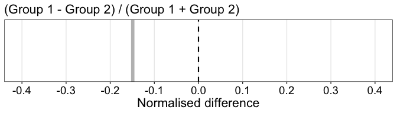
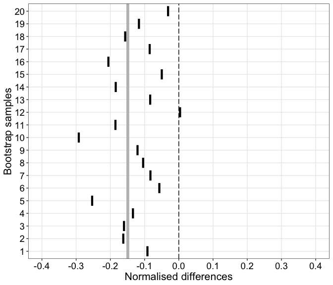
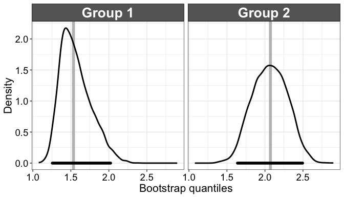
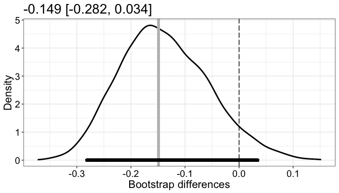

Compare two independent groups
================
Guillaume A. Rousselet
2019-05-25

Dependencies
============

``` r
library(tibble)
library(ggplot2)
# library(cowplot)
source("./functions/theme_gar.txt")
source("./functions/Rallfun-v35.txt")
source("./functions/functions.txt")
```

``` r
sessionInfo()
```

    ## R version 3.5.2 (2018-12-20)
    ## Platform: x86_64-apple-darwin15.6.0 (64-bit)
    ## Running under: macOS Mojave 10.14.5
    ## 
    ## Matrix products: default
    ## BLAS: /Library/Frameworks/R.framework/Versions/3.5/Resources/lib/libRblas.0.dylib
    ## LAPACK: /Library/Frameworks/R.framework/Versions/3.5/Resources/lib/libRlapack.dylib
    ## 
    ## locale:
    ## [1] en_GB.UTF-8/en_GB.UTF-8/en_GB.UTF-8/C/en_GB.UTF-8/en_GB.UTF-8
    ## 
    ## attached base packages:
    ## [1] stats     graphics  grDevices utils     datasets  methods   base     
    ## 
    ## other attached packages:
    ## [1] ggplot2_3.1.1 tibble_2.1.1 
    ## 
    ## loaded via a namespace (and not attached):
    ##  [1] Rcpp_1.0.1       knitr_1.21       magrittr_1.5     tidyselect_0.2.5
    ##  [5] munsell_0.5.0    colorspace_1.4-1 R6_2.4.0         rlang_0.3.4     
    ##  [9] stringr_1.4.0    plyr_1.8.4       dplyr_0.8.0.1    tools_3.5.2     
    ## [13] grid_3.5.2       gtable_0.3.0     xfun_0.4         withr_2.1.2     
    ## [17] htmltools_0.3.6  yaml_2.2.0       lazyeval_0.2.2   digest_0.6.18   
    ## [21] assertthat_0.2.1 crayon_1.3.4     purrr_0.3.2      glue_1.3.1      
    ## [25] evaluate_0.12    rmarkdown_1.11   stringi_1.4.3    compiler_3.5.2  
    ## [29] pillar_1.3.1     scales_1.0.0     pkgconfig_2.0.2

Wilcox's functions for two independent groups

``` r
# to compare any estimators
pb2gen(x, y, alpha=0.05, nboot=1000, est=median, SEED=FALSE)
# same as pb2gen but only to compare medians:
medpb2()
# same as pb2gen but only to compare trimmed means:
trimpb2()
# to compare variances:
comvar2()
# For robust measures of scale, use pb2gen
```

Illustrate populations
======================

We sample from 2 populations that differ in skewness, leading to large differences in the tails.

``` r
meanlog1 <- 0
meanlog2 <- 0.2
sdlog1 <- 0.5
sdlog2 <- 0.7

x <- seq(0, 5, 0.1)

p <- ggplot(as.tibble(x), aes(x = x)) + theme_gar +
  stat_function(geom = "line", size = 1.5, aes(colour = "Lognormal(0, 0.5)"),
                fun = dlnorm, args = list(meanlog = meanlog1, sdlog = sdlog1)) +
  stat_function(geom = "line", size = 1.5, aes(colour = "Lognormal(0.2, 0.7)"),
                fun = dlnorm, args = list(meanlog = meanlog2, sdlog = sdlog2)) +
  labs(x = "Values", y = "Density") +
  scale_colour_manual(name = "", values = c("Lognormal(0, 0.5)" = "orange",
                                            "Lognormal(0.2, 0.7)" = "purple")) +
  theme(legend.position = c(.6, .8)) +
  guides(colour = guide_legend(override.aes = list(size = 3)))
```

    ## Warning: `as.tibble()` is deprecated, use `as_tibble()` (but mind the new semantics).
    ## This warning is displayed once per session.

``` r
p.pop <- p
p
```



Population normalise difference
-------------------------------

We use samples of 100,000 values to define the population normalise difference between 3rd quartiles.

``` r
set.seed(21)
normdiff(q3(rlnorm(100000, meanlog = meanlog1, sdlog = sdlog1)), q3(rlnorm(100000, meanlog = meanlog2, sdlog = sdlog2)))
```

    ## [1] -0.1666533

Generate samples
================

We get 2 relatively large samples from 2 populations.

``` r
set.seed(21)
n1 <- 50
n2 <- 60
samp1 <- rlnorm(n1, meanlog = meanlog1, sdlog = sdlog1)
samp2 <- rlnorm(n2, meanlog = meanlog2, sdlog = sdlog2)
```

Instead of the traditional measures of central tendency, like the mean or the median, here we're going to estimate the 3rd quartile of the marginal distributions. This can be justified by an interest in differences among slower responses. To illustrate that with the bootstrap we can build confidence intervals for any quantity, the group estimations will be on a normalised difference of quartiles: *e**f**f**e**c**t* = (*q*3<sub>1</sub> − *q*3<sub>2</sub>)/(*q*3<sub>1</sub> + *q*3<sub>2</sub>).

Illustrate samples
==================

``` r
set.seed(21) # for reproducible jitter
# raw data
df <- tibble(val = c(samp1, samp2),
             y = rep(1, n1+n2),
             gp = factor(c(rep("Group 1",n1),rep("Group 2",n2)))
             )

df.q2 <- tibble(y = rep(0.9,2), 
                yend = rep(1.1,2),
                x = c(q2(samp1),q2(samp2)), 
                xend = x,
                gp = factor(c("Group 1","Group 2"))
                )

df.q3 <- tibble(y = rep(0.9,2), 
                yend = rep(1.1,2),
                x = c(q3(samp1),q3(samp2)), 
                xend = x,
                gp = factor(c("Group 1","Group 2"))
                )

p <- ggplot(data = df, aes(x = val, y = y)) + theme_gar +
  # scatterplots
  geom_jitter(height = .05, alpha = 0.5, 
              size = 3, shape = 21, fill = "grey", colour = "black") +
  theme(axis.ticks.y = element_blank(),
    axis.text.y = element_blank(),
    axis.title.y = element_blank(),
    panel.grid.minor.x = element_blank()) +
  scale_y_continuous(breaks = 1) +
  # 3rd quartile
  geom_segment(data = df.q3, aes(y = y, yend = yend,
    x = x, xend = xend),
    size = 2, lineend = 'round', colour = "grey") +
  # median
  geom_segment(data = df.q2, aes(y = y, yend = yend,
    x = x, xend = xend),
    size = 0.5, lineend = 'round') +
  labs(x = "Values") + 
  # ggtitle("Random sample") +
  facet_grid(cols = vars(gp))
p
```


``` r
pA1 <- p
```

Thick vertical line = 3rd quartile. Thin vertical line = 2nd quartile (median).

Sample difference
-----------------

### Illustrate results

``` r
nb <- 20

df <- tibble(bootid = 1,
             res = normdiff(q3(samp1), q3(samp2))
              )

p <- ggplot(df, aes(x = res, xend = res, y = bootid - 0.4, yend = bootid + 0.4)) + 
  theme_gar +
  geom_vline(xintercept = normdiff(q3(samp1),q3(samp2)),
             size = 2, colour = "grey") +
  geom_vline(xintercept = 0, size = 0.75, linetype = "dashed") +
  coord_cartesian(xlim = c(-0.4, 0.4)) +
  scale_x_continuous(breaks = seq(-0.5, 0.5, 0.1)) +
  labs(x = "Normalised difference") +
  theme(panel.grid.minor = element_blank(),
        axis.title.y = element_blank()) +
  ggtitle("(Group 1 - Group 2) / (Group 1 + Group 2)") +
  theme(plot.title = element_text(size = 16))
pA2 <- p
p
```



Thick grey vertical line = difference between 3rd quartiles. Vertical dashed line = zero reference line.

Generate bootstrap samples & confidence intervals
=================================================

We use 5,000 bootstrap samples.

``` r
set.seed(666)
nboot <- 5000
bootsamp1 <- matrix(sample(samp1, nboot * n1, replace = TRUE), nrow = nboot)
bootsamp2 <- matrix(sample(samp2, nboot * n2, replace = TRUE), nrow = nboot)
```

Illustrate 20 bootstrap samples
-------------------------------

For each sample we superimpose the 3rd quartile---short vertical black line. Disks = bootstrap observations. Long vertical grey lines mark the sample 3rd quartiles.

``` r
nb <- 20
df <- tibble(res = c(as.vector(bootsamp1[1:nb,]),as.vector(bootsamp2[1:nb,])),
             bootid = c(rep(1:nb, each = n1),rep(1:nb, each = n2)),
             gp = factor(c(rep("Group 1",nb*n1),rep("Group 2",nb*n2))))

df2 <- tibble(bootid = rep(1:nb,2),
              res = c(apply(bootsamp1[1:nb,],1,q3),apply(bootsamp2[1:nb,],1,q3)),
              gp = factor(rep(c("Group 1", "Group 2"), each = nb))
              )

p <- ggplot(df, aes(y = bootid, x = res)) + theme_gar +
  # 3rd quartile
  geom_vline(data = df.q3, aes(group = gp, xintercept = x), size = 2, colour = "grey") +
  # scatterplots
  geom_point(alpha = 0.3, position = position_jitter(height=0.1)) +
  labs(x = "Values", y = "Bootstrap samples") +
  geom_segment(data = df2, aes(x = res, xend = res,
                               y = bootid - 0.4, yend = bootid + 0.4),
               size = 1.5) +
  theme(panel.grid.minor = element_blank()) +
  scale_y_continuous(breaks = seq(1, 20, 1), expand = expand_scale(mult = c(0.01, 0.01))) +
  facet_grid(cols = vars(gp))
pB1 <- p
p
```


Illustrate bootstrap normalised differences
-------------------------------------------

### Illustrate results

``` r
nb <- 20

df <- tibble(bootid = 1:nb,
             res = normdiff(apply(bootsamp1[1:nb,],1,q3), apply(bootsamp2[1:nb,],1,q3))
              )

p <- ggplot(df, aes(x = res, xend = res, y = bootid - 0.4, yend = bootid + 0.4)) + 
  theme_gar +
  geom_vline(xintercept = normdiff(q3(samp1),q3(samp2)), size = 2, colour = "grey") +
   geom_vline(xintercept = 0, size = 0.5, linetype = "longdash") +
  coord_cartesian(xlim = c(-0.4, 0.4)) +
  scale_x_continuous(breaks = seq(-0.5, 0.5, 0.1)) +
  labs(x = "Normalised differences", y = "Bootstrap samples") +
  geom_segment(size = 1.5) +
  theme(panel.grid.minor = element_blank()) +
  scale_y_continuous(breaks = seq(1, 20, 1), expand = expand_scale(mult = c(0.01, 0.01)))
pB2 <- p
p
```



Bootstrap distributions
=======================

Compute confidence intervals
----------------------------

``` r
alpha <- 0.05
boot1.q3 <- apply(bootsamp1,1,q3)
boot2.q3 <- apply(bootsamp2,1,q3)
ci1 <- quantile(boot1.q3, probs = c(alpha/2, 1-alpha/2))
ci2 <- quantile(boot2.q3, probs = c(alpha/2, 1-alpha/2))
bootdiff <- normdiff(boot1.q3, boot2.q3)
ci.diff <- quantile(bootdiff, probs = c(alpha/2, 1-alpha/2)) 
```

Bootstrap distributions of group quantiles
------------------------------------------

``` r
df <- tibble(x = c(boot1.q3, boot2.q3),
             gp = factor(c(rep("Group 1",nboot),rep("Group 2",nboot))))

# df.q3 <- tibble(q3 = c(q3(samp1), q3(samp2)),
#                  group = factor(c("Group 1", "Group 2")))

df.ci <- tibble(x = c(ci1[1], ci2[1]),
                xend = c(ci1[2], ci2[2]),
                y = c(0, 0),
                yend = c(0, 0),
                gp = factor(c("Group 1", "Group 2")))
  
p <- ggplot(df, aes(x = x)) + theme_gar +
  # sample q3: vertical line + label
  geom_vline(data = df.q3, aes(xintercept = x, group = gp), size = 2, colour = "grey") +
  # density
  geom_line(stat = "density", size = 1) +
  # confidence interval ----------------------
  geom_segment(data = df.ci,
               aes(x = x, xend = xend, y = y, yend = yend),
               lineend = "round", size = 2, colour = "black") +
  labs(x = "Bootstrap quantiles",
       y = "Density") +
  facet_grid(cols = vars(gp))
p
```



``` r
pC1 <- p
```

Group normalised differences
----------------------------

``` r
samp.nd <- normdiff(q3(samp1), q3(samp2))

df <- tibble(x = bootdiff)

p <- ggplot(df, aes(x = x)) + theme_gar +
      geom_line(stat = "density", size = 1) +
  labs(x = "Bootstrap differences",
       y = "Density") +
  # sample 3rd quartile: vertical line
  geom_vline(xintercept = samp.nd, linetype = 'solid', size = 2, colour = "grey") +
  # confidence interval ----------------------
  geom_segment(x = ci.diff[1], xend = ci.diff[2],
               y = 0, yend = 0,
               lineend = "round", size = 2, colour = "black") +
  # zero reference line
  geom_vline(xintercept = 0, size = 0.5, linetype = "longdash") +
  ggtitle(paste0(round(samp.nd,digits = 3),
                 " [",
                 round(ci.diff[1],digits = 3),
                 ", ",
                 round(ci.diff[2],digits = 3)
                 ,"]"))
p
```



``` r
pC2 <- p
```

Make summary figure
===================

``` r
# pA <- cowplot::plot_grid(pA1, pA2,
#                     labels = NA,
#                     ncol = 2,
#                     nrow = 1,
#                     rel_widths = c(2, 1), 
#                     label_size = 20, 
#                     hjust = -0.5, 
#                     scale=.95)
# 
# pB <- cowplot::plot_grid(pB1, pB2,
#                     labels = NA,
#                     ncol = 2,
#                     nrow = 1,
#                     rel_widths = c(2, 1), 
#                     label_size = 20, 
#                     hjust = -0.5, 
#                     scale=.95)
# 
# pC <- cowplot::plot_grid(pC1, pC2,
#                     labels = NA,
#                     ncol = 2,
#                     nrow = 1,
#                     rel_widths = c(2, 1), 
#                     label_size = 20, 
#                     hjust = -0.5, 
#                     scale=.95)

p.LEFT <- cowplot::plot_grid(p.pop, pA1, pB1, pC1,
                    labels = c("A", "B", "C", "D"),
                    ncol = 1,
                    nrow = 4,
                    rel_heights = c(2, 1, 3, 2),
                    label_size = 20,
                    align = "v",
                    axis = "l",
                    hjust = -0.5,
                    scale=.95)

p.RIGHT <- cowplot::plot_grid(NULL, pA2, pB2, pC2,
                    labels = NA,
                    ncol = 1,
                    nrow = 4,
                    rel_heights = c(2, 1, 3, 2),
                    label_size = 20,
                    align = "v",
                    axis = "l",
                    hjust = -0.5,
                    scale=.95)

cowplot::plot_grid(p.LEFT, p.RIGHT,
                    labels = NA,
                    ncol = 2,
                    nrow = 1,
                    rel_widths = c(2, 1),
                    label_size = 20,
                    align = "h",
                    axis = "b",
                    hjust = -0.5,
                    scale=.95)

# save figure
ggsave(filename=('./figures/figure_2indgps.pdf'),width=17,height=15)
```

Confidence interval with n = 100
================================

``` r
set.seed(21)
n1 <- 100
n2 <- 100
samp1 <- rlnorm(n1, meanlog = meanlog1, sdlog = sdlog1)
samp2 <- rlnorm(n2, meanlog = meanlog2, sdlog = sdlog2)
nboot <- 5000
bootsamp1 <- matrix(sample(samp1, nboot * n1, replace = TRUE), nrow = nboot)
bootsamp2 <- matrix(sample(samp2, nboot * n2, replace = TRUE), nrow = nboot)
alpha <- 0.05
boot1.q3 <- apply(bootsamp1,1,q3)
boot2.q3 <- apply(bootsamp2,1,q3)
# ci1 <- quantile(boot1.q3, probs = c(alpha/2, 1-alpha/2))
# ci2 <- quantile(boot2.q3, probs = c(alpha/2, 1-alpha/2))
bootdiff <- normdiff(boot1.q3, boot2.q3)
ci.diff <- quantile(bootdiff, probs = c(alpha/2, 1-alpha/2)) 
ci.diff
```

    ##         2.5%        97.5% 
    ## -0.210203538  0.005840768

Confidence interval with n = 200
================================

``` r
set.seed(21)
n1 <- 200
n2 <- 200
samp1 <- rlnorm(n1, meanlog = meanlog1, sdlog = sdlog1)
samp2 <- rlnorm(n2, meanlog = meanlog2, sdlog = sdlog2)
nboot <- 5000
bootsamp1 <- matrix(sample(samp1, nboot * n1, replace = TRUE), nrow = nboot)
bootsamp2 <- matrix(sample(samp2, nboot * n2, replace = TRUE), nrow = nboot)
alpha <- 0.05
boot1.q3 <- apply(bootsamp1,1,q3)
boot2.q3 <- apply(bootsamp2,1,q3)
# ci1 <- quantile(boot1.q3, probs = c(alpha/2, 1-alpha/2))
# ci2 <- quantile(boot2.q3, probs = c(alpha/2, 1-alpha/2))
bootdiff <- normdiff(boot1.q3, boot2.q3)
ci.diff <- quantile(bootdiff, probs = c(alpha/2, 1-alpha/2)) 
ci.diff
```

    ##       2.5%      97.5% 
    ## -0.2257941 -0.1034133
