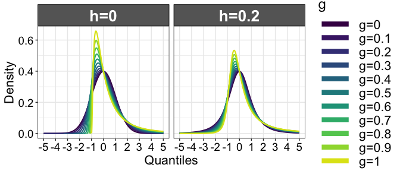

Compare correlations
================
Guillaume A. Rousselet
2022-11-07

# Dependencies

``` r
library(tibble)
library(ggplot2)
library(cubelyr)
library(beepr)
# library(cowplot)
source("./functions/theme_gar.txt")
source("./functions/Rallfun-v40.txt")
# generate PDF of g-and-h distributions 
source('./functions/ghpdf.txt') # code from Yuan Yan
# dependencies for den_tukey()
library(LambertW)
library(gsl)
library(nleqslv)
# Adaptation of code from Ruscio & Kaczetow (2008) to generate multivariate correlated data
source("./functions/gengh.txt") 
source("./functions/corfun.txt")
```

``` r
sessionInfo()
```

    ## R version 4.2.1 (2022-06-23)
    ## Platform: x86_64-apple-darwin17.0 (64-bit)
    ## Running under: macOS Catalina 10.15.7
    ## 
    ## Matrix products: default
    ## BLAS:   /Library/Frameworks/R.framework/Versions/4.2/Resources/lib/libRblas.0.dylib
    ## LAPACK: /Library/Frameworks/R.framework/Versions/4.2/Resources/lib/libRlapack.dylib
    ## 
    ## locale:
    ## [1] en_GB.UTF-8/en_GB.UTF-8/en_GB.UTF-8/C/en_GB.UTF-8/en_GB.UTF-8
    ## 
    ## attached base packages:
    ## [1] stats     graphics  grDevices utils     datasets  methods   base     
    ## 
    ## other attached packages:
    ## [1] nleqslv_3.3.3    gsl_2.1-7.1      LambertW_0.6.7-1 MASS_7.3-57     
    ## [5] beepr_1.3        cubelyr_1.0.1    ggplot2_3.3.6    tibble_3.1.8    
    ## 
    ## loaded via a namespace (and not attached):
    ##  [1] Rcpp_1.0.9         plyr_1.8.7         RColorBrewer_1.1-3 pillar_1.8.1      
    ##  [5] compiler_4.2.1     tools_4.2.1        digest_0.6.30      evaluate_0.15     
    ##  [9] lifecycle_1.0.3    gtable_0.3.1       pkgconfig_2.0.3    rlang_1.0.6       
    ## [13] cli_3.4.1          rstudioapi_0.13    yaml_2.3.5         xfun_0.31         
    ## [17] fastmap_1.1.0      withr_2.5.0        stringr_1.4.1      dplyr_1.0.10      
    ## [21] knitr_1.39         generics_0.1.3     vctrs_0.5.0        grid_4.2.1        
    ## [25] tidyselect_1.1.2   glue_1.6.2         R6_2.5.1           lamW_2.1.1        
    ## [29] fansi_1.0.3        rmarkdown_2.14     reshape2_1.4.4     purrr_0.3.4       
    ## [33] magrittr_2.0.3     scales_1.2.1       htmltools_0.5.3    colorspace_2.0-3  
    ## [37] utf8_1.2.2         stringi_1.7.8      RcppParallel_5.1.5 munsell_0.5.0     
    ## [41] audio_0.1-10

# Correlation functions

## From the stats package (base R)

Pearson: `cor.test(x, y, method = “pearson")`

Spearman: `cor.test(x, y, method = "spearman")`

Kendall: `cor.test(x, y, method = "kendall")`

## From Rand Wilcox

Available at this URL:

<https://dornsife.usc.edu/labs/rwilcox/software/>

and in the file `Rallfun-v40.txt` in the functions folder.

winsorised correlation: `wincor()`, `winall()`

percentage bend correlation: `pbcor()`, `pball()`

skipped correlations: `scor()`, `scorci()`, `mscor()`

# Generate normal data

In this example we sample from 2 uncorrelated normal populations. By
chance there seems to be a non negligible correlation. Changing the
random seed or commenting out the line `set.seed(21)` will give
different results. You can also sample trials from variables with a true
correlation by changing `rho`, assuming the variances are set to one.
Otherwise the covariance matrix will need to be adjusted to obtain the
expected correlations. See details at this URL:
<https://fredclavel.org/2019/04/17/simulating-correlated-multivariate-data/>

``` r
set.seed(21)
n <- 50 # sample size
mu <- c(0, 0) # means of the variables
rho <- 0 # correlation between variables
sigma <- matrix(c(1, rho, rho, 1), nrow = 2, byrow = TRUE) # covariance matrix
data <- MASS::mvrnorm(n = n, mu = mu, Sigma = sigma)
x <- data[,1]
y <- data[,2]

# make data frame
df <- tibble(x = x,
             y = y)

# ggplot figure
ggplot(df, aes(x = x, y = y)) + theme_classic() +
  # geom_hline(yintercept = 0) +
  # geom_vline(xintercept = 0) +
  geom_point(alpha = 0.4, size = 3) +
  # add smooth regression trend?
  # geom_smooth(method='loess',formula=y~x) +
  theme(axis.title = element_text(size = 15, colour = "black"),
        axis.text = element_text(size = 13, colour = "black"),
        strip.text = element_text(size = 15, face = "bold")) +
  # scale_x_continuous(limits = c(-4, 4),
  #                    breaks = seq(-4, 4, 1)) +
  labs(x = expression(italic("Variable A")), y = expression(italic("Variable B")))
```

<!-- -->

``` r
# ggsave(filename = "./corr_samp.pdf")
```

# Pearson’s correlation

``` r
out <- cor.test(x,y, method = "pearson")
out
```

    ## 
    ##  Pearson's product-moment correlation
    ## 
    ## data:  x and y
    ## t = -1.9622, df = 48, p-value = 0.05555
    ## alternative hypothesis: true correlation is not equal to 0
    ## 95 percent confidence interval:
    ##  -0.512010705  0.006329091
    ## sample estimates:
    ##        cor 
    ## -0.2724987

# Percentile bootstrap confidence interval

## Pearson correlation

``` r
pcorb(x,y, SEED = FALSE)
```

    ## $r
    ## [1] -0.2724987
    ## 
    ## $ci
    ## [1] -0.502344645  0.001232462

### Pearson correlation: detailed bootstrap code

Depending on the sample size, the CI bounds are adjusted. Without the
adjustment, the coverage is incorrect when there is heteroscedasticity.

``` r
set.seed(21)
nboot <- 599
# sample pairs of observations with replacement
data <- matrix(sample(length(y),size=length(y)*nboot,replace=TRUE),nrow=nboot)
# compute correlation for each pair
bvec <- apply(data,1,pcorbsub,x,y) # A 1 by nboot matrix.
# confidence interval is computed using special adjustments to account for heteroscedasticity
ilow<-15
ihi<-584
if(length(y) < 250){
ilow<-14
ihi<-585
}
if(length(y) < 180){
ilow<-11
ihi<-588
}
if(length(y) < 80){
ilow<-8
ihi<-592
}
if(length(y) < 40){
ilow<-7
ihi<-593
}
bsort <- sort(bvec)
ci <-c (bsort[ilow],bsort[ihi])

ggplot(enframe(bvec, name = NULL), aes(x = value)) + theme_bw() +
  geom_histogram(aes(y = ..density..), bins = 50,
                 fill = "white", colour = "black") +
  theme(axis.text = element_text(size = 14),
        axis.title = element_text(size = 16)) +
  labs(x = "Bootstrap correlations") 
```

<!-- -->

``` r
# ggsave(filename = "./pboot_dist.pdf")
```

Confidence interval = \[-0.495, 0.001\]

## percentage bend correlation

``` r
corb(x,y, corfun = pbcor, SEED = FALSE)
```

    ## $cor.ci
    ## [1] -0.515991990  0.003946243
    ## 
    ## $p.value
    ## [1] 0.05342237
    ## 
    ## $cor.est
    ## [1] -0.2502435

## 25% Winsorized correlation

``` r
corb(x,y, corfun=wincor, tr=0.25, SEED = FALSE)
```

    ## $cor.ci
    ## [1] -0.48955401  0.05366558
    ## 
    ## $p.value
    ## [1] 0.1268781
    ## 
    ## $cor.est
    ## [1] -0.2251957

## skipped correlation: Pearson

``` r
mscor(cbind(x,y),corfun=pcor)
```

    ## $cor
    ##            [,1]       [,2]
    ## [1,]  1.0000000 -0.2724987
    ## [2,] -0.2724987  1.0000000
    ## 
    ## $crit.val
    ## [1] 2.48066
    ## 
    ## $test.stat
    ##          [,1]     [,2]
    ## [1,]       NA 1.962183
    ## [2,] 1.962183       NA

## skipped correlation: Spearman

``` r
mscor(cbind(x,y),corfun=spear)
```

    ## $cor
    ##            x          y
    ## x  1.0000000 -0.2632893
    ## y -0.2632893  1.0000000
    ## 
    ## $crit.val
    ## [1] 2.48066
    ## 
    ## $test.stat
    ##          x        y
    ## x       NA 1.890836
    ## y 1.890836       NA

# Generate non-normal data

Here we generate populations that have a known Spearman’s correlation
and marginal distributions that follow a *g-and-h* distribution.

## Illustrate univariate *g-and-h* distributions

The Tukey *g-and-h* distributions have a median of zero. The parameter g
controls the asymmetry of the distribution, while the parameter h
controls the thickness of the tails. With h=0, g=0 corresponds to a
normal distribution, whereas g=1 gives a distribution with the same
shape as a lognormal distribution. These distributions are described in
this 1985 book:
<http://eu.wiley.com/WileyCDA/WileyTitle/productCd-047004005X.html>
There is also a description in Rand Wilcox’s book Introduction to Robust
Estimation. See also: <https://www.jstor.org/stable/25471119>  
<https://rss.onlinelibrary.wiley.com/doi/full/10.1111/j.1740-9713.2019.01273.x>

``` r
x <- seq(-5, 5, 0.01) # vector of quantiles
nx <- length(x)
A <- 0 # location parameter
B <- 1 # scale parameter
gseq <- seq(0, 1, 0.1) # sequence of g parameters
ng <- length(gseq)
hseq <- c(0, 0.2) # h parameters
nh <- length(hseq)

res <- array(data = NA, dim = c(nx, ng, nh), dimnames = list(x = x, g = gseq, h = hseq))

for(G in 1:ng){
  for(H in 1:nh){  
    res[,G,H] <- den_tukey(x, gseq[G], hseq[H])  
  }
}

df <- as_tibble(as.tbl_cube(res, met_name = "density"))
df$g <- as.factor(df$g)
df$h <- as.factor(df$h)
levels(df$g) <- c("g=0", "g=0.1", "g=0.2", "g=0.3", "g=0.4", "g=0.5", "g=0.6", "g=0.7", "g=0.8", "g=0.9", "g=1")
levels(df$h) <- c("h=0", "h=0.2")

v.end <- 0.95

ggplot(df, aes(x = x, y = density, colour = g)) + theme_gar +
  geom_line(size = 0.75) +
  scale_colour_viridis_d(end = v.end, option = "D") +  
  guides(colour = guide_legend(override.aes = list(size = 3))) +
  scale_x_continuous(breaks = seq(-5, 5, 1), minor_breaks = NULL) +
  labs(x = "Quantiles",
       y = "Density") +
  facet_wrap(facets = vars(h), ncol = 2)
```

<!-- -->

``` r
# ggsave(filename=(paste0('./figures/figure_gengh_h',h,'_',corr.type,'.pdf')),width=30,height=30,units="cm")
```

## Illustrate bivariate *g-and-h* distributions

First, two univariate *g-and-h* distributions are created. Second, a
correlation is imposed between them using using the iterative algorithm
from [Ruscio & Kaczetow
(2008)](https://www.ncbi.nlm.nih.gov/pubmed/26741201) and implemented in
the `GenDataPopulation()` function from the `RGenData` package.

We plot examples showing `g` varying from 0 to 1 (rows) and `rho`
varying from 0 to 0.8 (columns). Here we use the `gengh()` function
sourced at the start of the notebook. It is a modified version of
`GenDataPopulation()` that includes `g` and `h` arguments.

Generate example data with 10,000 observations in each
condition/scatterplot.

``` r
set.seed(21)
rhoseq <- seq(0, 0.8, 0.4)
nr <- length(rhoseq)
g.seq <- seq(0, 1, 0.5)
ng <- length(g.seq)
h <- 0
n.cases <- 10000
corr.type = "spearman"

res1 <- array(data = NA, dim = c(n.cases, ng, nr))
res2 <- array(data = NA, dim = c(n.cases, ng, nr))
res.corr <- matrix(NA, nrow = ng, ncol = nr)
for(G in 1:ng){
  for(R in 1:nr){
    out <- gengh(n.cases = n.cases, n.variables = 2, g = g.seq[G], h = h, rho = rhoseq[R], corr.type = corr.type)    
    res1[,G, R] <- out[,1]
    res2[,G, R] <- out[,2]
    res.corr[G, R] <- cor(out[,1], out[,2], method = corr.type)
  }
}
```

Check correlation values

``` r
round(res.corr, digits=3)
```

    ##        [,1] [,2] [,3]
    ## [1,] -0.002  0.4  0.8
    ## [2,]  0.000  0.4  0.8
    ## [3,] -0.010  0.4  0.8

Make tibble

``` r
df <- tibble(x = as.vector(res1), 
             y = as.vector(res2),
             g = rep(rep(g.seq, each = n.cases), nr),
             r = rep(rhoseq, each = n.cases * ng)
             )
```

Illustrate results: rho in columns, g in rows.

``` r
XLIM <- c(-5, 10)
XBREAKS <- seq(-10, 10, 5)

ggplot(df, aes(x = x, y = y)) + theme_gar +
  geom_point(alpha = 0.1, size = 1) +
  coord_cartesian(xlim = XLIM, ylim = XLIM) +
  scale_x_continuous(breaks = XBREAKS) +
  scale_y_continuous(breaks = XBREAKS) +
  theme(axis.title = element_blank()) + 
  facet_grid(rows = vars(g), cols = vars(r))
```

<!-- -->

``` r
#ggsave(filename=(paste0('./figures/figure_gengh_h',h,'_',corr.type,'.pdf')),width=30,height=30,units="cm")
```

# Compare correlations

## Independent case

In this situation, we have 2 groups, for each group we measure variables
A and B and then estimate their correlations. We define two asymmetric
populations, *pop1* and *pop2*, both with *g* = 0.4, and Spearman’s
correlations 0.5 and 0.6.

### Generate data

``` r
set.seed(777)
corr.type <- "spearman"
n.pop <- 500000 # population size
n <- 50 # sample size
g <- 0.4 # degree of asymmetry
h <- 0 # thickness of the tails
mu <- c(0, 0) # means of the variables
rho <- 0.5 # correlation between variables
sigma1 <- matrix(c(1, rho, rho, 1), nrow = 2, byrow = TRUE) # correlation matrix
rho <- 0.6 # correlation between variables
sigma2 <- matrix(c(1, rho, rho, 1), nrow = 2, byrow = TRUE) # correlation matrix

# group 1
#data <- MASS::mvrnorm(n = n, mu = mu, Sigma = sigma1) # normal distributions
#x1 <- data[,1]
#y1 <- data[,2]
pop1 <- gengh(n.cases = n.pop, n.variables = 2, g = g, h = h, rho = sigma1, corr.type = corr.type)
#cor(pop1[,1], pop1[,2], method = "spearman") #check results
#hist(pop1[,1])
sampid <- sample(n.pop, n, replace = TRUE) # sample n pairs from population 1
x1 <- pop1[sampid,1]
y1 <- pop1[sampid,2]

# group 2
#data <- MASS::mvrnorm(n = n, mu = mu, Sigma = sigma2) # normal distributions
pop2 <- gengh(n.cases = n.pop, n.variables = 2, g = g, h = h, rho = sigma2, corr.type = corr.type)
#cor(pop2[,1], pop2[,2], method = "spearman") #check results
sampid <- sample(n.pop, n, replace = TRUE) # sample n pairs from population 2
x2 <- pop2[sampid,1]
y2 <- pop2[sampid,2]

# make data frame
df <- tibble(x = c(x1, x2),
             y = c(y1, y2),
             group = factor(c(rep("group1",n),rep("group2",n))))

# ggplot figure
p <- ggplot(df, aes(x = x, y = y)) + theme_gar +
  # geom_hline(yintercept = 0) +
  # geom_vline(xintercept = 0) +
  geom_point(alpha = 0.4, size = 3) +
  # add smooth regression trend?
  # geom_smooth(method='loess',formula=y~x) +
  labs(x = expression(italic("Variable A")), y = expression(italic("Variable B"))) +
  facet_grid(cols = vars(group))
pA1 <- p
p
```

<!-- -->

### Compare two Pearson correlations

``` r
twopcor(x1,y1,x2,y2, SEED = FALSE)
```

    ## $r1
    ## [1] 0.5585885
    ## 
    ## $r2
    ## [1] 0.6233862
    ## 
    ## $ci
    ## [1] -0.3753179  0.1691921

### Compare two robust correlations

Percentage bend correlation

``` r
twocor(x1,y1,x2,y2, corfun = pbcor)
```

    ## $r1
    ## [1] 0.4737955
    ## 
    ## $r2
    ## [1] 0.6647129
    ## 
    ## $ci.dif
    ## [1] -0.43861434  0.08963921
    ## 
    ## $p.value
    ## [1] 0.2203673

Spearman correlation

``` r
out <- twocor(x1,y1,x2,y2, corfun = spear)

# save results for figure
cor1 <- out$r1
cor2 <- out$r2
out
```

    ## $r1
    ## [1] 0.4915726
    ## 
    ## $r2
    ## [1] 0.6719328
    ## 
    ## $ci.dif
    ## [1] -0.43134261  0.08935128
    ## 
    ## $p.value
    ## [1] 0.2470785

### Blank panel of text results

Define function

``` r
plot_textres <- function(x1,y1,x2,y2,size=10){
  
  res1 <- spear(x1,y1)$cor
  res2 <- spear(x2,y2)$cor
  diff <- round(res1-res2, digits = 3)
  res1 <- round(res1, digits = 2)
  res2 <- round(res2, digits = 2)
  df <- tibble(x = seq(1,2,length.out = 4), y = seq(0,4,length.out = 4))
  
  p <- ggplot(data = df, mapping=aes(x=x, y=y)) + theme_gar +
    geom_blank() +
    theme(axis.title = element_blank(),
      axis.ticks = element_blank(),
      axis.text = element_blank(),
      panel.grid.major = element_blank(), 
      panel.grid.minor = element_blank()) +
    geom_label(x = 1.5, y = 3, size = size, fontface= "bold",
      label = paste0("r1 = ", res1)) +
    geom_label(x = 1.5, y = 2, size = size, fontface= "bold",
      label = paste0("r2 = ", res2)) +
    geom_label(x = 1.5, y = 1, size = size, fontface= "bold",
      label = paste0("r1 - r2 = ", diff))
  p
}
```

Make figure

``` r
p <- plot_textres(x1,y1,x2,y2)
pA2 <- p
p
```

<!-- -->

### Bootstrap samples

We take bootstrap samples, illustrate them and compute Spearman’s
correlation.

``` r
set.seed(21)
# Sample pairs of observations with replacement
bootid1.1 <- sample(length(y1),size=length(y1),replace=TRUE)
bootid1.2 <- sample(length(y2),size=length(y2),replace=TRUE)

bootid2.1 <- sample(length(y1),size=length(y1),replace=TRUE)
bootid2.2 <- sample(length(y2),size=length(y2),replace=TRUE)

bootid3.1 <- sample(length(y1),size=length(y1),replace=TRUE)
bootid3.2 <- sample(length(y2),size=length(y2),replace=TRUE)

# make data frame
df <- tibble(x = c(x1[bootid1.1], x2[bootid1.2], 
                   x1[bootid2.1], x2[bootid2.2], 
                   x1[bootid3.1], x2[bootid3.2]),
             y = c(y1[bootid1.1], y2[bootid1.2],
                   y1[bootid2.1], y2[bootid2.2],
                   y1[bootid3.1], y2[bootid3.2]),
             group = factor(rep(c(rep("group1",n),rep("group2",n)),3)),
             boot = factor(rep(c("boot1","boot2","boot3"),each = n*2)))

# ggplot figure
p <- ggplot(df, aes(x = x, y = y)) + theme_gar +
  geom_point(alpha = 0.4, size = 3) +
  # add smooth regression trend?
  # geom_smooth(method='loess',formula=y~x) +
  scale_y_continuous(breaks = seq(-4, 4, 2)) +
  labs(x = expression(italic("Variable A")), y = expression(italic("Variable B"))) +
  facet_grid(rows = vars(boot), cols = vars(group))
pB1 <- p
p
```

<!-- -->

Text of results

``` r
pB2.1 <- plot_textres(x1[bootid1.1], y1[bootid1.1],
                      x2[bootid1.2], y2[bootid1.2], size = 6)
pB2.2 <- plot_textres(x1[bootid2.1], y1[bootid2.1],
                      x2[bootid2.2], y2[bootid2.2], size = 6)
pB2.3 <- plot_textres(x1[bootid3.1], y1[bootid3.1],
                      x2[bootid3.2], y2[bootid3.2], size = 6)

pB2 <- cowplot::plot_grid(pB2.1, pB2.2, pB2.3,
                    labels = NA,
                    ncol = 1,
                    nrow = 3,
                    rel_heights = c(1, 1, 1), 
                    label_size = 20, 
                    hjust = -0.5, 
                    scale=.95,
                    align = "h")
pB2
```

    ## Warning: Removed 1 rows containing missing values (geom_text).

<!-- -->

All bootstrap samples

``` r
set.seed(21)
nboot <- 5000 # number of bootstrap samples
alpha <- 0.05 # alpha level for confidence interval
corfun <- spear # robust correlation method to use
data1 <- matrix(sample(length(y1),size=length(y1)*nboot,replace=TRUE),nrow=nboot)
bvec1 <- apply(data1,1,corbsub,x1,y1,corfun) # A 1 by nboot matrix.
data2 <- matrix(sample(length(y2),size=length(y2)*nboot,replace=TRUE),nrow=nboot)
bvec2 <- apply(data2,1,corbsub,x2,y2,corfun) # A 1 by nboot matrix.
bvec <- sort(bvec1-bvec2)
corci1 <- quantile(bvec1, probs = c(alpha/2, 1-alpha/2), type = 6)
corci2 <- quantile(bvec2, probs = c(alpha/2, 1-alpha/2), type = 6)
corci.diff <- quantile(bvec, probs = c(alpha/2, 1-alpha/2), type = 6)
```

Illustrate groups 1 and 2

``` r
df <- tibble(x = c(bvec1, bvec2),
             group = factor(c(rep("group1",nboot),rep("group2",nboot))))

df.cor <- tibble(cor = c(cor1, cor2),
                 group = factor(c("group1", "group2")))

df.ci <- tibble(x = c(corci1[1], corci2[1]),
                xend = c(corci1[2], corci2[2]),
                y = c(0, 0),
                yend = c(0, 0),
                group = factor(c("group1", "group2")))
  
p <- ggplot(df, aes(x = x)) + theme_gar +
  # density
  geom_line(stat = "density", size = 1) +
  theme(axis.text.y = element_blank(),
        axis.ticks.y = element_blank()) +
  # sample correlation: vertical line + label
  geom_vline(data = df.cor, aes(xintercept = cor)) +
  # geom_label(data = df.cor, aes(labe), x = 2.3, y = 1.2, size = 7,
  #            colour = "white", fill = "black", fontface = "bold",
  #            label = paste("Sample mean = ", round(cor, digits = 2))) +
  # confidence interval ----------------------
  geom_segment(data = df.ci,
               aes(x = x, xend = xend, y = y, yend = yend),
               lineend = "round", size = 2, colour = "black") +
  labs(x = "Bootstrap correlations",
       y = "Density") +
  facet_grid(cols = vars(group))
  
  # geom_label(x = bootci[1]+0.15, y = 0.07, size = 5,
  #            colour = "white", fill = "black", fontface = "bold",
  #            label = paste("L = ", round(bootci[1], digits = 2))) +
  # geom_label(x = bootci[2]-0.15, y = 0.07, size = 5,
  #            colour = "white", fill = "black", fontface = "bold",
  #            label = paste("U = ", round(bootci[2], digits = 2))) +
  
p
```

<!-- -->

``` r
pC1 <- p
```

Illustrate difference

``` r
df <- tibble(x = bvec)

p <- ggplot(df, aes(x = x)) + theme_gar +
      geom_line(stat = "density", size = 1) +
  labs(x = "Bootstrap differences",
       y = "Density") +
  theme(axis.text.y = element_blank(),
        axis.ticks.y = element_blank()) +
  # confidence interval ----------------------
  geom_segment(x = corci.diff[1], xend = corci.diff[2],
               y = 0, yend = 0,
               lineend = "round", size = 2, colour = "black") +
  # geom_label(x = corci.diff[1]+0, y = 0.1, size = 5,
  #            colour = "white", fill = "black", fontface = "bold",
  #            label = paste("L = ", round(corci.diff[1], digits = 2))) +
  # geom_label(x = corci.diff[2]-0, y = 0.1, size = 5,
  #            colour = "white", fill = "black", fontface = "bold",
  #            label = paste("U = ", round(corci.diff[2], digits = 2))) +
  # sample mean: vertical line + label
  geom_vline(xintercept = cor1-cor2,
             linetype = 'solid') +
  # geom_label(x = 2.3, y = 1.2, size = 7,
  #            colour = "white", fill = "black", fontface = "bold",
  #            label = paste("Sample difference = ", round(cor1-cor2, digits = 2)))
  ggtitle(paste0(round(cor1-cor2,digits = 3),
                 " [",
                 round(corci.diff[1],digits = 3),
                 ", ",
                 round(corci.diff[2],digits = 3)
                 ,"]"))
p
```

<!-- -->

``` r
pC2 <- p
```

### Make summary figure

``` r
pA <- cowplot::plot_grid(pA1, pA2,
                    labels = NA,
                    ncol = 2,
                    nrow = 1,
                    rel_widths = c(2, 1), 
                    label_size = 20, 
                    hjust = -0.5, 
                    scale=.95)

pB <- cowplot::plot_grid(pB1, pB2,
                    labels = NA,
                    ncol = 2,
                    nrow = 1,
                    rel_widths = c(2, 1), 
                    label_size = 20, 
                    hjust = -0.5, 
                    scale=.95)

pC <- cowplot::plot_grid(pC1, pC2,
                    labels = NA,
                    ncol = 2,
                    nrow = 1,
                    rel_widths = c(2, 1), 
                    label_size = 20, 
                    hjust = -0.5, 
                    scale=.95)

cowplot::plot_grid(pA, pB, pC,
                    labels = c("A", "B", "C"),
                    ncol = 1,
                    nrow = 3,
                    rel_heights = c(1, 1.5, 1), 
                    label_size = 20, 
                    hjust = -0.5, 
                    scale=.95)

# save figure
ggsave(filename=('./figures/figure_compcorr.pdf'),width=12,height=14)
ggsave(filename=('./figures/figure10.pdf'),width=12,height=14)
```

## Simulation 1: rho1=0.5, rho2=0.6, vary n

What sample size do we need to detect a difference between a sample from
a population with Spearman’s rho = 0.5 and a sample from a population
with Spearman’s rho = 0.6? Let us assume that the marginal distributions
are skewed, with *g* = 0.4 and *h* = 0.

### Simulation

``` r
set.seed(21)
n.pop <- 500000 # population size
g <- 0.4 # degree of asymmetry
h <- 0 # thickness of the tails
nsim <- 5000
nboot <- 599 # as in twocor()
n.seq <- c(seq(20, 100, 20), seq(150, 500, 50), seq(600, 1000, 100)) # sample size
n.max <- max(n.seq)
alpha <- 0.05
probs <- c(alpha/2, 1-alpha/2)
# robust correlation method to use
corfun <- spearsim # simplified function to speed up simulation
corr.type <- "spearman"

# Create two populations both with n = 500,000.
rho <- 0.5 # correlation between variables
sigma1 <- matrix(c(1, rho, rho, 1), nrow = 2, byrow = TRUE) # correlation matrix
pop1 <- gengh(n.cases = n.pop, n.variables = 2, g = g, h = h, rho = sigma1, corr.type = corr.type)
rho <- 0.6 # correlation between variables
sigma2 <- matrix(c(1, rho, rho, 1), nrow = 2, byrow = TRUE) # correlation matrix
pop2 <- gengh(n.cases = n.pop, n.variables = 2, g = g, h = h, rho = sigma2, corr.type = corr.type)

diff.sig <- matrix(NA, nrow = nsim, ncol = length(n.seq))
diff.dist <- matrix(NA, nrow = nsim, ncol = length(n.seq))

for(iter in 1:nsim){
  
    if(iter == 1){
      print(paste("compcorr: iteration",iter,"/",nsim))
      beep(2)
    }
    if(iter %% 100 == 0){
      print(paste("compcorr: iteration",iter,"/",nsim))
      beep(2)
    }
    
    # group 1
    #data <- MASS::mvrnorm(n = n.max, mu = mu, Sigma = sigma1)
    sampid <- sample(n.pop, n.max, replace = TRUE) # sample from population 1
    hx1 <- pop1[sampid,1]
    hy1 <- pop1[sampid,2]
    
    # group 2
    #data <- MASS::mvrnorm(n = n.max, mu = mu, Sigma = sigma2)
    sampid <- sample(n.pop, n.max, replace = TRUE) # sample from population 2
    hx2 <- pop2[sampid,1]
    hy2 <- pop2[sampid,2]
    
    for(N in 1:length(n.seq)){
      
      # get vectors of specific size
      x1 <- hx1[1:n.seq[N]]
      x2 <- hx2[1:n.seq[N]]
      y1 <- hy1[1:n.seq[N]]
      y2 <- hy2[1:n.seq[N]]
      
      diff.dist[iter, N] <- corfun(x1,y1) - corfun(x2,y2)
      
      data1 <- matrix(sample(length(y1),size=length(y1)*nboot,replace=TRUE),nrow=nboot)
      bvec1 <- apply(data1,1,corbsubsim,x1,y1,corfun) # A 1 by nboot matrix.
      
      data2 <- matrix(sample(length(y2),size=length(y2)*nboot,replace=TRUE),nrow=nboot)
      bvec2 <- apply(data2,1,corbsubsim,x2,y2,corfun) # A 1 by nboot matrix.
      
      bvec <- sort(bvec1-bvec2)
      ci <- quantile(bvec, probs = c(alpha/2, 1-alpha/2), type = 6)
      
      diff.sig[iter, N] <- ci[1] >= 0 | ci[2] <= 0 
    }
  }

save(nsim, nboot, alpha, probs, diff.dist, diff.sig, n.seq,
  file = "./data/compcorr_nsim_0506.RData")

beep(8)
```

### Illustrate results: sampling distributions of differences.

``` r
load(file = "./data/compcorr_nsim_0506.RData")
df <- tibble(x = as.vector(diff.dist),
             n = factor(rep(n.seq, each = nsim)))

pA1 <- ggplot(df, aes(x = x)) + theme_gar +
  geom_vline(xintercept = -.1, size = 1) + # population difference
  geom_vline(xintercept = 0, size = 0.75, linetype = "dashed") + # reference line
  geom_line(stat = "density", aes(colour = n), size = 1) +
    scale_colour_viridis_d(begin = 0.1) +
  theme(axis.text.y = element_blank(),
        axis.ticks.y = element_blank(),
        axis.title = element_text(size = 18),
        legend.key.width = unit(1.5,"cm"),
        legend.text = element_text(size = 16),
        legend.title = element_text(size = 18),
        legend.position = c(.75, .55),
        plot.title = element_text(size = 20, colour = "black"),
        panel.background = element_rect(fill="grey90")) +
  labs(x = "Correlation differences",
       y = "Density") +
  scale_x_continuous(limits = c(-1, 1), 
                     breaks = seq(-1.5, 1.5, 0.25),
                     expand = c(0,0)) +
  # ggtitle("Sampling distributions \nof correlation differences") +
  guides(colour = guide_legend(override.aes = list(size=3), # make thicker legend lines
        title="Sample size", ncol = 2)) # change legend title
pA1
```

<!-- -->

### Illustrate results: power

``` r
p.curve <- apply(diff.sig, 2, mean)
df <- tibble(x = n.seq, y = p.curve)

# data frame to plot segments for 50% power
tmp.pos <- approx(y = n.seq, x = p.curve, xout = 0.50)$y
df.seg1 <- tibble(x=0, xend=tmp.pos,
                  y=0.5, yend=0.5)
df.seg2 <- tibble(x=tmp.pos, xend=tmp.pos,
                  y=0.5, yend=0)
# data frame to plot segments for 70% power
tmp.pos <- approx(y = n.seq, x = p.curve, xout = 0.70)$y
df.seg3 <- tibble(x=0, xend=tmp.pos,
                  y=0.7, yend=0.7)
df.seg4 <- tibble(x=tmp.pos, xend=tmp.pos,
                  y=0.7, yend=0)

pA2 <- ggplot(df, aes(x = x, y = y)) + theme_gar +
  geom_segment(data = df.seg1, aes(x=x, y=y, xend=xend, yend=yend)) +
  geom_segment(data = df.seg2, aes(x=x, y=y, xend=xend, yend=yend), 
               arrow = arrow(length = unit(0.2, "cm"))) +
  geom_segment(data = df.seg3, aes(x=x, y=y, xend=xend, yend=yend)) +
  geom_segment(data = df.seg4, aes(x=x, y=y, xend=xend, yend=yend), 
               arrow = arrow(length = unit(0.2, "cm"))) +
  geom_line(size = 1) + 
  scale_x_continuous(breaks = n.seq,
                     labels = c("20", " ",  "60", "", "100", as.character(n.seq[6:18])),
                     expand = c(0,0)) +
  theme(panel.grid.minor.x = element_blank(),
        plot.title = element_text(size=20),
        axis.title.x = element_text(size = 18),
        axis.text = element_text(size = 14, colour="black"),
        axis.text.x = element_text(angle = 90, vjust = 0.5),
        axis.title.y = element_text(size = 18),
        legend.key.width = unit(1.5,"cm"),
        legend.position = "right",
        legend.text=element_text(size = 16),
        legend.title=element_text(size = 18)) +
  labs(x = "Sample size", y = "True positives (power)") +
  scale_y_continuous(breaks=seq(0, 1, 0.1),
                     expand = c(0,0)) +
  coord_cartesian(ylim=c(0, 1))
  # ggtitle("Power curve") 
pA2
```

<!-- -->

**Power** Given that there is a population correlation difference of 0.1
between groups, for 50% of true positives, we need at least 420
observations in each group.

For 70% of true positives, we need at least 665 observations in each
group.

**Precision** Given the sample sizes required to achieve 50% and 70%
power, what is the proportion of experiments with difference estimates
within 0.05 of the population difference value (values between -0.15 and
-0.05)?

``` r
pop.corr <- -0.1
res.prec <- abs(diff.dist - pop.corr) # absolute differences
res.prop <- apply(res.prec <= 0.05, 2, mean)
np50 <- approx(y = n.seq, x = p.curve, xout = 0.50)$y # n for 50% power
np70 <- approx(y = n.seq, x= p.curve, xout = 0.70)$y # n for 70% power

# data frame to plot segments for n required for 50% power
tmp.pos <- approx(y = res.prop, x = n.seq, xout = np50)$y
df.seg1 <- tibble(x=np50, xend=np50,
                  y=0, yend=tmp.pos)
df.seg2 <- tibble(x=np50, xend=0,
                  y=tmp.pos, yend=tmp.pos)
# data frame to plot segments for n required for 70% power
tmp.pos <- approx(y = res.prop, x = n.seq, xout = np70)$y
df.seg3 <- tibble(x=np70, xend=np70,
                  y=0, yend=tmp.pos)
df.seg4 <- tibble(x=np70, xend=0,
                  y=tmp.pos, yend=tmp.pos)

# Illustrate proportion of experiments with correlation differences at most 0.05 away from the population difference of -0.1.
df <- tibble(x = n.seq, y = res.prop)

pA3 <- ggplot(df, aes(x = x, y = y)) + theme_gar +
  geom_segment(data = df.seg1, aes(x=x, y=y, xend=xend, yend=yend)) +
  geom_segment(data = df.seg2, aes(x=x, y=y, xend=xend, yend=yend), 
               arrow = arrow(length = unit(0.2, "cm"))) +
  geom_segment(data = df.seg3, aes(x=x, y=y, xend=xend, yend=yend)) +
  geom_segment(data = df.seg4, aes(x=x, y=y, xend=xend, yend=yend), 
               arrow = arrow(length = unit(0.2, "cm"))) +
  geom_line(size = 1) + 
  scale_y_continuous(breaks=seq(0, 1, 0.1),
                     expand = c(0,0)) +
  coord_cartesian(ylim=c(0, 1)) +
  scale_x_continuous(breaks = n.seq,
                     labels = c("20", " ",  "60", "", "100", as.character(n.seq[6:18])),
                     expand = c(0,0)) +
  theme(panel.grid.minor.x = element_blank(),
        plot.title = element_text(size=20),
        axis.title.x = element_text(size = 18),
        axis.text = element_text(size = 14, colour="black"),
        axis.title.y = element_text(size = 18),
        legend.key.width = unit(1.5,"cm"),
        legend.position = "right",
        legend.text=element_text(size = 16),
        legend.title=element_text(size = 18)) +
  labs(x = "Sample size", y = "% within 0.05 of population")
  # ggtitle("Measurement precision") 
pA3
```

<!-- -->

For 50% of estimates to be within +/- 0.05 of the true correlation
value, we need at least 182 observations in each group.

For 70% of estimates to be within +/- 0.05 of the true correlation
value, we need at least 443 observations in each group.

Given the sample size required to achieve 50% power, we can expect 68.4
% of experiments with difference estimates within 0.05 of the population
difference value.

Given the sample size required to achieve 70% power, we can expect 78.9
% of experiments with difference estimates within 0.05 of the population
difference value.

## Simulation 2: rho1=0, rho2=0.4, vary n

What sample size do we need to detect a difference between a sample from
a population with Spearman’s rho = 0 and a sample from a population with
Spearman’s rho = 0.4? Let us assume that the marginal distributions are
skewed, with *g* = 0.4 and *h* = 0.

### Simulation

``` r
set.seed(21)
n.pop <- 500000 # population size
g <- 0.4 # degree of asymmetry
h <- 0 # thickness of the tails
nsim <- 5000
nboot <- 599 # as in twocor()
n.seq <- c(seq(20, 200, 20)) # sample size
n.max <- max(n.seq)
alpha <- 0.05
probs <- c(alpha/2, 1-alpha/2)
# robust correlation method to use
corfun <- spearsim # simplified function to speed up simulation
corr.type <- "spearman"

# Create two populations both with n = 500,000.
rho <- 0 # correlation between variables
sigma1 <- matrix(c(1, rho, rho, 1), nrow = 2, byrow = TRUE) # correlation matrix
pop1 <- gengh(n.cases = n.pop, n.variables = 2, g = g, h = h, rho = sigma1, corr.type = corr.type)
rho <- 0.4 # correlation between variables
sigma2 <- matrix(c(1, rho, rho, 1), nrow = 2, byrow = TRUE) # correlation matrix
pop2 <- gengh(n.cases = n.pop, n.variables = 2, g = g, h = h, rho = sigma2, corr.type = corr.type)

diff.sig <- matrix(NA, nrow = nsim, ncol = length(n.seq))
diff.dist <- matrix(NA, nrow = nsim, ncol = length(n.seq))

for(iter in 1:nsim){
  
    if(iter == 1){
      print(paste("compcorr: iteration",iter,"/",nsim))
      beep(2)
    }
    if(iter %% 100 == 0){
      print(paste("compcorr: iteration",iter,"/",nsim))
      beep(2)
    }
    
    # group 1
    #data <- MASS::mvrnorm(n = n.max, mu = mu, Sigma = sigma1)
    sampid <- sample(n.pop, n.max, replace = TRUE) # sample from population 1
    hx1 <- pop1[sampid,1]
    hy1 <- pop1[sampid,2]
    
    # group 2
    #data <- MASS::mvrnorm(n = n.max, mu = mu, Sigma = sigma2)
    sampid <- sample(n.pop, n.max, replace = TRUE) # sample from population 2
    hx2 <- pop2[sampid,1]
    hy2 <- pop2[sampid,2]
    
    for(N in 1:length(n.seq)){
      
      # get vectors of specific size
      x1 <- hx1[1:n.seq[N]]
      x2 <- hx2[1:n.seq[N]]
      y1 <- hy1[1:n.seq[N]]
      y2 <- hy2[1:n.seq[N]]
      
      diff.dist[iter, N] <- corfun(x1,y1) - corfun(x2,y2)
      
      data1 <- matrix(sample(length(y1),size=length(y1)*nboot,replace=TRUE),nrow=nboot)
      bvec1 <- apply(data1,1,corbsubsim,x1,y1,corfun) # A 1 by nboot matrix.
      
      data2 <- matrix(sample(length(y2),size=length(y2)*nboot,replace=TRUE),nrow=nboot)
      bvec2 <- apply(data2,1,corbsubsim,x2,y2,corfun) # A 1 by nboot matrix.
      
      bvec <- sort(bvec1-bvec2)
      ci <- quantile(bvec, probs = c(alpha/2, 1-alpha/2), type = 6)
      
      diff.sig[iter, N] <- ci[1] >= 0 | ci[2] <= 0 
    }
  }

save(nsim, nboot, alpha, probs, diff.dist, diff.sig, n.seq,
  file = "./data/compcorr_nsim_0004.RData")

beep(8)
```

### Illustrate results: sampling distributions of differences.

``` r
load(file = "./data/compcorr_nsim_0004.RData")
df <- tibble(x = as.vector(diff.dist),
             n = factor(rep(n.seq, each = nsim)))

pB1 <- ggplot(df, aes(x = x)) + theme_gar +
  geom_vline(xintercept = -.4, size = 1) + # population difference
  geom_vline(xintercept = 0, size = 0.75, linetype = "dashed") + # reference line
  geom_line(stat = "density", aes(colour = n), size = 1) +
    scale_colour_viridis_d(begin = 0.1) +
  guides(colour = guide_legend(override.aes = list(size=3),
         title="Sample size")) +
  theme(axis.text.y = element_blank(),
        axis.ticks.y = element_blank(),
        axis.title = element_text(size = 18),
        legend.key.width = unit(1.5,"cm"),
        legend.text = element_text(size = 16),
        legend.title = element_text(size = 18),
        legend.position = c(.85, .5),
        plot.title = element_text(size = 20, colour = "black"),
        panel.background = element_rect(fill="grey90")) +
  labs(x = "Correlation differences",
       y = "Density") +
  scale_x_continuous(limits = c(-1.5, 0.5), 
                     breaks = seq(-1.5, 1.5, 0.25),
                     expand = c(0,0)) +
  # ggtitle("Sampling distributions \nof correlation differences") +
  guides(colour = guide_legend(override.aes = list(size=3), # make thicker legend lines
        title="Sample size")) # change legend title
pB1
```

    ## Warning: Removed 13 rows containing non-finite values (stat_density).

<!-- -->

### Illustrate results: power

``` r
p.curve <- apply(diff.sig, 2, mean)
df <- tibble(x = n.seq, y = p.curve)

# data frame to plot segments for 50% power
tmp.pos <- approx(y = n.seq, x = p.curve, xout = 0.7)$y
df.seg1 <- tibble(x=0, xend=tmp.pos,
                  y=0.7, yend=0.7)
df.seg2 <- tibble(x=tmp.pos, xend=tmp.pos,
                  y=0.7, yend=0)
# data frame to plot segments for 70% power
tmp.pos <- approx(y = n.seq, x = p.curve, xout = 0.9)$y
df.seg3 <- tibble(x=0, xend=tmp.pos,
                  y=0.9, yend=0.9)
df.seg4 <- tibble(x=tmp.pos, xend=tmp.pos,
                  y=0.9, yend=0)

pB2 <- ggplot(df, aes(x = x, y = y)) + theme_gar +
  geom_segment(data = df.seg1, aes(x=x, y=y, xend=xend, yend=yend)) +
  geom_segment(data = df.seg2, aes(x=x, y=y, xend=xend, yend=yend), 
               arrow = arrow(length = unit(0.2, "cm"))) +
  geom_segment(data = df.seg3, aes(x=x, y=y, xend=xend, yend=yend)) +
  geom_segment(data = df.seg4, aes(x=x, y=y, xend=xend, yend=yend), 
               arrow = arrow(length = unit(0.2, "cm"))) +
  geom_line(size = 1) + 
  scale_x_continuous(breaks = n.seq,
                     labels = as.character(n.seq),
                     expand = c(0,0)) +
  theme(panel.grid.minor.x = element_blank(),
        plot.title = element_text(size=20, vjust=-10, hjust=0.05),
        axis.title.x = element_text(size = 18),
        axis.text = element_text(size = 14, colour="black"),
        axis.text.x = element_text(angle = 90, vjust = 0.5),
        axis.title.y = element_text(size = 18),
        legend.key.width = unit(1.5,"cm"),
        legend.position = "right",
        legend.text=element_text(size = 16),
        legend.title=element_text(size = 18)) +
  labs(x = "Sample size", y = "True positives (power)") +
  scale_y_continuous(breaks=seq(0, 1, 0.1),
                     expand = c(0,0)) +
  coord_cartesian(ylim=c(0, 1))
  # ggtitle("Power curve") 
pB2
```

<!-- -->

**Power** Given that there is a population correlation difference of 0.4
between groups, for 70% of true positives, we need at least 77
observations in each group.

For 90% of true positives, we need at least 128 observations in each
group.

**Precision** Given the sample sizes required to achieve 70% and 90%
power, what is the proportion of experiments with difference estimates
within 0.1 of the population difference value (values between -0.5 and
-0.3)?

``` r
pop.corr <- -0.4
res.prec <- abs(diff.dist - pop.corr) # absolute differences
res.prop <- apply(res.prec <= 0.1, 2, mean)
np70 <- approx(y = n.seq, x = p.curve, xout = 0.70)$y # n for 70% power
np90 <- approx(y = n.seq, x= p.curve, xout = 0.90)$y # n for 90% power

# data frame to plot segments for n required for 50% power
tmp.pos <- approx(y = res.prop, x = n.seq, xout = np70)$y
df.seg1 <- tibble(x=np70, xend=np70,
                  y=0, yend=tmp.pos)
df.seg2 <- tibble(x=np70, xend=0,
                  y=tmp.pos, yend=tmp.pos)
# data frame to plot segments for n required for 70% power
tmp.pos <- approx(y = res.prop, x = n.seq, xout = np90)$y
df.seg3 <- tibble(x=np90, xend=np90,
                  y=0, yend=tmp.pos)
df.seg4 <- tibble(x=np90, xend=0,
                  y=tmp.pos, yend=tmp.pos)

# Illustrate proportion of experiments with correlation differences at most 0.05 away from the population difference of -0.4.
df <- tibble(x = n.seq, y = res.prop)

pB3 <- ggplot(df, aes(x = x, y = y)) + theme_gar +
  geom_segment(data = df.seg1, aes(x=x, y=y, xend=xend, yend=yend)) +
  geom_segment(data = df.seg2, aes(x=x, y=y, xend=xend, yend=yend), 
               arrow = arrow(length = unit(0.2, "cm"))) +
  geom_segment(data = df.seg3, aes(x=x, y=y, xend=xend, yend=yend)) +
  geom_segment(data = df.seg4, aes(x=x, y=y, xend=xend, yend=yend), 
               arrow = arrow(length = unit(0.2, "cm"))) +
  geom_line(size = 1) + 
  scale_y_continuous(breaks=seq(0, 1, 0.1),
                     expand = c(0,0)) +
  coord_cartesian(ylim=c(0, 1)) +
  scale_x_continuous(breaks = n.seq,
                     labels = as.character(n.seq),
                     expand = c(0,0)) +
  theme(panel.grid.minor.x = element_blank(),
        plot.title = element_text(size=20),
        axis.title.x = element_text(size = 18),
        axis.text = element_text(size = 14, colour="black"),
        axis.title.y = element_text(size = 18),
        legend.key.width = unit(1.5,"cm"),
        legend.position = "right",
        legend.text=element_text(size = 16),
        legend.title=element_text(size = 18)) +
  labs(x = "Sample size", y = "% within 0.05 of population") +
  ggtitle("Measurement precision") 
pB3
```

<!-- -->
Correlations near zero are associated with large uncertainty, as
reflected in the broad sampling distributions for the difference. As a
consequence, many experiments will be far from the population
difference, unless very large sample sizes are used.

For 40% of estimates to be within +/- 0.1 of the true correlation value,
we need at least 51 observations in each group.

For 50% of estimates to be within +/- 0.1 of the true correlation value,
we need at least 84 observations in each group.

Given the sample size required to achieve 70% power, we can expect 48.3
% of experiments with difference estimates within 0.05 of the population
difference value.

Given the sample size required to achieve 90% power, we can expect 59.9
% of experiments with difference estimates within 0.05 of the population
difference value.

# Make summary figure

``` r
p.top <- cowplot::plot_grid(pA1, pA2,
                    labels = NA,
                    ncol = 2,
                    nrow = 1,
                    rel_widths = c(2, 1.5),
                    align = "v",
                    axis = "l",
                    scale=.95)

p.bottom <- cowplot::plot_grid(pB1 + theme(legend.position="none"), pB2,
                    labels = NA,
                    ncol = 2,
                    nrow = 1,
                    rel_widths = c(2, 1.5),
                    align = "v",
                    axis = "l",
                    scale=.95)

cowplot::plot_grid(p.top, p.bottom,
                    labels = c("A", "B"),
                    ncol = 1,
                    nrow = 2,
                    rel_heights = c(1, 1),
                    label_size = 20,
                    align = "h",
                    axis = "b",
                    hjust = -5,
                    vjust = 3,
                    scale=.95)

# save figure
ggsave(filename=('./figures/figure_compcorr_sim.pdf'),width=17,height=12)
ggsave(filename=('./figures/figure11.pdf'),width=17,height=12)
```

## Dependent case

In the dependent case, several variables are measured in the same group
of participants. There are two cases: overlapping and non-overlapping
correlations.

### Overlapping case

For instance, if we have 3 dependent variables, we could compare the
correlation between variables 1 and 3 to the correlation between
variables 2 and 3.

**Generate data assuming multivariate normal distributions with
Pearson’s correlations**

``` r
set.seed(21)
n <- 50 # sample size
mu <- c(0, 0, 0) # means of the variables
rho12 <- 0.8 # correlation between variables 1 and 2
rho13 <- 0.2 # correlation between variables 1 and 3
rho23 <- 0.6 # correlation between variables 2 and 3
# define covariance matrix
sigma <- matrix(c(1, rho12, rho13, 
                  rho12, 1, rho23,
                  rho13, rho23, 1), 
                nrow = 3, byrow = TRUE) 

data <- MASS::mvrnorm(n = n, mu = mu, Sigma = sigma)
x <- data[,1:2]
y <- data[,3]

#check results -- use n = 5000 or more
#cor(pop[,1], pop[,3], method = "pearson") # A/C population correlation - expect rho13
#cor(pop[,2], pop[,3], method = "pearson") # B/C population correlation - expect rho23
```

**Illustrate A-C correlation**

``` r
# make data frame
df <- tibble(x = x[,1],
             y = y)
# ggplot figure
ggplot(df, aes(x = x, y = y)) + theme_classic() +
  geom_point(alpha = 0.6, size = 3) +
  # add smooth regression trend?
  # geom_smooth(method='loess',formula=y~x) +
  theme(axis.title = element_text(size = 15, colour = "black"),
        axis.text = element_text(size = 13, colour = "black"),
        strip.text = element_text(size = 15, face = "bold")) +
  # scale_x_continuous(limits = c(-4, 4),
  #                    breaks = seq(-4, 4, 1)) +
  labs(x = expression(italic("Variable A")), y = expression(italic("Variable C")))
```

<!-- -->

**Illustrate B-C correlation**

``` r
 # make data frame
df <- tibble(x = x[,2],
             y = y)
# ggplot figure
ggplot(df, aes(x = x, y = y)) + theme_classic() +
  geom_point(alpha = 0.6, size = 3) +
  # add smooth regression trend?
  # geom_smooth(method='loess',formula=y~x) +
  theme(axis.title = element_text(size = 15, colour = "black"),
        axis.text = element_text(size = 13, colour = "black"),
        strip.text = element_text(size = 15, face = "bold")) +
  # scale_x_continuous(limits = c(-4, 4),
  #                    breaks = seq(-4, 4, 1)) +
  labs(x = expression(italic("Variable B")), y = expression(italic("Variable C")))
```

<!-- -->

Code from Rand Wilcox:

For Pearson correlation:

``` r
# x = matrix with 2 columns
# y = vector
TWOpov(x,y)
```

    ## $est.rho1
    ## [1] 0.349879
    ## 
    ## $est.rho2
    ## [1] 0.7459425
    ## 
    ## $dif
    ## [1] -0.3960635
    ## 
    ## $ci
    ## [1] -0.5517974 -0.2423106

``` r
#TWOpovPV to get a p-value
```

For a robust correlation:

``` r
# x = matrix with 2 columns
# y = vector
twoDcorR(x,y, corfun=wincor, SEED=FALSE)
```

    ## $est.rho1
    ## [1] 0.3115092
    ## 
    ## $est.rho2
    ## [1] 0.7897376
    ## 
    ## $est.dif
    ## [1] -0.4782284
    ## 
    ## $ci
    ## [1] -0.7115209 -0.2309345
    ## 
    ## $p.value
    ## [1] 0

**Generate data assuming multivariate non-normal distributions with
Spearman’s correlations**

``` r
set.seed(21)
n <- 50 # sample size
mu <- c(0, 0, 0) # means of the variables
rho12 <- 0.8 # correlation between variables 1 and 2
rho13 <- 0.2 # correlation between variables 1 and 3
rho23 <- 0.6 # correlation between variables 2 and 3
# define covariance matrix
sigma <- matrix(c(1, rho12, rho13, 
                  rho12, 1, rho23,
                  rho13, rho23, 1), 
                nrow = 3, byrow = TRUE) 

data <- MASS::mvrnorm(n = n, mu = mu, Sigma = sigma)
x <- data[,1:2]
y <- data[,3]

#check results -- use n = 5000 or more
#cor(pop[,1], pop[,3], method = "pearson") # A/C population correlation - expect rho13
#cor(pop[,2], pop[,3], method = "pearson") # B/C population correlation - expect rho23
```

**Illustrate A-C correlation**

``` r
# make data frame
df <- tibble(x = x[,1],
             y = y)
# ggplot figure
ggplot(df, aes(x = x, y = y)) + theme_classic() +
  geom_point(alpha = 0.6, size = 3) +
  # add smooth regression trend?
  # geom_smooth(method='loess',formula=y~x) +
  theme(axis.title = element_text(size = 15, colour = "black"),
        axis.text = element_text(size = 13, colour = "black"),
        strip.text = element_text(size = 15, face = "bold")) +
  # scale_x_continuous(limits = c(-4, 4),
  #                    breaks = seq(-4, 4, 1)) +
  labs(x = expression(italic("Variable A")), y = expression(italic("Variable C")))
```

<!-- -->

**Illustrate B-C correlation**

``` r
 # make data frame
df <- tibble(x = x[,2],
             y = y)
# ggplot figure
ggplot(df, aes(x = x, y = y)) + theme_classic() +
  geom_point(alpha = 0.6, size = 3) +
  # add smooth regression trend?
  # geom_smooth(method='loess',formula=y~x) +
  theme(axis.title = element_text(size = 15, colour = "black"),
        axis.text = element_text(size = 13, colour = "black"),
        strip.text = element_text(size = 15, face = "bold")) +
  # scale_x_continuous(limits = c(-4, 4),
  #                    breaks = seq(-4, 4, 1)) +
  labs(x = expression(italic("Variable B")), y = expression(italic("Variable C")))
```

<!-- -->

### Non-overlapping case

For instance, if we have 4 dependent variables, we could compare the
correlation between variables 1 and 2 to the correlation between
variables 3 and 4. Here are functions from Rand Wilcox to tackle this
situation. We leave it as an exercise to generate example data for this
situation.

For Pearson correlation:

``` r
# x = matrix with 2 columns
# y = matrix with 2 columns
TWOpNOV(x,y)
```

For a robust correlation:

``` r
# x = matrix with 2 columns
# y = matrix with 2 columns
twoDNOV(x,y, corfun=wincor, SEED=FALSE)
```
