Boostrap confidence intervals: coverage, width, stability, power
================
Guillaume A. Rousselet
2022-06-13

# Dependencies

``` r
library(tibble)
library(ggplot2)

# install.packages("devtools")
# devtools::install_github("GRousselet/rogme")
library(rogme)

library(beepr)
# library(cowplot)
source("./functions/theme_gar.txt")
source("./functions/functions.txt")
# source("./functions/Rallfun-v40.txt")

# define viridis colourmaps
cc4 <- viridisLite::viridis(4, end = 0.95)
cc5 <- viridisLite::viridis(5)
```

``` r
sessionInfo()
```

    ## R version 4.2.0 (2022-04-22)
    ## Platform: x86_64-apple-darwin17.0 (64-bit)
    ## Running under: macOS Catalina 10.15.7
    ## 
    ## Matrix products: default
    ## BLAS:   /Library/Frameworks/R.framework/Versions/4.2/Resources/lib/libRblas.0.dylib
    ## LAPACK: /Library/Frameworks/R.framework/Versions/4.2/Resources/lib/libRlapack.dylib
    ## 
    ## locale:
    ## [1] en_GB.UTF-8/en_GB.UTF-8/en_GB.UTF-8/C/en_GB.UTF-8/en_GB.UTF-8
    ## 
    ## attached base packages:
    ## [1] stats     graphics  grDevices utils     datasets  methods   base     
    ## 
    ## other attached packages:
    ## [1] beepr_1.3     rogme_0.2.1   ggplot2_3.3.6 tibble_3.1.7 
    ## 
    ## loaded via a namespace (and not attached):
    ##  [1] pillar_1.7.0      compiler_4.2.0    tools_4.2.0       digest_0.6.29    
    ##  [5] viridisLite_0.4.0 evaluate_0.15     lifecycle_1.0.1   gtable_0.3.0     
    ##  [9] pkgconfig_2.0.3   rlang_1.0.2       cli_3.3.0         rstudioapi_0.13  
    ## [13] yaml_2.3.5        xfun_0.31         fastmap_1.1.0     withr_2.5.0      
    ## [17] stringr_1.4.0     dplyr_1.0.9       knitr_1.39        generics_0.1.2   
    ## [21] vctrs_0.4.1       grid_4.2.0        tidyselect_1.1.2  glue_1.6.2       
    ## [25] R6_2.5.1          fansi_1.0.3       rmarkdown_2.14    purrr_0.3.4      
    ## [29] magrittr_2.0.3    scales_1.2.0      ellipsis_0.3.2    htmltools_0.5.2  
    ## [33] colorspace_2.0-3  utf8_1.2.2        stringi_1.7.6     munsell_0.5.0    
    ## [37] crayon_1.5.1      audio_0.1-10

We look at coverage and the width of one-sample bootstrap confidence
intervals for different quantities:  
- mean  
- 20% trimmed mean  
- median  
- Harrell-Davis estimator of the 50th quantile

We sample from a lognormal distribution. For simplicity, we consider
only two cases, in which we keep the sample size constant (n=30) and
vary the number of bootstrap samples `nboot` from 500 to 10000 in steps
of 500, or we use 2000 boostraps samples and vary sample size from 10 to
100 in steps of 10. Coverage is defined as the proportion of times
confidence intervals contain the population value.

# Example of 50 experiments

For each experiment, we sample trials with replacement from a lognormal
population and compute different quantities and their confidence
intervals.

## Simulation

``` r
n <- 30 # sample size
nboot <- 5000 # number of bootstrap samples
nsim <- 50 # number of iterations
alpha <- 0.05
probs <- c(alpha/2, 1-alpha/2)

ci.m <- matrix(NA, nrow = nsim, ncol = 2)
ci.tm <- matrix(NA, nrow = nsim, ncol = 2)
ci.md <- matrix(NA, nrow = nsim, ncol = 2)
ci.hd <- matrix(NA, nrow = nsim, ncol = 2)

# define population parameters
pop <- rlnorm(2000000)
df.pop <- tibble(x = c(mean(pop), mean(pop, trim = 0.2), median(pop), hd(pop)), 
                 est = factor(c("M", "TM", "MD", "HD"))
                 )
df.pop$est <- keeporder(df.pop$est)
rm(pop)

for(iter in 1:nsim){
  
  # random sample from population
  samp <- rlnorm(n)
  
  # bootstrap sampling
  bootsamp <- matrix(sample(samp, n*nboot, replace = TRUE), nrow = nboot)
  
  # mean  
  boot.m <- apply(bootsamp, 1, mean)
  ci.m[iter,] <- quantile(boot.m, type = 6, names = FALSE, probs = probs)
  
  # trimmed mean
  boot.tm <- apply(bootsamp, 1, mean, trim = 0.2)
  ci.tm[iter,] <- quantile(boot.tm, type = 6, names = FALSE, probs = probs)
  
  # median
  boot.md <- apply(bootsamp, 1, median)
  ci.md[iter,] <- quantile(boot.md, type = 6, names = FALSE, probs = probs)
  
  # Harrell-Davis
  boot.hd <- apply(bootsamp, 1, hd)
  ci.hd[iter,] <- quantile(boot.hd, type = 6, names = FALSE, probs = probs)    
}

save(ci.m, ci.tm, ci.md, ci.hd, file = "./data/coverage50.RData")
```

## Figure

``` r
load(file = "./data/coverage50.RData")

n <- 30 # sample size
nboot <- 5000 # number of bootstrap samples
nsim <- 50 # number of iterations
alpha <- 0.05
probs <- c(alpha/2, 1-alpha/2)

# define population parameters
pop <- rlnorm(2000000)
df.pop <- tibble(x = c(mean(pop), mean(pop, trim = 0.2), median(pop), hd(pop)), 
                 est = factor(c("M", "TM", "MD", "HD"))
                 )
df.pop$est <- keeporder(df.pop$est)
rm(pop)

df <- tibble(x = c(ci.m[,1], ci.tm[,1], ci.md[,1], ci.hd[,1]),
             xend = c(ci.m[,2], ci.tm[,2], ci.md[,2], ci.hd[,2]),
             y = rep(1:nsim, 4),
             yend = rep(1:nsim, 4),
             est = factor(rep(c("M", "TM", "MD", "HD"), each = nsim))
             )

df$est <- keeporder(df$est)

p <- ggplot(df, aes(x=x, xend=xend, y=y, yend=yend, group = est, colour = est)) + theme_gar +
  # CI segments
  geom_segment(size = 1, lineend = "round") +
  # population values = vertical lines
  geom_vline(data = df.pop, aes(xintercept = x, group = est)) +
  scale_colour_manual(values = cc4) +
  coord_cartesian(xlim = c(0, 4)) +
  scale_y_continuous(breaks = c(1, seq(5, 50, 5)),
                     minor_breaks = seq(1, 50, 1)) +
  theme(legend.position = "none") +
  labs(x = "Bootstrap estimates",
       y = "Confidence intervals") +
  facet_wrap(vars(est), ncol = 2)
p.50ci <- p
p
```

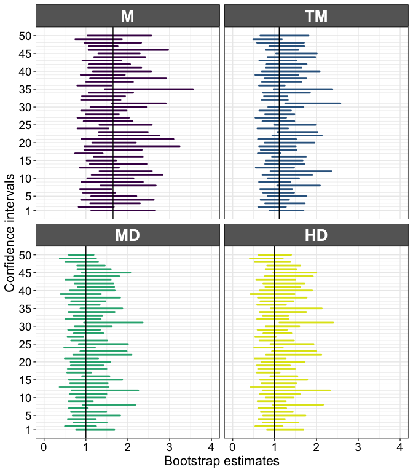<!-- -->

## Save figure

``` r
# save figure
ggsave(filename=('./figures/figure_onesamp_50ci.pdf'),width=7,height=8)
ggsave(filename=('./figures/figure5.pdf'),width=7,height=8)
```

# Define population values

``` r
pop <- rlnorm(10000000)
pop.m <- exp(1/2) # mean(pop)
pop.md <- exp(0) # median(pop)
pop.tm <- mean(pop, trim = 0.2)
# pop.hd <- hd(pop)
rm(pop)
```

# Coverage simulation: vary bootstrap samples, n = 30

We vary the number of bootstrap samples used to compute the confidence
intervals. Sample size is constant. We measure coverage and CI width.
The width is defined as the value of the upper bound minus the value of
the lower bound.

``` r
set.seed(21)
nsim <- 5000
n <- 30
nboot.seq <- seq(500, 10000, 500)
nboot.max <- max(nboot.seq)
alpha <- 0.05
probs <- c(alpha/2, 1-alpha/2)

# define matrices of results -----------------------------
# coverage
cov.m <- matrix(NA, nrow = nsim, ncol = length(nboot.seq))
cov.tm <- cov.m
cov.md <- cov.m
cov.hd <- cov.m

# width
wid.m <- matrix(NA, nrow = nsim, ncol = length(nboot.seq))
wid.tm <- wid.m
wid.md <- wid.m
wid.hd <- wid.m

# normalised width
nwid.m <- matrix(NA, nrow = nsim, ncol = length(nboot.seq))
nwid.tm <- wid.m
nwid.md <- wid.m
nwid.hd <- wid.m

for(iter in 1:nsim){
  if(iter == 1){beep(2)}
  if(iter %% 100 == 0){
    print(paste("iteration",iter,"/",nsim))
    beep(2)
  }
  samp <- rlnorm(n) # sample from lognormal distribution
  bootsamp <- matrix(sample(samp, n*nboot.max, replace = TRUE), nrow = nboot.max)
  boot.m <- apply(bootsamp, 1, mean)
  boot.tm <- apply(bootsamp, 1, mean, trim = 0.2)
  boot.md <- apply(bootsamp, 1, median)
  boot.hd <- apply(bootsamp, 1, hd)
  for(NB in 1:length(nboot.seq)){
    # mean
    ci <- quantile(boot.m[1:nboot.seq[NB]], type = 6, names = FALSE, probs = probs)
    cov.m[iter, NB] <- cover(ci, pop.m)
    wid.m[iter, NB] <- ci[2] - ci[1]
    nwid.m[iter, NB] <- normdiff(ci[2], ci[1])
    # trimmed mean
    ci <- quantile(boot.tm[1:nboot.seq[NB]], type = 6, names = FALSE, probs = probs)
    cov.tm[iter, NB] <- cover(ci, pop.tm)
    wid.tm[iter, NB] <- ci[2] - ci[1]
    nwid.tm[iter, NB] <- normdiff(ci[2], ci[1])
    # median
    ci <- quantile(boot.md[1:nboot.seq[NB]], type = 6, names = FALSE, probs = probs)
    cov.md[iter, NB] <- cover(ci, pop.md)
    wid.md[iter, NB] <- ci[2] - ci[1]
    nwid.md[iter, NB] <- normdiff(ci[2], ci[1])
    # Harrell-Davis
    ci <- quantile(boot.hd[1:nboot.seq[NB]], type = 6, names = FALSE, probs = probs)
    cov.hd[iter, NB] <- cover(ci, pop.md)
    wid.hd[iter, NB] <- ci[2] - ci[1]
    nwid.hd[iter, NB] <- normdiff(ci[2], ci[1])
  }
}

save(nsim, n, nboot.seq, alpha, probs,
  pop.m, pop.md, pop.tm,
  cov.m, cov.tm, cov.md, cov.hd,
  wid.m, wid.tm, wid.md, wid.hd,
  nwid.m, nwid.tm, nwid.md, nwid.hd,
  file = "./data/onesamp_coverage.RData")

beep(8)
```

## Illustrate results: coverage

We compute coverage as the mean across simulations.

``` r
load(file = "./data/onesamp_coverage.RData")
df <- tibble(res = c(apply(cov.m, 2, mean), 
                     apply(cov.tm, 2, mean), 
                     apply(cov.md, 2, mean), 
                     apply(cov.hd, 2, mean)),
             est = rep(c("M", "TM", "MD", "HD"), each = length(nboot.seq)),
             nboot = rep(nboot.seq, 4))

lab <- c("500", " ",  "1500", " ", "2500", " ", "3500", " ", "4500", " ", 
         "5500", " ", "6500", " ", "7500", " ", "8500", " ", "9500", " ")

df$est <- as.character(df$est)
df$est <- factor(df$est, levels=unique(df$est))

p <- ggplot(df, aes(x = nboot, y = res, colour = est, linetype = est)) + theme_gar +
      geom_hline(yintercept = 0.95) +
      geom_line(size = 1) +
      scale_colour_manual(values = cc4) +
      scale_linetype_manual(values = c("dashed", "dotted", "longdash", "solid")) +
      coord_cartesian(ylim = c(0.80, 1)) +
      scale_x_continuous(breaks = nboot.seq,
                         labels = lab) +
      labs(x = "Number of bootstrap samples", 
           y = "Coverage",
           colour = "Estimator",
           linetype = "Estimator") +
      theme(legend.position = "bottom",
            panel.grid.minor.x = element_blank(),
            legend.key.width = unit(5,"cm")) +
      guides(colour = guide_legend(override.aes = list(size=3), nrow=2), # make thicker legend lines
             title="Estimator") + # change legend title 
      ggtitle("n = 30")
pcov.n30 <- p
p
```

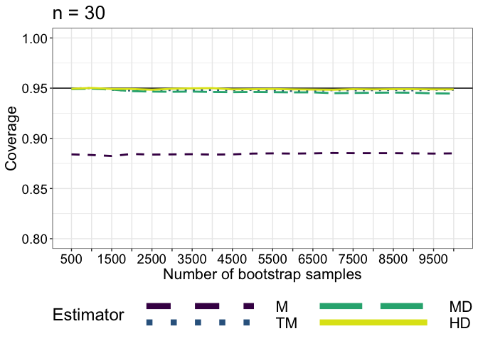<!-- -->

Average coverage across bootstrap samples:  
Mean = 88.4%  
20% trimmed mean = 94.8%  
Median = 94.6%  
Harrell-Davis = 94.9%

## Illustrate results: width

We summarise the width across simulations as the median width. Using the
mean shows even bigger gaps between the mean and the 3 other estimators.
However, because the intervals are for different quantities, the
comparison in absolute width is difficult. As an alternative, in the
next section we consider normalised width, defined as:

(CI_{upper}+CI_{lower})").

The comparison of CI widths is more straightforward when the same
measure of central tendency is involved in all comparisons, as done in
notebook `ptb.Rmd`, where CI are computed for the mean or trimmed mean
using 4 different techniques.

``` r
# load(file = "./data/onesamp_coverage.RData")
df <- tibble(res = c(apply(wid.m, 2, median), 
                     apply(wid.tm, 2, median), 
                     apply(wid.md, 2, median), 
                     apply(wid.hd, 2, median)),
             est = rep(c("M", "TM", "MD", "HD"), each = length(nboot.seq)),
             nboot = rep(nboot.seq, 4))

df$est <- as.character(df$est)
df$est <- factor(df$est, levels=unique(df$est))

p <- ggplot(df, aes(x = nboot, y = res, colour = est, linetype = est)) + theme_gar +
      geom_line(size = 1) +
      scale_colour_manual(values = cc4) +
      scale_linetype_manual(values = c("dashed", "dotted", "longdash", "solid")) +
      coord_cartesian(ylim = c(0.85, 1.25)) +
      scale_x_continuous(breaks = nboot.seq,
                         labels = lab) +
      labs(x = "Number of bootstrap samples", 
           y = "CI median width",
           colour = "Estimator",
           linetype = "Estimator") +
      theme(legend.position = "bottom",
            panel.grid.minor.x = element_blank(),
            legend.key.width = unit(5,"cm")) +
      guides(colour = guide_legend(override.aes = list(size=3), nrow=2), # make thicker legend lines
             title="Estimator") # change legend title 
p
```

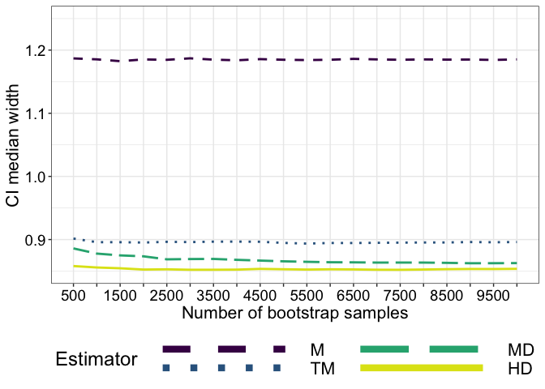<!-- -->

## Illustrate results: normalised width

``` r
# load(file = "./data/onesamp_coverage.RData")
df <- tibble(res = c(apply(nwid.m, 2, mean), 
                     apply(nwid.tm, 2, mean), 
                     apply(nwid.md, 2, mean), 
                     apply(nwid.hd, 2, mean)),
             est = rep(c("M", "TM", "MD", "HD"), each = length(nboot.seq)),
             nboot = rep(nboot.seq, 4))

df$est <- as.character(df$est)
df$est <- factor(df$est, levels=unique(df$est))

p <- ggplot(df, aes(x = nboot, y = res, colour = est, linetype = est)) + theme_gar +
      geom_line(size = 1) +
      scale_colour_manual(values = cc4) +
      # coord_cartesian(ylim = c(0.85, 1.25)) +
      scale_linetype_manual(values = c("dashed", "dotted", "longdash", "solid")) +
      scale_x_continuous(breaks = nboot.seq,
                         labels = lab) +
      labs(x = "Number of bootstrap samples", 
           y = "CI normalised width",
           colour = "Estimator",
           linetype = "Estimator") +
      theme(legend.position = "bottom",
            panel.grid.minor.x = element_blank(),
            legend.key.width = unit(5,"cm")) +
  guides(colour = guide_legend(override.aes = list(size=3), nrow=2), # make thicker legend lines
        title="Estimator") # change legend title
p
```

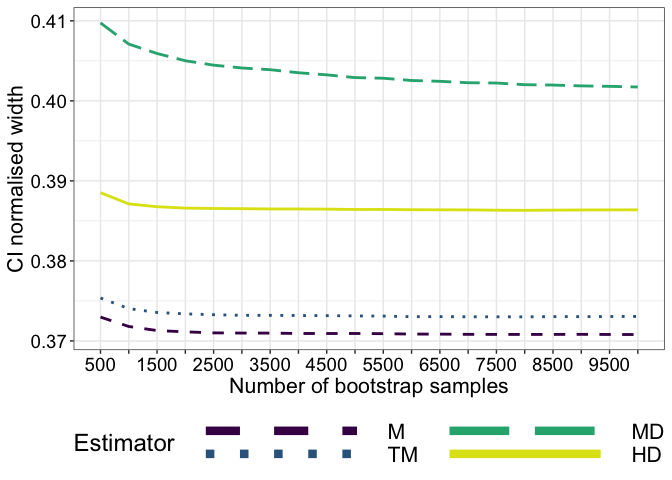<!-- -->

# Coverage simulation: vary bootstrap samples, n = 10

``` r
set.seed(21)
nsim <- 5000
n <- 10
nboot.seq <- seq(500, 10000, 500)
nboot.max <- max(nboot.seq)
alpha <- 0.05
probs <- c(alpha/2, 1-alpha/2)

# define matrices of results -----------------------------
# coverage
cov.m <- matrix(NA, nrow = nsim, ncol = length(nboot.seq))
cov.tm <- cov.m
cov.md <- cov.m
cov.hd <- cov.m

# width
wid.m <- matrix(NA, nrow = nsim, ncol = length(nboot.seq))
wid.tm <- wid.m
wid.md <- wid.m
wid.hd <- wid.m

# normalised width
nwid.m <- matrix(NA, nrow = nsim, ncol = length(nboot.seq))
nwid.tm <- wid.m
nwid.md <- wid.m
nwid.hd <- wid.m

for(iter in 1:nsim){
  if(iter == 1){beep(2)}
  if(iter %% 500 == 0){
    print(paste("iteration",iter,"/",nsim))
    beep(2)
  }
  samp <- rlnorm(n) # sample from lognormal distribution
  bootsamp <- matrix(sample(samp, n*nboot.max, replace = TRUE), nrow = nboot.max)
  boot.m <- apply(bootsamp, 1, mean)
  boot.tm <- apply(bootsamp, 1, mean, trim = 0.2)
  boot.md <- apply(bootsamp, 1, median)
  boot.hd <- apply(bootsamp, 1, hd)
  
  for(NB in 1:length(nboot.seq)){
    # mean
    ci <- quantile(boot.m[1:nboot.seq[NB]], type = 6, names = FALSE, probs = probs)
    cov.m[iter, NB] <- cover(ci, pop.m)
    wid.m[iter, NB] <- ci[2] - ci[1]
    nwid.m[iter, NB] <- normdiff(ci[2], ci[1])
    # trimmed mean
    ci <- quantile(boot.tm[1:nboot.seq[NB]], type = 6, names = FALSE, probs = probs)
    cov.tm[iter, NB] <- cover(ci, pop.tm)
    wid.tm[iter, NB] <- ci[2] - ci[1]
    nwid.tm[iter, NB] <- normdiff(ci[2], ci[1])
    # median
    ci <- quantile(boot.md[1:nboot.seq[NB]], type = 6, names = FALSE, probs = probs)
    cov.md[iter, NB] <- cover(ci, pop.md)
    wid.md[iter, NB] <- ci[2] - ci[1]
    nwid.md[iter, NB] <- normdiff(ci[2], ci[1])
    # Harrell-Davis
    ci <- quantile(boot.hd[1:nboot.seq[NB]], type = 6, names = FALSE, probs = probs)
    cov.hd[iter, NB] <- cover(ci, pop.md)
    wid.hd[iter, NB] <- ci[2] - ci[1]
    nwid.hd[iter, NB] <- normdiff(ci[2], ci[1])
  }
}

save(nsim, n, nboot.seq, alpha, probs,
  pop.m, pop.md, pop.tm,
  cov.m, cov.tm, cov.md, cov.hd,
  wid.m, wid.tm, wid.md, wid.hd,
  nwid.m, nwid.tm, nwid.md, nwid.hd,
  file = "./data/onesamp_coverage_n10.RData")

beep(8)
```

## Illustrate results: coverage

We compute coverage as the mean across simulations.

``` r
load(file = "./data/onesamp_coverage_n10.RData")
df <- tibble(res = c(apply(cov.m, 2, mean), 
                     apply(cov.tm, 2, mean), 
                     apply(cov.md, 2, mean), 
                     apply(cov.hd, 2, mean)),
             est = rep(c("M", "TM", "MD", "HD"), each = length(nboot.seq)),
             nboot = rep(nboot.seq, 4))

lab <- c("500", " ",  "1500", " ", "2500", " ", "3500", " ", "4500", " ", 
         "5500", " ", "6500", " ", "7500", " ", "8500", " ", "9500", " ")

df$est <- as.character(df$est)
df$est <- factor(df$est, levels=unique(df$est))

p <- ggplot(df, aes(x = nboot, y = res, colour = est, linetype = est)) + theme_gar +
      geom_hline(yintercept = 0.95) +
      geom_line(size = 1) +
      scale_colour_manual(values = cc4) +
      scale_linetype_manual(values = c("dashed", "dotted", "longdash", "solid")) +
      coord_cartesian(ylim = c(0.80, 1)) +
      scale_x_continuous(breaks = nboot.seq,
                         labels = lab) +
      labs(x = "Number of bootstrap samples", 
           y = "Coverage",
           colour = "Estimator",
           linetype = "Estimator") +
      theme(legend.position = "bottom",
            panel.grid.minor.x = element_blank(),
            legend.key.width = unit(5,"cm")) +
  guides(colour = guide_legend(override.aes = list(size=3), nrow=2), # make thicker legend lines
        title="Estimator") + # change legend title
    ggtitle("n = 10")
pcov.n10 <- p
p
```

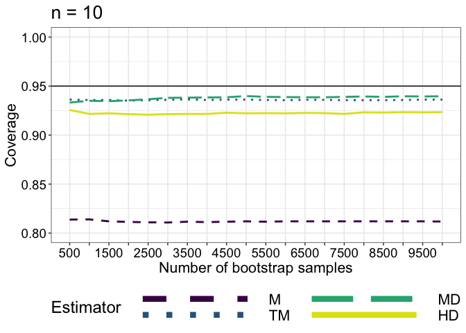<!-- -->

Average coverage across bootstrap samples:  
Mean = 81.2%  
20% trimmed mean = 93.6%  
Median = 93.8%  
Harrell-Davis = 92.2%

# Coverage simulation: vary sample size, nboot = 2000

We vary sample size from 10 to 100, in steps of 10. The number of
bootstrap samples used to compute the confidence intervals is constant
(`nboot` = 2,000).

``` r
set.seed(21)
nsim <- 5000
n.seq <- c(seq(10, 100, 10), 150, 200)
n.max <- max(n.seq)
nboot <- 2000
alpha <- 0.05
probs <- c(alpha/2, 1-alpha/2)

# define matrices of results -----------------------------
# coverage
cov.m <- matrix(NA, nrow = nsim, ncol = length(n.seq))
cov.tm <- cov.m
cov.md <- cov.m
cov.hd <- cov.m

# width
wid.m <- matrix(NA, nrow = nsim, ncol = length(n.seq))
wid.tm <- wid.m
wid.md <- wid.m
wid.hd <- wid.m

# normalised width
nwid.m <- matrix(NA, nrow = nsim, ncol = length(n.seq))
nwid.tm <- wid.m
nwid.md <- wid.m
nwid.hd <- wid.m

for(iter in 1:nsim){
  if(iter == 1){beep(2)}
  if(iter %% 500 == 0){
    print(paste("iteration",iter,"/",nsim))
    beep(2)
  }
 
  samp <- rlnorm(n.max) # sample from lognormal distribution
   
  for(N in 1:length(n.seq)){
 
    bootsamp <- matrix(sample(samp[1:n.seq[N]], n.seq[N]*nboot, replace = TRUE), nrow = nboot)
  
    boot.m <- apply(bootsamp, 1, mean) # compute nboot means
    boot.tm <- apply(bootsamp, 1, mean, trim = 0.2) # nboot trimmed means
    boot.md <- apply(bootsamp, 1, median) # nboot medians
    boot.hd <- apply(bootsamp, 1, hd) # nboot Harrell-Davis estimate of 50th quantile
    
    # mean
    ci <- quantile(boot.m, type = 6, names = FALSE, probs = probs)
    cov.m[iter, N] <- cover(ci, pop.m)
    wid.m[iter, N] <- ci[2] - ci[1]
    nwid.m[iter, N] <- normdiff(ci[2], ci[1])
    # trimmed mean
    ci <- quantile(boot.tm, type = 6, names = FALSE, probs = probs)
    cov.tm[iter, N] <- cover(ci, pop.tm)
    wid.tm[iter, N] <- ci[2] - ci[1]
    nwid.tm[iter, N] <- normdiff(ci[2], ci[1])
    # median
    ci <- quantile(boot.md, type = 6, names = FALSE, probs = probs)
    cov.md[iter, N] <- cover(ci, pop.md)
    wid.md[iter, N] <- ci[2] - ci[1]
    nwid.md[iter, N] <- normdiff(ci[2], ci[1])
    # Harrell-Davis
    ci <- quantile(boot.hd, type = 6, names = FALSE, probs = probs)
    cov.hd[iter, N] <- cover(ci, pop.md)
    wid.hd[iter, N] <- ci[2] - ci[1]
    nwid.hd[iter, N] <- normdiff(ci[2], ci[1])
  }
}

save(nsim, n.seq, nboot, alpha, probs,
  pop.m, pop.md, pop.tm,
  cov.m, cov.tm, cov.md, cov.hd,
  wid.m, wid.tm, wid.md, wid.hd,
  nwid.m, nwid.tm, nwid.md, nwid.hd,
  file = "./data/onesamp_coverage_nboot2000.RData")

beep(8)
```

## Illustrate results: coverage

We compute coverage as the mean across simulations.

``` r
load(file = "./data/onesamp_coverage_nboot2000.RData")
df <- tibble(res = c(apply(cov.m, 2, mean), 
                     apply(cov.tm, 2, mean), 
                     apply(cov.md, 2, mean), 
                     apply(cov.hd, 2, mean)),
             est = rep(c("M", "TM", "MD", "HD"), each = length(n.seq)),
             nboot = rep(n.seq, 4))

df$est <- as.character(df$est)
df$est <- factor(df$est, levels=unique(df$est))

p <- ggplot(df, aes(x = nboot, y = res, colour = est, linetype = est)) + theme_gar +
      geom_hline(yintercept = 0.95) +
      geom_line(size = 1) +
      scale_colour_manual(values = cc4) +
      scale_linetype_manual(values = c("dashed", "dotted", "longdash", "solid")) +
      coord_cartesian(ylim = c(0.80, 1)) +
      scale_x_continuous(breaks = n.seq) +
      labs(x = "Sample size", 
           y = "Coverage",
           colour = "Estimator",
           linetype = "Estimator") +
      theme(legend.position = "bottom",
            panel.grid.minor.x = element_blank(),
            legend.key.width = unit(5,"cm")) +
      guides(colour = guide_legend(override.aes = list(size=3), nrow=2), # make thicker legend lines
        title="Estimator") +  # change legend title
      ggtitle("nboot = 2000")
p.nboot2000 <- p
p
```

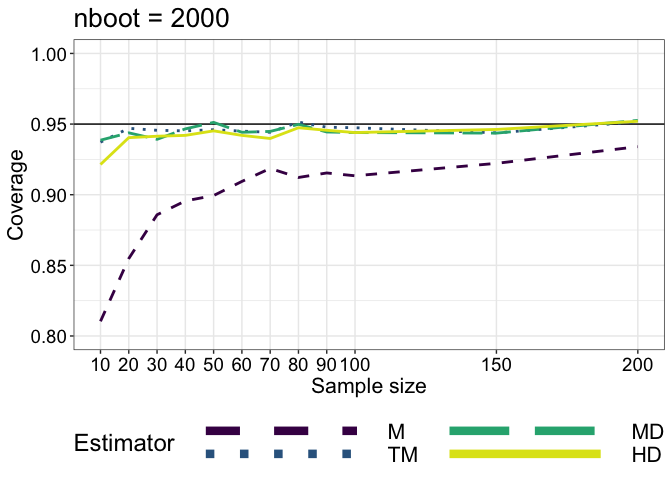<!-- -->

## Illustrate results: width

We summarise the width across simulations as the median width. Using the
mean shows even bigger gaps between the mean and the 3 other estimators.

``` r
# load(file = "./data/onesamp_coverage.RData")
df <- tibble(res = c(apply(wid.m, 2, median), 
                     apply(wid.tm, 2, median), 
                     apply(wid.md, 2, median), 
                     apply(wid.hd, 2, median)),
             est = rep(c("M", "TM", "MD", "HD"), each = length(n.seq)),
             nboot = rep(n.seq, 4))

df$est <- as.character(df$est)
df$est <- factor(df$est, levels=unique(df$est))

p <- ggplot(df, aes(x = nboot, y = res, colour = est, linetype = est)) + theme_gar +
      geom_line(size = 1) +
      scale_colour_manual(values = cc4) +
      scale_linetype_manual(values = c("dashed", "dotted", "longdash", "solid")) +
      # coord_cartesian(ylim = c(0.85, 1.25)) +
      scale_x_continuous(breaks = n.seq) +
      labs(x = "Sample size", 
           y = "CI median width",
           colour = "Estimator",
           linetype = "Estimator") +
      theme(legend.position = "bottom",
            panel.grid.minor.x = element_blank(),
            legend.key.width = unit(5,"cm")) +
  guides(colour = guide_legend(override.aes = list(size=3), nrow=2), # make thicker legend lines
        title="Estimator") # change legend title
# pB <- p
p
```

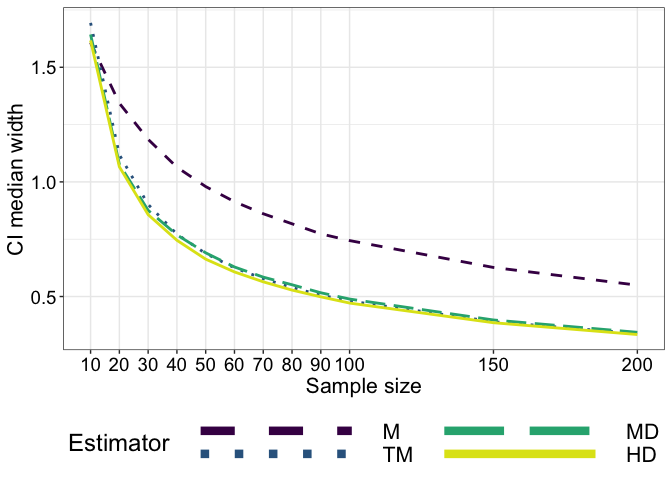<!-- -->

## Illustrate results: normalised width

We summarise the width across simulations as the median width.

``` r
# load(file = "./data/onesamp_coverage.RData")
df <- tibble(res = c(apply(nwid.m, 2, mean), 
                     apply(nwid.tm, 2, mean), 
                     apply(nwid.md, 2, mean), 
                     apply(nwid.hd, 2, mean)),
             est = rep(c("M", "TM", "MD", "HD"), each = length(n.seq)),
             nboot = rep(n.seq, 4))

df$est <- as.character(df$est)
df$est <- factor(df$est, levels=unique(df$est))

p <- ggplot(df, aes(x = nboot, y = res, colour = est, linetype = est)) + theme_gar +
      geom_line(size = 1) +
      scale_colour_manual(values = cc4) +
      scale_linetype_manual(values = c("dashed", "dotted", "longdash", "solid")) +
      # coord_cartesian(ylim = c(0.85, 1.25)) +
      scale_x_continuous(breaks = nboot.seq,
                         labels = lab) +
      labs(x = "Sample size", 
           y = "CI normalised width",
           colour = "Estimator",
           linetype = "Estimator") +
      theme(legend.position = "bottom",
            panel.grid.minor.x = element_blank(),
            legend.key.width = unit(5,"cm")) +
  guides(colour = guide_legend(override.aes = list(size=3), nrow=2), # make thicker legend lines
        title="Estimator") # change legend title
# pB <- p
p
```

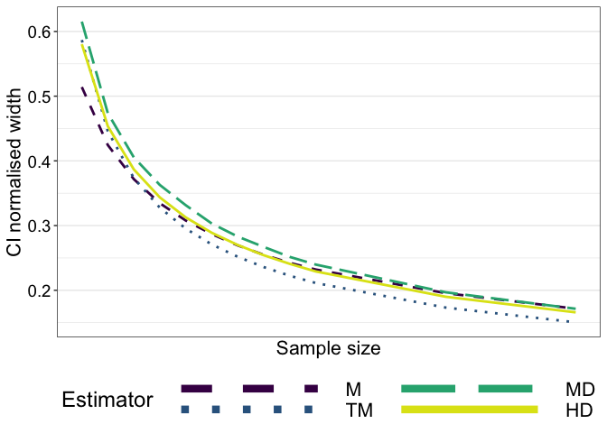<!-- -->

# Coverage simulation: vary sample size, nboot = 200

We vary sample size from 10 to 100, in steps of 10. The number of
bootstrap samples used to compute the confidence intervals is constant
(`nboot` = 200).

``` r
set.seed(21)
nsim <- 10000
n.seq <- c(seq(10, 100, 10), 150, 200)
n.max <- max(n.seq)
nboot <- 200
alpha <- 0.05
probs <- c(alpha/2, 1-alpha/2)

# define matrices of results -----------------------------
# coverage
cov.m <- matrix(NA, nrow = nsim, ncol = length(n.seq))
cov.tm <- cov.m
cov.md <- cov.m
cov.hd <- cov.m

# width
wid.m <- matrix(NA, nrow = nsim, ncol = length(n.seq))
wid.tm <- wid.m
wid.md <- wid.m
wid.hd <- wid.m

# normalised width
nwid.m <- matrix(NA, nrow = nsim, ncol = length(n.seq))
nwid.tm <- wid.m
nwid.md <- wid.m
nwid.hd <- wid.m

for(iter in 1:nsim){
  if(iter == 1){beep(2)}
  if(iter %% 500 == 0){
    print(paste("iteration",iter,"/",nsim))
    beep(2)
  }
  
   samp <- rlnorm(n.max) # sample from lognormal distribution
   
  for(N in 1:length(n.seq)){
 
    bootsamp <- matrix(sample(samp[1:n.seq[N]], n.seq[N]*nboot, replace = TRUE), nrow = nboot)
  
  boot.m <- apply(bootsamp, 1, mean)
  boot.tm <- apply(bootsamp, 1, mean, trim = 0.2)
  boot.md <- apply(bootsamp, 1, median)
  boot.hd <- apply(bootsamp, 1, hd)
  
    # mean
    ci <- quantile(boot.m, type = 6, names = FALSE, probs = probs)
    cov.m[iter, N] <- cover(ci, pop.m)
    wid.m[iter, N] <- ci[2] - ci[1]
    nwid.m[iter, N] <- normdiff(ci[2], ci[1])
    # trimmed mean
    ci <- quantile(boot.tm, type = 6, names = FALSE, probs = probs)
    cov.tm[iter, N] <- cover(ci, pop.tm)
    wid.tm[iter, N] <- ci[2] - ci[1]
    nwid.tm[iter, N] <- normdiff(ci[2], ci[1])
    # median
    ci <- quantile(boot.md, type = 6, names = FALSE, probs = probs)
    cov.md[iter, N] <- cover(ci, pop.md)
    wid.md[iter, N] <- ci[2] - ci[1]
    nwid.md[iter, N] <- normdiff(ci[2], ci[1])
    # Harrell-Davis
    ci <- quantile(boot.hd, type = 6, names = FALSE, probs = probs)
    cov.hd[iter, N] <- cover(ci, pop.md)
    wid.hd[iter, N] <- ci[2] - ci[1]
    nwid.hd[iter, N] <- normdiff(ci[2], ci[1])
  }
}

save(nsim, n.seq, nboot, alpha, probs,
  pop.m, pop.md, pop.tm,
  cov.m, cov.tm, cov.md, cov.hd,
  wid.m, wid.tm, wid.md, wid.hd,
  nwid.m, nwid.tm, nwid.md, nwid.hd,
  file = "./data/onesamp_coverage_nboot200.RData")

beep(8)
```

## Illustrate results: coverage

We compute coverage as the mean across simulations.

``` r
load(file = "./data/onesamp_coverage_nboot200.RData")
df <- tibble(res = c(apply(cov.m, 2, mean), 
                     apply(cov.tm, 2, mean), 
                     apply(cov.md, 2, mean), 
                     apply(cov.hd, 2, mean)),
             est = rep(c("M", "TM", "MD", "HD"), each = length(n.seq)),
             nboot = rep(n.seq, 4))

df$est <- as.character(df$est)
df$est <- factor(df$est, levels=unique(df$est))

p <- ggplot(df, aes(x = nboot, y = res, colour = est, linetype = est)) + theme_gar +
      geom_hline(yintercept = 0.95) +
      geom_line(size = 1) +
      scale_colour_manual(values = cc4) +
      scale_linetype_manual(values = c("dashed", "dotted", "longdash", "solid")) +
      coord_cartesian(ylim = c(0.80, 1)) +
      scale_x_continuous(breaks = n.seq) +
      labs(x = "Sample size", 
           y = "Coverage",
           colour = "Estimator",
           linetype = "Estimator") +
      theme(legend.position = "bottom",
            panel.grid.minor.x = element_blank(),
            legend.key.width = unit(5,"cm")) +
  guides(colour = guide_legend(override.aes = list(size=3), nrow=2), # make thicker legend lines
        title="Estimator") + # change legend title
  ggtitle("nboot = 200")
p.nboot200 <- p
p
```

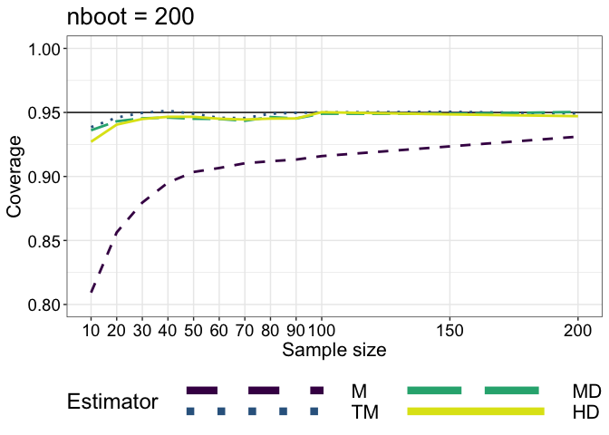<!-- -->

# Summary figure

``` r
legend <- cowplot::get_legend(pcov.n10 + theme(legend.position = "bottom"))

p.main <- cowplot::plot_grid(pcov.n10 + theme(legend.position = "none"), 
                   pcov.n30 + theme(legend.position = "none"),
                   p.nboot200 + theme(legend.position = "none"), 
                   p.nboot2000 + theme(legend.position = "none"),
                    labels = c("A", "B", "C", "D"),
                    ncol = 2,
                    nrow = 2,
                    label_size = 20, 
                    hjust = -0.5, 
                    scale=.95)

cowplot::plot_grid(p.main,
                   legend,
                    labels = NA,
                    ncol = 1,
                    nrow = 2,
                    rel_heights =  c(1, .1), 
                    label_size = 20, 
                    hjust = -0.5, 
                    scale=.95)

# save figure
ggsave(filename=('./figures/figure_onesamp_coverage.pdf'),width=15,height=10)
ggsave(filename=('./figures/figure7.pdf'),width=15,height=10)
```

# Stability

We look at the variability of confidence intervals for the same sample.

## One sample

``` r
set.seed(21)
n <- 30
samp <- rlnorm(n)

# raw data
df <- tibble(val = samp,
             y = rep(1, n)
             )

df.est <- tibble(y = rep(0.9,4), 
                 yend = rep(1.1,4),
                 x = c(mean(samp), mean(samp, trim = 0.2), median(samp), hd(samp)), 
                 xend = x,
                 est = factor(c("M", "TM", "MD", "HD"))
                )

df.est$est <- keeporder(df.est$est)

p <- ggplot(data = df, aes(x = val, y = y)) + theme_gar +
  # scatterplots
    geom_jitter(height = .05, alpha = 0.5, 
                size = 3, shape = 21, fill = "grey", colour = "black") +
  theme(axis.ticks.y = element_blank(),
        axis.text.y = element_blank(),
        axis.title.y = element_blank(),
        panel.grid.minor.x = element_blank(),
        legend.position = "bottom",
        legend.key.width = unit(5,"cm")) +
  scale_x_continuous(breaks = seq(0, 10, 1)) +
  scale_y_continuous(breaks = 1) +
  # estimates
  geom_segment(data = df.est, aes(y = y, yend = yend,
                   x = x, xend = xend, colour = est, linetype = est),
                   size = 1, lineend = 'round') +
  scale_colour_manual(values = cc4) +
  scale_linetype_manual(values = c("dashed", "dotted", "longdash", "solid")) +
  labs(x = "Values",
       colour = "Estimator",
       linetype = "Estimator") + 
   guides(colour = guide_legend(override.aes = list(size=3), nrow=2), 
        title="Estimator") #+
  # ggtitle("Random sample")
p
```

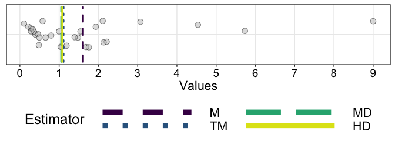<!-- -->

``` r
pA <- p
```

## One bootstrap confidence interval

``` r
nboot <- 5000
alpha <- 0.05
probs <- c(alpha/2, 1-alpha/2)
# bootstrap sampling
bootsamp <- matrix(sample(samp, n*nboot, replace = TRUE), nrow = nboot)
# mean  
boot.m <- apply(bootsamp, 1, mean)
ci.m <- quantile(boot.m, type = 6, names = FALSE, probs = probs)
# trimmed mean
boot.tm <- apply(bootsamp, 1, mean, trim = 0.2)
ci.tm <- quantile(boot.tm, type = 6, names = FALSE, probs = probs)
# median
boot.md <- apply(bootsamp, 1, median)
ci.md <- quantile(boot.md, type = 6, names = FALSE, probs = probs)
# Harrell-Davis
boot.hd <- apply(bootsamp, 1, hd)
ci.hd <- quantile(boot.hd, type = 6, names = FALSE, probs = probs)  

df <- tibble(x = c(boot.m, boot.tm, boot.md, boot.hd),
             est = factor(rep(c("M", "TM", "MD", "HD"), each = nboot))
             )

df$est <- as.character(df$est)
df$est <- factor(df$est, levels=unique(df$est))

# df.est - defined in previous chunk

df.ci <- tibble(x = c(ci.m[1], ci.tm[1], ci.md[1], ci.hd[1]),
                xend = c(ci.m[2], ci.tm[2], ci.md[2], ci.hd[2]),
                y = rep(0, 4),
                yend = rep(0, 4),
                est = factor(c("M", "TM", "MD", "HD"))
                )

df.ci$est <- as.character(df.ci$est)
df.ci$est <- factor(df.ci$est, levels=unique(df.ci$est))
  
p <- ggplot(df, aes(x = x, group = est, colour = est)) + theme_gar +
  # density
  geom_line(stat = "density", size = 1) +
  scale_colour_manual(values = cc4) +
  theme(legend.position = "none",
        axis.text.y = element_blank(),
        axis.ticks.y = element_blank()) +
  # sample estimates: vertical line + label
  geom_vline(data = df.est, aes(xintercept = x, group = est)) +
  # confidence interval ----------------------
  geom_segment(data = df.ci,
               aes(x = x, xend = xend, y = y, yend = yend, group = est),
               lineend = "round", size = 2, colour = "black") +
  labs(x = "Bootstrap estimates",
       y = "Density") +
  facet_wrap(vars(est), ncol = 2)
p
```

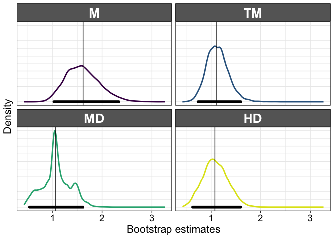<!-- -->

``` r
pB <- p
```

## Twenty bootstrap confidence intervals

We compute confidence intervals several times for the same sample, to
look at the bootstrap sampling variability.

``` r
set.seed(21)
nboot <- 500 # low number of samples to reveal differences
nrep <- 20 # number of confidence intervals
alpha <- 0.05
probs <- c(alpha/2, 1-alpha/2)

ci.m <- matrix(NA, nrow = nrep, ncol = 2)
ci.tm <- matrix(NA, nrow = nrep, ncol = 2)
ci.md <- matrix(NA, nrow = nrep, ncol = 2)
ci.hd <- matrix(NA, nrow = nrep, ncol = 2)

for(R in 1:nrep){
# bootstrap sampling
bootsamp <- matrix(sample(samp, n*nboot, replace = TRUE), nrow = nboot)
# mean  
boot.m <- apply(bootsamp, 1, mean)
ci.m[R,] <- quantile(boot.m, type = 6, names = FALSE, probs = probs)
# trimmed mean
boot.tm <- apply(bootsamp, 1, mean, trim = 0.2)
ci.tm[R,] <- quantile(boot.tm, type = 6, names = FALSE, probs = probs)
# median
boot.md <- apply(bootsamp, 1, median)
ci.md[R,] <- quantile(boot.md, type = 6, names = FALSE, probs = probs)
# Harrell-Davis
boot.hd <- apply(bootsamp, 1, hd)
ci.hd[R,] <- quantile(boot.hd, type = 6, names = FALSE, probs = probs)    
}

df <- tibble(x = c(ci.m[,1], ci.tm[,1], ci.md[,1], ci.hd[,1]),
                xend = c(ci.m[,2], ci.tm[,2], ci.md[,2], ci.hd[,2]),
                y = rep(1:nrep, 4),
                yend = rep(1:nrep, 4),
                est = factor(rep(c("M", "TM", "MD", "HD"), each = nrep))
                )

df$est <- as.character(df$est)
df$est <- factor(df$est, levels=unique(df$est))
  
p <- ggplot(df, aes(x=x, xend=xend, y=y, yend=yend, group = est, colour = est)) + theme_gar +
  # CI segments
  geom_segment(size = 1, lineend = "round") +
  scale_colour_manual(values = cc4) +
  coord_cartesian(xlim = c(0, 2.5)) +
  scale_y_continuous(breaks = seq(1, 20, 1)) +
  theme(legend.position = "none") +
  # sample estimates: vertical line + label
  geom_vline(data = df.est, aes(xintercept = x, group = est)) +
  labs(x = "Bootstrap estimates",
       y = "Confidence intervals") +
  facet_wrap(vars(est), ncol = 2)
p
```

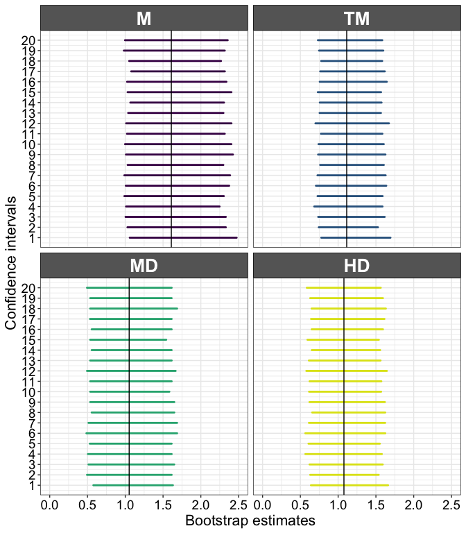<!-- -->

``` r
pC <- p
```

## Simulation

``` r
set.seed(21)
nboot.seq <- seq(500, 10000, 500)
nboot.max <- max(nboot.seq)
nrep <- 2000 # number of confidence intervals

ci.m <- array(NA, dim = c(nrep, length(nboot.seq), 2))
ci.tm <- ci.m
ci.md <- ci.m
ci.hd <- ci.m

for(R in 1:nrep){
  
  if(R == 1){beep(2)}
  if(R %% 100 == 0){
    print(paste("CI",R,"/",nrep))
    beep(2)
  }
  
# bootstrap sampling
bootsamp <- matrix(sample(samp, n*nboot.max, replace = TRUE), nrow = nboot.max)
boot.m <- apply(bootsamp, 1, mean)
boot.tm <- apply(bootsamp, 1, mean, trim = 0.2)
boot.md <- apply(bootsamp, 1, median)
boot.hd <- apply(bootsamp, 1, hd)
for(NB in 1:length(nboot.seq)){
    ci.m[R, NB, ] <- quantile(boot.m[1:nboot.seq[NB]], type = 6, names = FALSE, probs = probs)
    ci.tm[R, NB, ] <- quantile(boot.tm[1:nboot.seq[NB]], type = 6, names = FALSE, probs = probs)
    ci.md[R, NB, ] <- quantile(boot.md[1:nboot.seq[NB]], type = 6, names = FALSE, probs = probs)
    ci.hd[R, NB, ] <- quantile(boot.hd[1:nboot.seq[NB]], type = 6, names = FALSE, probs = probs)
  }
}

save(nboot.seq, nrep,
  ci.m, ci.tm, ci.md, ci.hd,
  file = "./data/onesamp_stability.RData")

beep(8)
```

## Illustrate results

``` r
load(file = "./data/onesamp_stability.RData")
# Quantify stability as sd() across repetitions
sd.m <- apply(ci.m, c(2,3), sd)
sd.tm <- apply(ci.tm, c(2,3), sd)
sd.md <- apply(ci.md, c(2,3), sd)
sd.hd <- apply(ci.hd, c(2,3), sd)

df <- tibble(val = c(sd.m[,1], sd.tm[,1], sd.md[,1], sd.hd[,1],
                   sd.m[,2], sd.tm[,2], sd.md[,2], sd.hd[,2]),
                ci = rep(c("LO", "HI"), each = length(nboot.seq)*4),
                nboot = rep(nboot.seq, 8),
                est = factor(rep(rep(c("M", "TM", "MD", "HD"), 
                                     each = length(nboot.seq)),2))
                )

df$ci <- keeporder(df$ci)
  
p <- ggplot(df, aes(x=nboot, y=val, group = est, colour = est, linetype = est)) + theme_gar +
  geom_line(size = 1) +
  scale_colour_manual(values = cc4) +
  scale_linetype_manual(values = c("dashed", "dotted", "longdash", "solid")) +
  theme(legend.position = "bottom",
        panel.grid.minor.x = element_blank(),
        legend.key.width = unit(5,"cm")) +
  guides(colour = guide_legend(override.aes = list(size=3), nrow=2), 
        title="Estimator") +
  labs(x = "Number of bootstrap samples",
       y = "Variability in SD units",
       colour = "Estimator",
       linetype = "Estimator") +
  scale_x_continuous(breaks = nboot.seq,
                         labels = lab) +
  facet_grid(cols = vars(ci))
p
```

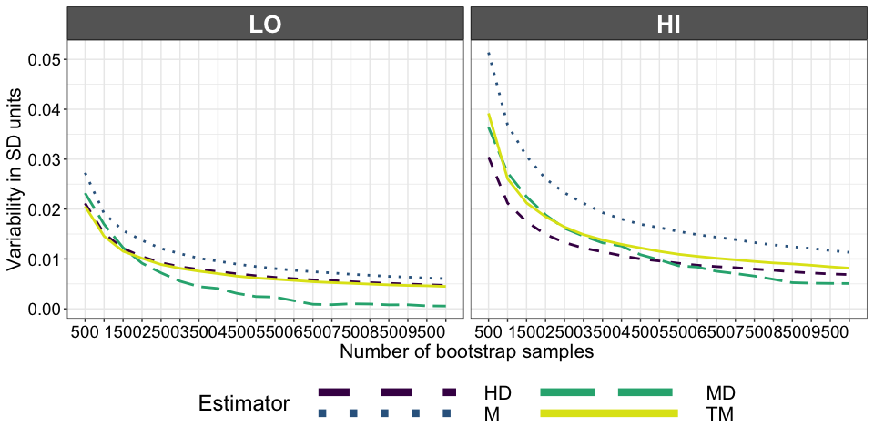<!-- -->

``` r
pD <- p
```

## Summary figure

``` r
pAB <- cowplot::plot_grid(pA, pB,
                    labels = c("A", "B"),
                    ncol = 1,
                    nrow = 2,
                    rel_heights =  c(1, 3), 
                    align = "v",
                    axis = "l",
                    label_size = 20, 
                    hjust = 0, 
                    scale = .95)

pTOP <- cowplot::plot_grid(pAB, pC,
                    labels = c(NA, "C"),
                    ncol = 2,
                    nrow = 1,
                    rel_widths =  c(1, 1), 
                    align = "v",
                    # axis = "b",
                    label_size = 20, 
                    hjust = -0.5, 
                    vjust = 2.8,
                    scale = .95)

cowplot::plot_grid(pTOP, pD,
                    labels = c(NA, "D"),
                    ncol = 1,
                    nrow = 2,
                    rel_heights = c(1.5, 1), 
                    # align = "v",
                    # axis = "l",
                    label_size = 20, 
                    hjust = -2, 
                    scale = .95)

# save figure
ggsave(filename=('./figures/figure_onesamp_stability.pdf'),width=15,height=17)
ggsave(filename=('./figures/figure8.pdf'),width=15,height=17)
```
