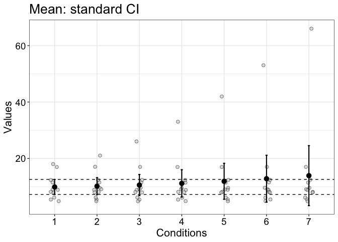
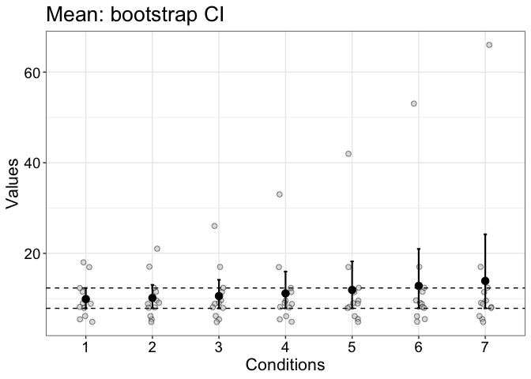
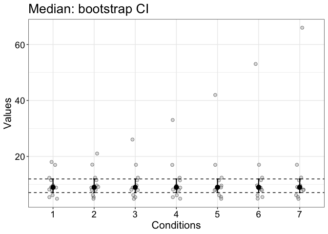
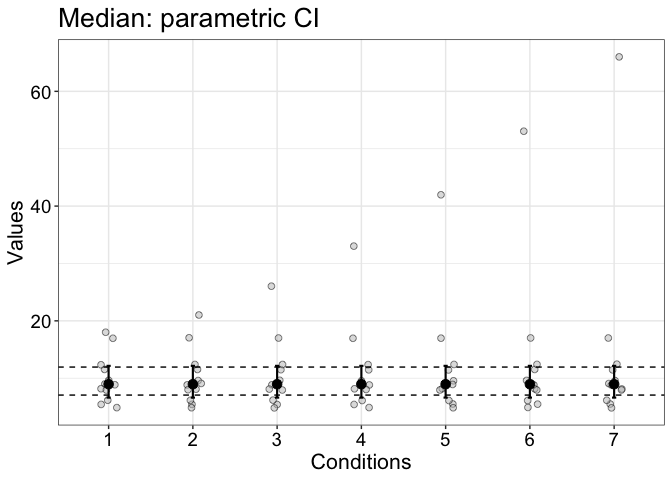

The bootstrap is not robust
================
Guillaume A. Rousselet
2022-06-13

# Dependencies

``` r
library(tibble)
library(ggplot2)
# library(cowplot)
source("./functions/Rallfun-v40.txt")
source("./functions/theme_gar.txt")
```

The bootstrap is sometimes described as a robust technique. In itself,
it is not robust. A simple example can illustrate this lack of
robustness: percentile bootstrap confidence intervals for the mean are
not robust, because the mean is not a robust estimator of central
tendency.

# Generate data and compute confidence intervals

``` r
set.seed(21)
n <- 10
samp <- rnorm(n, 8, 2) 
samp <- c(samp, 17)
samp_mat <- matrix(NA, nrow = 12, ncol = 7)
ci_mean_t <- matrix(NA, nrow = 2, ncol = 7)
mean_res <- vector(mode = "numeric", length = 7)
median_res <- vector(mode = "numeric", length = 7)
ci_mean_pb <- matrix(NA, nrow = 2, ncol = 7)
ci_median_pb <- matrix(NA, nrow = 2, ncol = 7)
ci_median_param <- matrix(NA, nrow = 2, ncol = 7)
for(C in 1:7){
  todo <- c(samp, 17+C^2)
  samp_mat[,C] <- todo
  mean_res[C] <- mean(todo)
  median_res[C] <- median(todo)
  ci_mean_t[,C] <- t.test(todo)$conf.int
  ci_mean_pb[,C] <- onesampb(todo, mean)$ci # default to nboot = 2000
  ci_median_pb[,C] <- onesampb(todo, median)$ci
  ci_median_param[,C] <- sint(todo) # parametric method for the median
}
```

# Illustrate results: mean + standard CI

``` r
set.seed(777) # for reproducible jitter
# raw data
df <- tibble(res = as.vector(samp_mat),
             cond = factor(rep(1:7, each = 12)))
# mean + confidence intervals
df2 <- tibble(res = mean_res,
              cond = factor(1:7),
              ci_low = ci_mean_t[1,],
              ci_up = ci_mean_t[2,])

p <- ggplot(df, aes(x = cond, y = res)) + theme_gar +
   # scatterplots
  geom_jitter(shape = 21, width = .1, colour = 'black', fill = 'grey', size = 2, alpha = 0.5) +
  geom_hline(yintercept = ci_mean_t[1,1], linetype = 'dashed') +
  geom_hline(yintercept = ci_mean_t[2,1], linetype = 'dashed') +
    # confidence intervals
geom_errorbar(data = df2, aes(x=cond, ymin=ci_low, ymax=ci_up), 
              width=.05, size=0.75) + 
  geom_point(data = df2, aes(x=cond, y=res), size=3) +
   theme(panel.grid.minor.x = element_blank()) +
  labs(x = "Conditions", y = "Values") +
  ggtitle("Mean: standard CI") 
p
```

<!-- -->

``` r
pA <- p
```

# Illustrate results: mean + boot CI

``` r
set.seed(777) # for reproducible jitter
# raw data
df <- tibble(res = as.vector(samp_mat),
             cond = factor(rep(1:7, each = 12)))
# mean + confidence intervals
df2 <- tibble(res = mean_res,
              cond = factor(1:7),
              ci_low = ci_mean_pb[1,],
              ci_up = ci_mean_pb[2,])

p <- ggplot(df, aes(x = cond, y = res)) + theme_gar +
   # scatterplots
  geom_jitter(shape = 21, width = .1, colour = 'black', fill = 'grey', size = 2, alpha = 0.5) +
  geom_hline(yintercept = ci_mean_pb[1,1], linetype = 'dashed') +
  geom_hline(yintercept = ci_mean_pb[2,1], linetype = 'dashed') +
    # confidence intervals
geom_errorbar(data = df2, aes(x=cond, ymin=ci_low, ymax=ci_up), 
              width=.05, size=0.75) + 
  geom_point(data = df2, aes(x=cond, y=res), size=3) +
   theme(panel.grid.minor.x = element_blank()) +
  labs(x = "Conditions", y = "Values") +
  ggtitle("Mean: bootstrap CI") 
p
```

<!-- -->

``` r
pB <- p
```

# Illustrate results: median + boot CI

``` r
set.seed(777) # for reproducible jitter
# raw data
df <- tibble(res = as.vector(samp_mat),
             cond = factor(rep(1:7, each = 12)))
# mean + confidence intervals
df2 <- tibble(res = median_res,
              cond = factor(1:7),
              ci_low = ci_median_pb[1,],
              ci_up = ci_median_pb[2,])

p <- ggplot(df, aes(x = cond, y = res)) + theme_gar +
   # scatterplots
  geom_jitter(shape = 21, width = .1, colour = 'black', fill = 'grey', size = 2, alpha = 0.5) +
  geom_hline(yintercept = ci_median_pb[1,1], linetype = 'dashed') +
  geom_hline(yintercept = ci_median_pb[2,1], linetype = 'dashed') +
    # confidence intervals
geom_errorbar(data = df2, aes(x=cond, ymin=ci_low, ymax=ci_up), 
              width=.05, size=0.75) + 
  geom_point(data = df2, aes(x=cond, y=res), size=3) +
   theme(panel.grid.minor.x = element_blank()) +
  labs(x = "Conditions", y = "Values") +
  ggtitle("Median: bootstrap CI") 
p
```

<!-- -->

``` r
pC <- p
```

# Illustrate results: median + parametric CI

``` r
set.seed(777) # for reproducible jitter
# raw data
df <- tibble(res = as.vector(samp_mat),
             cond = factor(rep(1:7, each = 12)))
# mean + confidence intervals
df2 <- tibble(res = median_res,
              cond = factor(1:7),
              ci_low = ci_median_param[1,],
              ci_up = ci_median_param[2,])

p <- ggplot(df, aes(x = cond, y = res)) + theme_gar +
   # scatterplots
  geom_jitter(shape = 21, width = .1, colour = 'black', fill = 'grey', size = 2, alpha = 0.5) +
  geom_hline(yintercept = ci_median_pb[1,1], linetype = 'dashed') +
  geom_hline(yintercept = ci_median_pb[2,1], linetype = 'dashed') +
    # confidence intervals
geom_errorbar(data = df2, aes(x=cond, ymin=ci_low, ymax=ci_up), 
              width=.05, size=0.75) + 
  geom_point(data = df2, aes(x=cond, y=res), size=3) +
   theme(panel.grid.minor.x = element_blank()) +
  labs(x = "Conditions", y = "Values") +
  ggtitle("Median: parametric CI") 
p
```

<!-- -->

``` r
# pC <- p
```

# Summary figure

``` r
cowplot::plot_grid(pA, pB, pC,
                    labels = c("A", "B", "C"),
                    ncol = 3,
                    nrow = 1,
                    rel_widths = c(1, 1, 1), 
                    label_size = 20, 
                    hjust = -0.5, 
                    scale=.95,
                    align = "h")

# save figure
ggsave(filename=('./figures/figure_notrobust.pdf'),width=10,height=5)
ggsave(filename=('./figures/figure6.pdf'),width=10,height=5)
```
