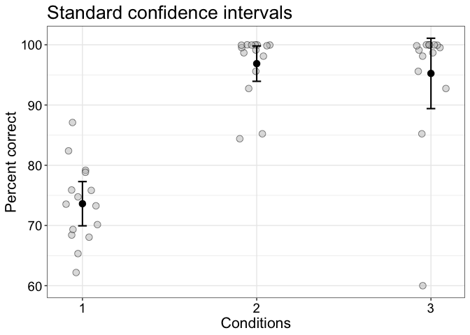
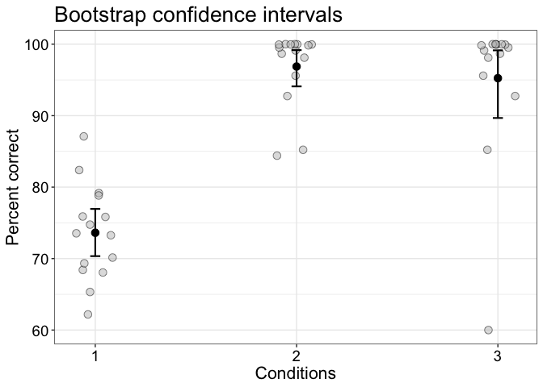

Percentage correct example
================
Guillaume A. Rousselet
2019-05-24

Dependencies
============

``` r
library(tibble)
library(ggplot2)
# library(cowplot)
source("./functions/theme_gar.txt")
source("./functions/Rallfun-v35.txt")
```

After taking the mean across trials, correct/incorrect data are often wrongly assumed to be normaly distributed. Instead, these data are always positive and bounded, and are better modelled using a beta distribution (Kruschke, 2014). Similarly, standard methods are inappropriate for ordinal data, like Likert scale results, which are too often treated as metric (Bürkner & Vuorre, 2019; Liddell & Kruschke, 2018).

Make data and compute confidence intervals
==========================================

``` r
set.seed(6666)
n <- 15
norm_samp <- rnorm(n, mean = 75, sd = 10)
skew_samp <- rbeta(n, 10, 0.2) * 100
skew_samp2 <- sort(skew_samp)
skew_samp2[1] <- 60
# hist(rbeta(10000,10,0.2)*100, 50)

norm_stci <- t.test(norm_samp, conf.level = 0.95)$conf.int
skew_stci <- t.test(skew_samp, conf.level = 0.95)$conf.int
skew_stci2 <- t.test(skew_samp2, conf.level = 0.95)$conf.int

norm_pbci <- onesampb(norm_samp, est = mean)$ci
skew_pbci <- onesampb(skew_samp, est = mean)$ci
skew_pbci2 <- onesampb(skew_samp2, est = mean)$ci
```

Illustration: standard confidence interval
==========================================

``` r
set.seed(21) # for reproducible jitter
# raw data
df <- tibble(pc = c(norm_samp, skew_samp, skew_samp2),
             cond = rep(1:3, each = n))
# mean + confidence intervals
df2 <- tibble(pc = c(mean(norm_samp), mean(skew_samp), mean(skew_samp2)),
              cond = 1:3,
              ci_low = c(norm_stci[1], skew_stci[1], skew_stci2[1]),
              ci_up = c(norm_stci[2], skew_stci[2], skew_stci2[2]))

p <- ggplot(data = df, aes(x = cond, y = pc)) + theme_gar +
  # scatterplots
    geom_jitter(width = .1, alpha = 0.5, 
                size = 3, shape = 21, fill = "grey", colour = "black") +
  scale_x_continuous(breaks = c(1,2,3)) +
  # confidence intervals
geom_errorbar(data = df2, aes(x=cond, ymin=ci_low, ymax=ci_up), 
              width=.05, size=0.75) + 
  geom_point(data = df2, aes(x=cond, y=pc), size=3) +
   theme(panel.grid.minor.x = element_blank()) +
  labs(x = "Conditions", y = "Percent correct") +
  ggtitle("Standard confidence intervals") 
p
```



``` r
pA <- p
```

Illustration: bootstrap confidence interval
===========================================

``` r
set.seed(21) # for reproducible jitter
# raw data
df <- tibble(pc = c(norm_samp, skew_samp, skew_samp2),
             cond = rep(1:3, each = n))
# mean + confidence intervals
df2 <- tibble(pc = c(mean(norm_samp), mean(skew_samp), mean(skew_samp2)),
              cond = 1:3,
              ci_low = c(norm_pbci[1], skew_pbci[1], skew_pbci2[1]),
              ci_up = c(norm_pbci[2], skew_pbci[2], skew_pbci2[2]))

p <- ggplot(data = df, aes(x = cond, y = pc)) + theme_gar +
  # scatterplots
    geom_jitter(width = .1, alpha = 0.5, 
                size = 3, shape = 21, fill = "grey", colour = "black") +
  scale_x_continuous(breaks = c(1,2,3)) +
  # confidence intervals
geom_errorbar(data = df2, aes(x=cond, ymin=ci_low, ymax=ci_up), 
              width=.05, size=0.75) + 
  geom_point(data = df2, aes(x=cond, y=pc), size=3) +
   theme(panel.grid.minor.x = element_blank()) +
  labs(x = "Conditions", y = "Percent correct") +
  ggtitle("Bootstrap confidence intervals") 
p
```



``` r
pB <- p
```

Summary figure
==============

``` r
cowplot::plot_grid(pA, pB,
                    labels = c("A", "B"),
                    ncol = 2,
                    nrow = 1,
                    rel_widths = c(1, 1), 
                    label_size = 20, 
                    hjust = -0.5, 
                    scale=.95,
                    align = "h")

# save figure
ggsave(filename=('./figures/figure_pc.pdf'),width=10,height=5)
```

References
==========

Bürkner, Paul-Christian, and Matti Vuorre. “Ordinal Regression Models in Psychology: A Tutorial.” Advances in Methods and Practices in Psychological Science 2, no. 1 (March 1, 2019): 77–101. <https://doi.org/10.1177/2515245918823199>.

Kruschke, John. Doing Bayesian Data Analysis - 2nd Edition. Academic Press, 2014. <https://www.elsevier.com/books/doing-bayesian-data-analysis/kruschke/978-0-12-405888-0>.

Liddell, Torrin M., and John K. Kruschke. “Analyzing Ordinal Data with Metric Models: What Could Possibly Go Wrong?” Journal of Experimental Social Psychology 79 (November 1, 2018): 328–48. <https://doi.org/10.1016/j.jesp.2018.08.009>.
