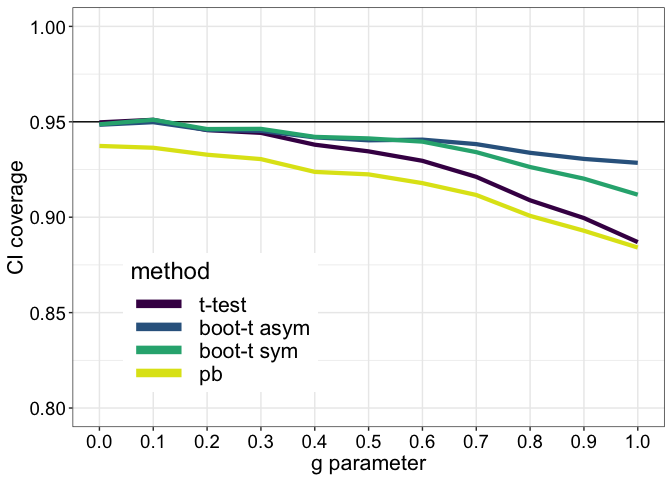
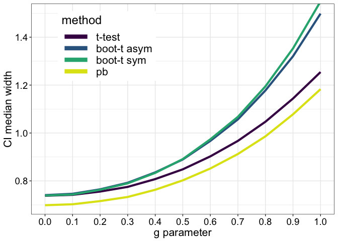
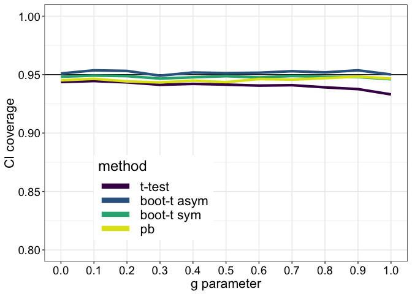
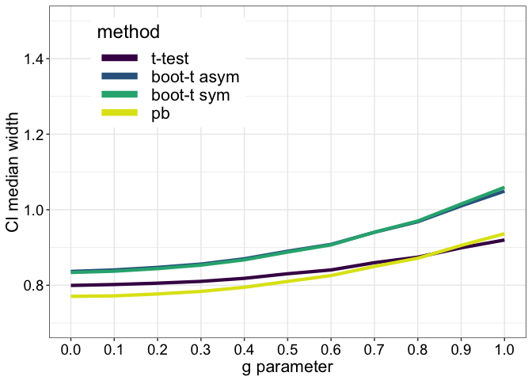
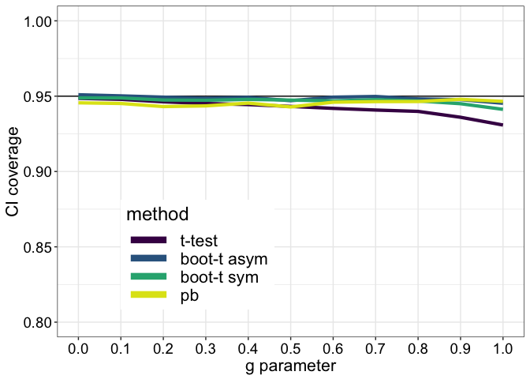
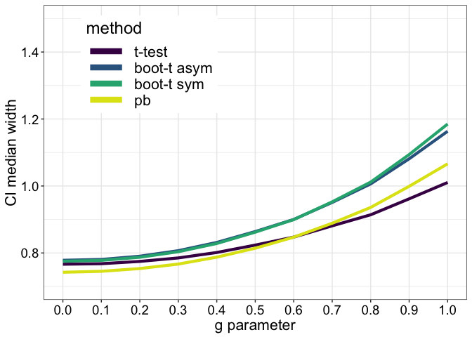
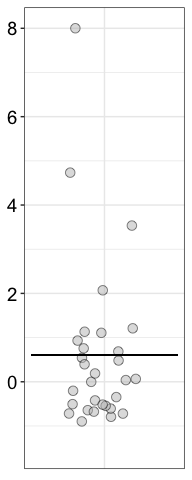
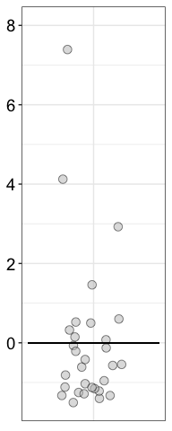
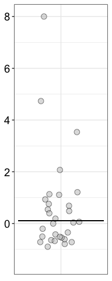

Bootstrap-t method
================
Guillaume A. Rousselet
2019-05-25

``` r
# dependencies
library(ggplot2)
library(tibble)
source('./functions/Rallfun-v35.txt')
source('./functions/theme_gar.txt')
source('./functions/functions.txt')
library(beepr)
# library(cowplot)
```

``` r
sessionInfo()
```

    ## R version 3.5.2 (2018-12-20)
    ## Platform: x86_64-apple-darwin15.6.0 (64-bit)
    ## Running under: macOS Mojave 10.14.5
    ## 
    ## Matrix products: default
    ## BLAS: /Library/Frameworks/R.framework/Versions/3.5/Resources/lib/libRblas.0.dylib
    ## LAPACK: /Library/Frameworks/R.framework/Versions/3.5/Resources/lib/libRlapack.dylib
    ## 
    ## locale:
    ## [1] en_GB.UTF-8/en_GB.UTF-8/en_GB.UTF-8/C/en_GB.UTF-8/en_GB.UTF-8
    ## 
    ## attached base packages:
    ## [1] stats     graphics  grDevices utils     datasets  methods   base     
    ## 
    ## other attached packages:
    ## [1] beepr_1.3     tibble_2.1.1  ggplot2_3.1.1
    ## 
    ## loaded via a namespace (and not attached):
    ##  [1] Rcpp_1.0.1       knitr_1.21       magrittr_1.5     tidyselect_0.2.5
    ##  [5] munsell_0.5.0    colorspace_1.4-1 R6_2.4.0         rlang_0.3.4     
    ##  [9] stringr_1.4.0    plyr_1.8.4       dplyr_0.8.0.1    tools_3.5.2     
    ## [13] grid_3.5.2       gtable_0.3.0     xfun_0.4         audio_0.1-5.1   
    ## [17] withr_2.1.2      htmltools_0.3.6  assertthat_0.2.1 yaml_2.2.0      
    ## [21] lazyeval_0.2.2   digest_0.6.18    crayon_1.3.4     purrr_0.3.2     
    ## [25] glue_1.3.1       evaluate_0.12    rmarkdown_1.11   stringi_1.4.3   
    ## [29] compiler_3.5.2   pillar_1.3.1     scales_1.0.0     pkgconfig_2.0.2

Functions from Rand Wilcox
==========================

One-sample
----------

``` r
# one-sample test on trimmed means
trimci(x,tr=.2,alpha=.05,null.value=0)

# bootstrap-t on trimmed means
trimcibt(x, tr=0.2, alpha=0.1, nboot=1000, side=FALSE)
# tr = amount of trimming
# side = FALSE for an equal-tailed confidence interval, potential asymmetric
# side = TRUE for a symmetric confidence interval
```

Two independent groups
----------------------

``` r
# t-test on trimmed means
yuen(x,y,tr=.2,alpha=.05)

# bootstrap-t on trimmed means
yuenbt(x,y,tr=0.2,alpha=0.05,nboot=599,side=FALSE)
```

Two dependent groups
--------------------

``` r
# t-test on dependent trimmed means
yuend<-function(x,y,tr=.2,alpha=.05)
  
# bootstrap-t on trimmed means
ydbt(x,y,tr=0.2,alpha=0.05,nboot=599,side=FALSE,plotit=TRUE,op=1)
```

Declare custom functions
========================

Modify `trimci` to return confidence interval only
--------------------------------------------------

``` r
#  Compute a 1-alpha confidence interval for the trimmed mean
#  The default amount of trimming is tr=.2
trimci <- function(x, tr=.2, alpha=.05){
  se <- sqrt(winvar(x,tr))/((1-2*tr)*sqrt(length(x)))
  trimci <- vector(mode="numeric",length=2)
  df <- length(x)-2*floor(tr*length(x))-1
  trimci[1] <- mean(x,tr)-qt(1-alpha/2,df)*se
  trimci[2] <- mean(x,tr)+qt(1-alpha/2,df)*se
  trimci
}
```

Modify `trimcibt` to return confidence interval only
----------------------------------------------------

Return both symmetric and asymmetric confidence intervals

``` r
#  The default amount of trimming is tr=0.2
cibt <- function (x, tr=0.2, alpha=.05, nboot=599){
  # test <- (mean(x,tr)-nullval)/trimse(x,tr)
  data <- matrix(sample(x,size=length(x)*nboot,replace=TRUE),nrow=nboot)
  data <- data-mean(x,tr)
  top <- apply(data,1,mean,tr)
  bot <- apply(data,1,trimse,tr)
  tval <- top/bot
  icrit <- round((1-alpha)*nboot)
  ibot <- round(alpha*nboot/2)
  itop <- nboot-ibot #altered code very slightly to correspond to recent versions of my books.
  # yields an equal-tailed (asymmetric) confidence interval
  tval <- sort(tval)
  ci.asym <- c(0, 0)
    ci.asym[1] <- mean(x,tr)-tval[itop]*trimse(x,tr)
    ci.asym[2] <- mean(x,tr)-tval[ibot]*trimse(x,tr)
  # symmetric two-sided method
    tval <- abs(tval)
    tval <- sort(tval)
    ci.sym <- c(0, 0)
    ci.sym[1] <- mean(x,tr)-tval[icrit]*trimse(x,tr)
    ci.sym[2] <- mean(x,tr)+tval[icrit]*trimse(x,tr)
    # p.value<-(sum(abs(test)<=abs(tval)))/nboot
  list(ci.asym = ci.asym, ci.sym = ci.sym)
}
```

### Modify `trimcibt` to return T bootstrap distribution only

``` r
# tr specifies the amount of trimming - default to 0, so the mean is used.
getboott <- function(x, tr=0, nboot=599){
data <- matrix(sample(x,size=length(x)*nboot,replace=TRUE),nrow=nboot)
data <- data - mean(x,tr)
top <- apply(data,1,mean,tr)
bot <- apply(data,1,trimse,tr)
tval <- top/bot
tval
}
```

Compute T-value only: define function
-------------------------------------

``` r
tval <- function(x,nv,tr=0){
  se <- sqrt(winvar(x,tr)) / ((1-2*tr) * sqrt(length(x)))
  tval <- (mean(x,tr)-nv) / se
  tval
}
```

Expected vs. empirical t distributions
======================================

We consider populations that are progressively more skewed. With increased skewness, the sampling distributions of the T values also increases in skewness. This leads to inaccurate confidence intervals. The percentile-t bootstrap addresses this problem by using the data in the sample to compute a data-driven T distribution. We can then read the quantiles from that distribution and plug-in the values in the standard t-test confidence interval equation.

Populations
-----------

The `ghdist()` function is used to generate random numbers from *g & h* distributions. All such distributions have a median of zero. The parameter g controls the asymmetry of the distribution, while the parameter h controls the thickness of the tails. The g & h distributions are described in this 1985 book: <http://eu.wiley.com/WileyCDA/WileyTitle/productCd-047004005X.html> There is also a description in Rand Wilcox's book Introduction to Robust Estimation. See also: <https://www.jstor.org/stable/25471119>

### Examples in which g varies from 0 to 1.

``` r
set.seed(21)
nsim <- 1000000 # population size
nkde <- 50000 # sample size for KDE
gseq <- seq(0,1,0.1) # sequence of g parameters
xseq <- seq(-5,7,0.01) # points at which to compute KDE
gh.kde <- matrix(0, nrow = length(xseq), ncol = length(gseq)) # KDE results to plot in next figure
mean.g <- vector(mode = "numeric", length = length(gseq))
tmean10.g <- vector(mode = "numeric", length = length(gseq))
tmean20.g <- vector(mode = "numeric", length = length(gseq))
md.g <- vector(mode = "numeric", length = length(gseq))
for(G in 1:length(gseq)){
  print(paste("gseq =",G,"/",length(gseq)))
  beep(2)
  set.seed(7)
  samp <- ghdist(nsim, g = gseq[G], h = 0)
  gh.kde[,G] <- akerd(ghdist(nkde, g = gseq[G], h = 0), 
                      pts = xseq, pyhat = TRUE, plotit = FALSE)
  mean.g[G] <- mean(samp) # population mean
  tmean10.g[G] <- mean(samp, trim = 0.1) # population 10% trimmed mean
  tmean20.g[G] <- mean(samp, trim = 0.2) # population 20% trimmed mean
  md.g[G] <- median(samp) # population median
}

save(gseq, mean.g, tmean10.g, tmean20.g, md.g, 
     xseq, gh.kde,
  file = "./data/ptb_params.RData")
```

Combine all kernel density functions into one data frame and make summary figure.

``` r
load(file = "./data/ptb_params.RData")

# make data frame
df <- tibble(x = rep(xseq, length(gseq)),
             y = as.vector(gh.kde),
             g = factor(rep(gseq, each = length(xseq))))

# make plot
p <- ggplot(df, aes(x = x, y = y, colour = g)) + theme_gar +
          geom_line(size = 1) +
          scale_colour_viridis_d(end = 0.9) +
          theme(legend.title = element_text(size=16, face="bold"),
                legend.position = c(.8, .55)) +
          coord_cartesian(xlim = c(-4, 6)) +
          scale_y_continuous(breaks = seq(0, 1, 0.2)) +
  scale_x_continuous(breaks = seq(-4, 15, 1)) +
  labs(x = "Observations", y = "Density") +
  guides(colour = guide_legend(override.aes = list(size=3)))
p
```


``` r
p.g <- p
```

T sampling distributions for g varying from 0 to 1.
---------------------------------------------------

With positive g values, the *g&h* distributions are lognormal distributions.

Compute sampling distributions of T values using 50,000 samples of n=30.

``` r
nsim <- 50000
n <- 30
gseq <- seq(0,1,0.1)
tres.g <- matrix(0, nrow = nsim, ncol = length(gseq))
for(G in 1:length(gseq)){
  set.seed(7)
  tres.g[,G] <- apply(matrix(ghdist(n*nsim, g = gseq[G], h = 0),nrow = nsim), 
                     1, tval, nv = mean.g[G])
  # null value (nv) changes for each distribution because the mean changes with the variable g. The median is always zero.
}
save(tres.g, nsim, n,
     gseq, x,
     file = "./data/gh_t_sampdist.RData")
```

Combine all kernel density functions into one data frame and make summary figure.

``` r
load(file = "./data/gh_t_sampdist.RData")
# make data frame
df <- tibble(x = as.vector(tres.g),
             g = factor(rep(gseq, each = nsim)))

# make plot
p <- ggplot(df, aes(x = x, colour = g)) + theme_gar +
          geom_line(stat = "density", size=1) +
          scale_colour_viridis_d(end = 0.9) +
          theme(legend.title = element_text(size=16, face="bold"),
                legend.position = c(.15, .55)) +
          coord_cartesian(xlim = c(-8, 5)) +
          scale_y_continuous(breaks = seq(0, 1, 0.1)) +
  scale_x_continuous(breaks = seq(-8, 5, 1)) +
  labs(x = "T values", y = "Density") +
  guides(colour = guide_legend(override.aes = list(size=3)))
p
```


``` r
p.t <- p
```

T values: assumed, real, bootstrap
----------------------------------

### Compute bootstrap samples

``` r
set.seed(1)
n <- 30 # sample size
nsim <- 20 # number of samples + bootstrap distributions
nboot <- 5000 # number of bootstrap samples
tboot <- matrix(0, nrow = nsim, ncol = nboot)
for(iter in 1:nsim){
  tboot[iter,] <- getboott(ghdist(n, g = 1, h = 0), nboot = nboot)
}
save(tboot, file = "./data/ptb_tboot.RData")
```

### Figure

In grey: 20 bootstrap distributions of T values obtained from 20 samples of n=30 observations from a g&h distribution with g = 1. In red: theoretical T distribution. In black: empirical T distribution obtained using 50,000 samples of n=30 observations.

``` r
load(file = "./data/ptb_tboot.RData") # get tboot matrix
n <- 30 # sample size
nsim <- 20 # number of samples + bootstrap distributions
nboot <- 5000 # number of bootstrap samples
alpha <- 0.05

# Real/empirical T distribution
df.empT <- as_tibble(with(density(tres.g[,11]), data.frame(x,y)))
# empirical cut-off T values for alpha = 0.05  
g1.q <- quantile(tres.g[,11], probs = c(alpha/2, 1-alpha/2), type = 6)
    
p <- ggplot(tibble(x = as.vector(tboot), 
                   samp = factor(rep(1:nsim, nboot))), 
            aes(x = x)) + theme_gar +
  # bootstrap distributions from nsim samples
  geom_line(aes(group = samp, colour = "bootstrap samples"), stat = "density", size = 0.5) +
  # Theoretical T distribution = RED -----------------------------
  # stat_function(data = data.frame(x = c(-5, 5)), 
  #               aes(x = x, colour = "theoretical T"),
  #               fun = dt, args = list(df = n-1), size = 0.75) + 
  geom_line(data = tibble(x = seq(-7, 5, 0.01), y = dt(x, n-1)),
            aes(x = x, y = y, colour = "theoretical T"), 
            size = 0.75) +
  # theoretical cut-off T values for alpha = 0.05
  geom_segment(x = qt(alpha/2, n-1),
               xend = qt(alpha/2, n-1),
               y = 0,
               yend = dt(qt(alpha/2, n-1), n-1),
               size = 1,
               colour = "red") +
  geom_segment(x = qt(1-alpha/2, n-1),
               xend = qt(1-alpha/2, n-1),
               y = 0,
               yend = dt(qt(1-alpha/2, n-1), n-1),
               size = 1,
               colour = "red") +
  # Real/empirical T distribution = BLACK ------------------------
  geom_line(data = df.empT, aes(x = x, y = y, colour = "empirical T"), 
            size = 1) +
  # empirical cut-off T values for alpha = 0.05  
  # Lower quantile
  geom_segment(x = g1.q[1],
                xend = g1.q[1],
                y = 0,
                yend = df.empT$y[which.min(abs(df.empT$x-g1.q[1]))],
                size = 1,
                colour = "black") +
  annotate(geom = "label", x = -3, y = 0.13, size  = 7, colour = "black",
           label = expression(bold("q"[0.025]))) +
  # Upper quantile
  geom_segment(x = g1.q[2],
                xend = g1.q[2],
                y = 0,
                yend = df.empT$y[which.min(abs(df.empT$x-g1.q[2]))],
                size = 1,
                colour = "black") +
  annotate(geom = "label", x = 2.5, y = 0.13, size  = 7, colour = "black",
  label = expression(bold("q"[0.975]))) +
  # set colours -------------------------------  
  scale_colour_manual(name = "", values = c("bootstrap samples" = "grey",
                                            "theoretical T" = "red",
                                            "empirical T" = "black")) +
  coord_cartesian(xlim = c(-7, 4)) +
  scale_x_continuous(breaks = seq(-6, 5, 2)) +
  labs(x = "T values", y = "Density") +
  theme(legend.position = c(.25, .8)) +
guides(colour = guide_legend(override.aes = list(size = 3)))
  # ggtitle(paste0("t distribution: df = ",df))
p
```


``` r
p.boot <- p
```

Coverage: t-test on means
-------------------------

### Simulation

Include tests on means, 10% trimmed means and 20% trimmed means.

``` r
set.seed(21)
nsim <- 20000
n <- 30
nboot <- 599
gseq <- seq(0, 1, 0.1)

# mean
t.cover.m <- array(0, dim = c(nsim, length(gseq), 3)) # standard, asym, sym
t.width.m <- array(0, dim = c(nsim, length(gseq), 3)) # standard, asym, sym
t.cover.pb.m <- array(0, dim = c(nsim, length(gseq))) # percentile bootstrap
t.width.pb.m <- array(0, dim = c(nsim, length(gseq)))

# 10% trimmed mean
t.cover.10tm <- array(0, dim = c(nsim, length(gseq), 3)) # standard, asym, sym
t.width.10tm <- array(0, dim = c(nsim, length(gseq), 3)) # standard, asym, sym
t.cover.pb.10tm <- array(0, dim = c(nsim, length(gseq))) # percentile bootstrap
t.width.pb.10tm <- array(0, dim = c(nsim, length(gseq)))

# 20% trimmed mean
t.cover.20tm <- array(0, dim = c(nsim, length(gseq), 3)) # standard, asym, sym
t.width.20tm <- array(0, dim = c(nsim, length(gseq), 3)) # standard, asym, sym
t.cover.pb.20tm <- array(0, dim = c(nsim, length(gseq))) # percentile bootstrap
t.width.pb.20tm <- array(0, dim = c(nsim, length(gseq)))

for(G in 1:length(gseq)){
  
  mu.m <- mean.g[G]
  mu.10tm <- tmean10.g[G]
  mu.20tm <- tmean20.g[G]
  
  beep(2)
  print(paste("Coverage simulation: g =", gseq[G]))
  
  for(iter in 1:nsim){
    
    samp <- ghdist(n, g = gseq[G], h = 0) 
    
    # MEAN ----------------------
    tr <- 0
    mu <- mu.m
    #standard CI
    ci <- trimci(samp, tr = tr)
    t.cover.m[iter,G,1] <- mu >= ci[1] & mu <= ci[2]
    t.width.m[iter,G,1] <- ci[2] - ci[1]

    #percentile-t bootstrap CIs
    out <- cibt(samp, nboot = nboot, tr = tr)
    t.cover.m[iter,G,2] <- mu >= out$ci.asym[1] & mu <= out$ci.asym[2]
    t.width.m[iter,G,2] <- out$ci.asym[2] - out$ci.asym[1]

    t.cover.m[iter,G,3] <- mu >= out$ci.sym[1] & mu <= out$ci.sym[2]
    t.width.m[iter,G,3] <- out$ci.sym[2] - out$ci.sym[1]

    #percentile bootstrap
    ci <- quantile(apply(matrix(sample(samp, n*nboot, replace=TRUE), nrow=nboot), 1, mean, trim = tr), probs = c(0.025, 0.975), type = 6)
    t.cover.pb.m[iter,G] <- mu >= ci[1] & mu <= ci[2]
    t.width.pb.m[iter,G] <- ci[2] - ci[1]
    
    # 10% TRIMMED MEAN ----------------------
    tr <- 0.1
    mu <- mu.10tm
    #standard CI
    ci <- trimci(samp, tr = tr)
    t.cover.10tm[iter,G,1] <- mu >= ci[1] & mu <= ci[2]
    t.width.10tm[iter,G,1] <- ci[2] - ci[1]

    #percentile-t bootstrap CIs
    out <- cibt(samp, nboot = nboot, tr = tr)
    t.cover.10tm[iter,G,2] <- mu >= out$ci.asym[1] & mu <= out$ci.asym[2]
    t.width.10tm[iter,G,2] <- out$ci.asym[2] - out$ci.asym[1]

    t.cover.10tm[iter,G,3] <- mu >= out$ci.sym[1] & mu <= out$ci.sym[2]
    t.width.10tm[iter,G,3] <- out$ci.sym[2] - out$ci.sym[1]

    #percentile bootstrap
    ci <- quantile(apply(matrix(sample(samp, n*nboot, replace=TRUE), nrow=nboot), 1, mean, trim = tr), probs = c(0.025, 0.975), type = 6)
    t.cover.pb.10tm[iter,G] <- mu >= ci[1] & mu <= ci[2]
    t.width.pb.10tm[iter,G] <- ci[2] - ci[1]
    
    # 20% TRIMMED MEAN ----------------------
    tr <- 0.2
    mu <- mu.20tm
    #standard CI
    ci <- trimci(samp, tr = tr)
    t.cover.20tm[iter,G,1] <- mu >= ci[1] & mu <= ci[2]
    t.width.20tm[iter,G,1] <- ci[2] - ci[1]

    #percentile-t bootstrap CIs
    out <- cibt(samp, nboot = nboot, tr = tr)
    t.cover.20tm[iter,G,2] <- mu >= out$ci.asym[1] & mu <= out$ci.asym[2]
    t.width.20tm[iter,G,2] <- out$ci.asym[2] - out$ci.asym[1]

    t.cover.20tm[iter,G,3] <- mu >= out$ci.sym[1] & mu <= out$ci.sym[2]
    t.width.20tm[iter,G,3] <- out$ci.sym[2] - out$ci.sym[1]

    #percentile bootstrap
    ci <- quantile(apply(matrix(sample(samp, n*nboot, replace=TRUE), nrow=nboot), 1, mean, trim = tr), probs = c(0.025, 0.975), type = 6)
    t.cover.pb.20tm[iter,G] <- mu >= ci[1] & mu <= ci[2]
    t.width.pb.20tm[iter,G] <- ci[2] - ci[1]
    }
}
save(t.cover.m, t.width.m, t.cover.pb.m, t.width.pb.m,
     t.cover.10tm, t.width.10tm, t.cover.pb.10tm, t.width.pb.10tm,
     t.cover.20tm, t.width.20tm, t.cover.pb.20tm, t.width.pb.20tm,
     nsim, n, gseq, nboot,
  file = "./data/gh_coverage.RData")
beep(8)
```

### Figure: coverage

``` r
load(file = "./data/gh_coverage.RData")
df <- tibble(coverage = c(as.vector(apply(t.cover.m, c(2,3), mean)),
                          as.vector(apply(t.cover.pb.m, 2, mean))),
             g = rep(gseq, 4),
             method = rep(c("t-test","boot-t asym","boot-t sym", "pb"), each = length(gseq)))

df$method <- keeporder(df$method)

p <- ggplot(df, aes(x = g, y = coverage, colour = method)) + theme_gar +
  geom_hline(yintercept = 0.95) +
  geom_line(size = 1.5) +
  scale_color_viridis_d(end = 0.95) +
  coord_cartesian(ylim = c(.8, 1)) +
  scale_x_continuous(breaks = gseq, minor_breaks = NULL) +
  theme(legend.position = c(.25, .25)) +
  labs(x = "g parameter", y = "CI coverage") +
  guides(colour = guide_legend(override.aes = list(size = 3)))
# ggsave(filename = './theor_t.pdf')
p
```



``` r
p.coverage.m <- p
```

For all methods, coverage goes down with skewness. Among the parametric methods, the standard t-test is the most affected by skewness, with coverage less than 90% for the most skewed condition. The asymmetric bootstrap-t CI seem to perform the best. The percentile bootstrap performs the worst in all situations, and has coverage systematically below 95%, including for normal distributions.

### Figure: width

Use median width to look at typical confidence interval. Using the mean suggests even larger differences.

``` r
df <- tibble(coverage = c(as.vector(apply(t.width.m, c(2,3), median)),
                          as.vector(apply(t.width.pb.m, 2, median))),
             g = rep(gseq, 4),
             method = rep(c("t-test","boot-t asym","boot-t sym", "pb"), each = length(gseq)))

df$method <- keeporder(df$method)

p <- ggplot(df, aes(x = g, y = coverage, colour = method)) + theme_gar +
  # geom_hline(yintercept = 0.95) +
  geom_line(size = 1.5) +
  scale_color_viridis_d(end = 0.95) +
  coord_cartesian(ylim = c(.7, 1.5)) +
  scale_x_continuous(breaks = gseq, minor_breaks = NULL) +
  theme(legend.position = c(.25, .8)) +
  labs(x = "g parameter", y = "CI median width") +
  guides(colour = guide_legend(override.aes = list(size = 3)))
# ggsave(filename = './theor_t.pdf')
p
```



``` r
p.width.m <- p
```

The coverage issue identified for the t-test and the percentile bootstrap seem to some extent due to too short CIs. \#\# Coverage: t-test on 20% trimmed means

### Figure: coverage

``` r
df <- tibble(coverage = c(as.vector(apply(t.cover.20tm, c(2,3), mean)),
                          as.vector(apply(t.cover.pb.20tm, 2, mean))),
             g = rep(gseq, 4),
             method = rep(c("t-test","boot-t asym","boot-t sym", "pb"), each = length(gseq)))

df$method <- keeporder(df$method)

p <- ggplot(df, aes(x = g, y = coverage, colour = method)) + theme_gar +
  geom_hline(yintercept = 0.95) +
  geom_line(size = 1.5) +
  scale_color_viridis_d(end = 0.95) +
  coord_cartesian(ylim = c(.8, 1)) +
  scale_x_continuous(breaks = gseq, minor_breaks = NULL) +
  theme(legend.position = c(.3, .25)) +
  labs(x = "g parameter", y = "CI coverage") +
  guides(colour = guide_legend(override.aes = list(size = 3)))
p
```



``` r
p.coverage.20tm <- p
```

The low coverage observed in the previous simulations can be addressed by making inferences about the 20% trimmed mean instead of the mean. In that situation, all methods perform similarly, with near 95% coverage in all conditions. The t-test on trimmed means performs slightly less well than the others in the conditions with the most skewness. The two types of bootstrap-t CIs overall have the coverage closest to 95%.

### Figure: width

``` r
df <- tibble(coverage = c(as.vector(apply(t.width.20tm, c(2,3), mean)),
                          as.vector(apply(t.width.pb.20tm, 2, mean))),
             g = rep(gseq, 4),
             method = rep(c("t-test","boot-t asym","boot-t sym", "pb"), each = length(gseq)))

df$method <- keeporder(df$method)

p <- ggplot(df, aes(x = g, y = coverage, colour = method)) + theme_gar +
  # geom_hline(yintercept = 0.95) +
  geom_line(size = 1.5) +
  scale_color_viridis_d(end = 0.95) +
  coord_cartesian(ylim = c(.7, 1.5)) +
  scale_x_continuous(breaks = gseq, minor_breaks = NULL) +
  theme(legend.position = c(.25, .8)) +
  labs(x = "g parameter", y = "CI median width") +
  guides(colour = guide_legend(override.aes = list(size = 3)))
p
```



``` r
p.width.20tm <- p
```

Again the bootstrap-t CIs tended to be quite larger than the t-test and bootstrap ones. So when sampling from very skewed distributions and making inferences about 20% trimmed means, it could be beneficial to use the percentile bootstrap over other methods.

Coverage: t-test on 10% trimmed means
-------------------------------------

Trimming only 10% gives similar results.

### Figure: coverage

``` r
df <- tibble(coverage = c(as.vector(apply(t.cover.10tm, c(2,3), mean)),
                          as.vector(apply(t.cover.pb.10tm, 2, mean))),
             g = rep(gseq, 4),
             method = rep(c("t-test","boot-t asym","boot-t sym", "pb"), each = length(gseq)))

df$method <- keeporder(df$method)

p <- ggplot(df, aes(x = g, y = coverage, colour = method)) + theme_gar +
  geom_hline(yintercept = 0.95) +
  geom_line(size = 1.5) +
  scale_color_viridis_d(end = 0.95) +
  coord_cartesian(ylim = c(.8, 1)) +
  scale_x_continuous(breaks = gseq, minor_breaks = NULL) +
  theme(legend.position = c(.3, .25)) +
  labs(x = "g parameter", y = "CI coverage") +
  guides(colour = guide_legend(override.aes = list(size = 3)))
p
```



``` r
p.coverage.10tm <- p
```

### Figure: width

``` r
df <- tibble(coverage = c(as.vector(apply(t.width.10tm, c(2,3), mean)),
                          as.vector(apply(t.width.pb.10tm, 2, mean))),
             g = rep(gseq, 4),
             method = rep(c("t-test","boot-t asym","boot-t sym", "pb"), each = length(gseq)))

df$method <- keeporder(df$method)

p <- ggplot(df, aes(x = g, y = coverage, colour = method)) + theme_gar +
  # geom_hline(yintercept = 0.95) +
  geom_line(size = 1.5) +
  scale_color_viridis_d(end = 0.95) +
  coord_cartesian(ylim = c(.7, 1.5)) +
  scale_x_continuous(breaks = gseq, minor_breaks = NULL) +
  theme(legend.position = c(.25, .8)) +
  labs(x = "g parameter", y = "CI median width") +
  guides(colour = guide_legend(override.aes = list(size = 3)))
p
```



``` r
p.width.10tm <- p
```

Summary figure
--------------

``` r
left.panel <- cowplot::plot_grid(p.g, 
                                 p.t + theme(legend.position = "none"), 
                                 p.boot,
                    labels = c("A", "B", "C"),
                    ncol = 1,
                    nrow = 3,
                    align = "v",
                    axis = "l",
                    label_size = 20, 
                    hjust = -0.5, 
                    scale = .95)

right.panel <- cowplot::plot_grid(p.coverage.m + theme(legend.position = "none"), 
                                  p.width.m + theme(legend.position = "none"), 
                                  p.coverage.10tm + theme(legend.position = "none"),
                                  p.width.10tm + theme(legend.position = "none"),
                                  p.coverage.20tm,
                                  p.width.20tm + theme(legend.position = "none"),
                    labels = c("D", "E", "F", "G", "H", "I"),
                    ncol = 2,
                    nrow = 3,
                    rel_heights = c(1, 1, 1),
                    align = "vh",
                    axis = "lb",
                    label_size = 20, 
                    hjust = -0.5, 
                    scale = .95)

cowplot::plot_grid(left.panel, right.panel, 
                    labels = NA,
                    ncol = 2,
                    nrow = 1,
                    rel_widths = c(0.75, 1),
                    # align = "vh",
                    # axis = "lb",
                    label_size = 20, 
                    hjust = -0.5, 
                    scale = .95)

# save figure
ggsave(filename=('./figures/figure_ptb.pdf'),width=20,height=15)
```

Explain bootstrap-t procedure
=============================

Get sample
----------

``` r
set.seed(21)
n <- 30
samp <- ghdist(n, g = 1, h = 0) 
```

Illustrate procedure for the mean
---------------------------------

### Sample

``` r
set.seed(21) # for reproducible jitter
# raw data
df <- tibble(pc = samp,
             cond = rep(1, n))

p <- ggplot(data = df, aes(x = cond, y = pc)) + theme_gar +
  # scatterplots
    geom_jitter(width = .05, alpha = 0.5, 
                size = 3, shape = 21, fill = "grey", colour = "black") +
  theme(axis.ticks.x = element_blank(),
        axis.text.x = element_blank(),
        axis.title = element_blank(),
        panel.grid.minor.x = element_blank()) +
  scale_x_continuous(breaks = 1) +
  coord_cartesian(ylim = c(-1.5, 8)) +
  # mean
  geom_segment(aes(x = 0.9, xend = 1.1,
                   y = mean(samp), yend = mean(samp)))
pA1 <- p
p
```



### Mean centred sample

Centre sample so the mean is zero.

``` r
set.seed(21) # for reproducible jitter

# centred data
mcsamp <-  samp - mean(samp)

# make data frame
df.mc <- tibble(pc = mcsamp,
             cond = rep(1, n))

p <- ggplot(data = df.mc, aes(x = cond, y = pc)) + theme_gar +
  # scatterplots
    geom_jitter(width = .05, alpha = 0.5, 
                size = 3, shape = 21, fill = "grey", colour = "black") +
  theme(axis.ticks.x = element_blank(),
        axis.text.x = element_blank(),
        axis.title = element_blank(),
        panel.grid.minor.x = element_blank()) +
  scale_x_continuous(breaks = 1) +
  coord_cartesian(ylim = c(-1.5, 8)) +
  # mean
  geom_segment(aes(x = 0.9, xend = 1.1,
                   y = mean(mcsamp), yend = mean(mcsamp)))
         
pA2 <- p
p
```



### Bootstrap sampling distribution of *T* values

Bootstrap mean centred sample (mean = zero), to derive a sampling distribution of *T* values under the null hypothesis.

**Compute**

``` r
set.seed(44)
nboot <- 5000
alpha <- 0.05
bootT <- apply(matrix(sample(mcsamp, nboot*n, replace = TRUE), nrow = nboot), 1, tval, nv = 0)
bootT.q <- quantile(bootT, probs = c(alpha/2, 1-alpha/2), type = 6)

# absolute T values
abootT <- abs(bootT)
abootT.q <- quantile(abootT, probs = 1-alpha, type = 6)
```

**Illustrate**

``` r
df <- as_tibble(with(density(bootT), data.frame(x,y)))

p <- ggplot(df, aes(x = x, y = y)) + theme_gar +
  # geom_line(stat = "density") +
  labs(x = expression(paste("Bootstrap",italic("T"),"values")),
    y = "Density") +
  # Lower quantile
  geom_segment(x = bootT.q[1],
                xend = bootT.q[1],
                y = 0,
                yend = df$y[which.min(abs(df$x-bootT.q[1]))],
                size = 1,
                colour = "red") +
  annotate(geom = "label", x = -4, y = 0.07, size  = 7, colour = "red",
    label = expression(bold("q"[0.025]))) +
  # Upper quantile
  geom_segment(x = bootT.q[2],
                xend = bootT.q[2],
                y = 0,
                yend = df$y[which.min(abs(df$x-bootT.q[2]))],
                size = 1,
                colour = "red") +
  annotate(geom = "label", x = 3, y = 0.07, size  = 7, colour = "red",
    label = expression(bold("q"[0.975]))) +
  # density
  geom_line(data = df, size = 1) +
  # CI formula: lower bound -----
  annotate(geom = "label", x = -7, y = 0.3, size = 7,
    colour = "white", fill = "black", fontface = "bold",
    label = expression(bold("CI"["lo"]*" = m - q"["0.975"]*" * SEM"))) +
  # CI formula: upper bound -----
   annotate(geom = "label", x = -7, y = 0.2, size = 7,
   colour = "white", fill = "black", fontface = "bold",
   label = expression(bold("CI"["up"]*" = m - q"["0.025"]*" * SEM"))) +
  # title
  ggtitle("Asymmetric method") +
  theme(plot.title = element_text(hjust=0.02, vjust=-10, face='bold')) +
  scale_x_continuous(breaks = seq(-12, 4, 2)) +
  coord_cartesian(xlim = c(-11, 5))

p
```


``` r
pA3 <- p
```

### Bootstrap sampling distribution of absolute *T* values

``` r
df <- as_tibble(with(density(abootT, from = 0), data.frame(x,y)))

p <- ggplot(df, aes(x = x, y = y)) + theme_gar +
  # geom_line(stat = "density") +
  labs(x = expression(paste("Absolute bootstrap",italic("T"),"values")),
    y = "Density") +
  # Upper quantile
  geom_segment(x = abootT.q,
                xend = abootT.q,
                y = 0,
                yend = df$y[which.min(abs(df$x-abootT.q))],
                size = 1,
                colour = "red") +
  annotate(geom = "label", x = 3.2, y = 0.1, size  = 7, colour = "red",
    label = expression(bold("q"[0.95]))) +
  # density
  geom_line(data = df, size = 1) +
  # CI formula: 
  annotate(geom = "label", x = 6, y = 0.4, size = 7,
    colour = "white", fill = "black", fontface = "bold",
    label = expression(bold("CI = m \u00B1 q"["0.95"]*" * SEM"))) +
  # title
  ggtitle("Symmetric method") +
  theme(plot.title = element_text(hjust=0.2, vjust=-10, face='bold')) +
  scale_x_continuous(breaks = seq(-2, 10, 2)) +
  coord_cartesian(xlim = c(0, 11))

p
```


``` r
pA4 <- p
```

Illustrate procedure for the 20% trimmed mean
---------------------------------------------

### Sample

``` r
set.seed(21) # for reproducible jitter

# raw data
df <- tibble(pc = samp,
             cond = rep(1, n))

p <- ggplot(data = df, aes(x = cond, y = pc)) + theme_gar +
  # scatterplots
    geom_jitter(width = .05, alpha = 0.5, 
                size = 3, shape = 21, fill = "grey", colour = "black") +
  theme(axis.ticks.x = element_blank(),
        axis.text.x = element_blank(),
        axis.title = element_blank(),
        panel.grid.minor.x = element_blank()) +
  scale_x_continuous(breaks = 1) +
  coord_cartesian(ylim = c(-1.5, 8)) +
  # 20% trimmed mean
  geom_segment(aes(x = 0.9, xend = 1.1,
                   y = mean(samp, trim = 0.2), yend = mean(samp, trim = 0.2)))
pB1 <- p
p
```


### Trimmed mean centred sample

``` r
set.seed(21) # for reproducible jitter
# centred data
tmcsamp <-  samp - mean(samp, trim = 0.2)

# make data frame
df.tmc <- tibble(pc = tmcsamp,
             cond = rep(1, n))

p <- ggplot(data = df.tmc, aes(x = cond, y = pc)) + theme_gar +
  # scatterplots
    geom_jitter(width = .05, alpha = 0.5, 
                size = 3, shape = 21, fill = "grey", colour = "black") +
  theme(axis.ticks.x = element_blank(),
        axis.text.x = element_blank(),
        axis.title = element_blank(),
        panel.grid.minor.x = element_blank()) +
  scale_x_continuous(breaks = 1) +
  coord_cartesian(ylim = c(-1.5, 8)) +
  # 20% trimmed mean
  geom_segment(aes(x = 0.9, xend = 1.1,
                   y = mean(tmcsamp, trim = 0.2), yend = mean(tmcsamp, trim = 0.2)))
pB2 <- p        
p
```



### Bootstrap sampling distribution of *T* values

**Compute**

``` r
set.seed(44)
nboot <- 5000
alpha <- 0.05
bootT <- apply(matrix(sample(tmcsamp, nboot*n, replace = TRUE), nrow = nboot), 1, tval, nv = 0, tr = 0.2)
bootT.q <- quantile(bootT, probs = c(alpha/2, 1-alpha/2), type = 6)

# absolute T values
abootT <- abs(bootT)
abootT.q <- quantile(abootT, probs = 1-alpha, type = 6)
```

**Illustrate** Note how trimming reduces the skewness of the *T* sampling distribution.

``` r
df <- as_tibble(with(density(bootT), data.frame(x,y)))

p <- ggplot(df, aes(x = x, y = y)) + theme_gar +
  # geom_line(stat = "density") +
  labs(x = expression(paste("Bootstrap",italic("T"),"values")),
    y = "Density") +
  # Lower quantile
  geom_segment(x = bootT.q[1],
                xend = bootT.q[1],
                y = 0,
                yend = df$y[which.min(abs(df$x-bootT.q[1]))],
                size = 1,
                colour = "red") +
  annotate(geom = "label", x = -3.5, y = 0.07, size  = 7, colour = "red",
    label = expression(bold("q"[0.025]))) +
  # Upper quantile
  geom_segment(x = bootT.q[2],
                xend = bootT.q[2],
                y = 0,
                yend = df$y[which.min(abs(df$x-bootT.q[2]))],
                size = 1,
                colour = "red") +
  annotate(geom = "label", x = 3.2, y = 0.07, size  = 7, colour = "red",
    label = expression(bold("q"[0.975]))) +
  # density
  geom_line(data = df, size = 1) +
  # CI formula: lower bound
  annotate(geom = "label", x = -6, y = 0.3, size = 7,
    colour = "white", fill = "black", fontface = "bold",
    label = expression(bold("CI"["lo"]*" = m - q"["0.975"]*" * SEM"))) +
  # CI formula: upper bound
  annotate(geom = "label", x = -6, y = 0.2, size = 7,
    colour = "white", fill = "black", fontface = "bold",
    label = expression(bold("CI"["up"]*" = m - q"["0.025"]*" * SEM"))) +
  # title
  ggtitle("Asymmetric method") +
  theme(plot.title = element_text(hjust=0.02, vjust=-10, face='bold')) +
  scale_x_continuous(breaks = seq(-12, 4, 2)) +
  coord_cartesian(xlim = c(-11, 5))

p
```


``` r
pB3 <- p
```

### Bootstrap sampling distribution of absolute *T* values

``` r
df <- as_tibble(with(density(abootT, from = 0), data.frame(x,y)))

p <- ggplot(df, aes(x = x, y = y)) + theme_gar +
  # geom_line(stat = "density") +
  labs(x = expression(paste("Absolute bootstrap",italic("T"),"values")),
    y = "Density") +
  # Upper quantile
  geom_segment(x = abootT.q,
                xend = abootT.q,
                y = 0,
                yend = df$y[which.min(abs(df$x-abootT.q))],
                size = 1,
                colour = "red") +
  annotate(geom = "label", x = 3, y = 0.1, size  = 7, colour = "red",
    label = expression(bold("q"[0.95]))) +
  # density
  geom_line(data = df, size = 1) +
  # CI formula: 
  annotate(geom = "label", x = 4, y = 0.4, size = 7,
    colour = "white", fill = "black", fontface = "bold",
    label = expression(bold("CI = m \u00B1 q"["0.95"]*" * SEM"))) +
  # title
  ggtitle("Symmetric method") +
  theme(plot.title = element_text(hjust=0.25, vjust=-10, face='bold')) +
  scale_x_continuous(breaks = seq(-2, 10, 1)) +
  coord_cartesian(xlim = c(0, 11))

p
```


``` r
pB4 <- p
```

Summary figure
==============

``` r
top.panel <- cowplot::plot_grid(pA1, pA2, pA3, pA4,
                                labels = NA,
                                ncol = 4,
                                nrow = 1,
                                rel_widths = c(0.2, 0.2, 1, 1),
                                align = "h",
                                axis = "tb",
                                hjust = -0.5, 
                                scale = .95)

bottom.panel <- cowplot::plot_grid(pB1, pB2, pB3, pB4,
                                labels = NA,
                                ncol = 4,
                                nrow = 1,
                                rel_widths = c(0.2, 0.2, 1, 1),
                                align = "h",
                                axis = "tb",
                                hjust = -0.5, 
                                scale = .95)

cowplot::plot_grid(top.panel, bottom.panel,
                    labels = c("A", "B"),
                    ncol = 1,
                    nrow = 2,
                    label_size = 20, 
                    hjust = -0.5, 
                    scale = .95)

# save figure
ggsave(filename=('./figures/figure_ptb_explained.pdf'),width=20,height=10)
```
