Bootstrap sampling distributions
================
Guillaume A. Rousselet
2022-06-13

# Dependencies

``` r
library(tibble)
library(ggplot2)
# library(cowplot)
source("./functions/theme_gar.txt")
# source("./functions/Rallfun-v40.txt")
```

``` r
sessionInfo()
```

    ## R version 4.2.0 (2022-04-22)
    ## Platform: x86_64-apple-darwin17.0 (64-bit)
    ## Running under: macOS Catalina 10.15.7
    ## 
    ## Matrix products: default
    ## BLAS:   /Library/Frameworks/R.framework/Versions/4.2/Resources/lib/libRblas.0.dylib
    ## LAPACK: /Library/Frameworks/R.framework/Versions/4.2/Resources/lib/libRlapack.dylib
    ## 
    ## locale:
    ## [1] en_GB.UTF-8/en_GB.UTF-8/en_GB.UTF-8/C/en_GB.UTF-8/en_GB.UTF-8
    ## 
    ## attached base packages:
    ## [1] stats     graphics  grDevices utils     datasets  methods   base     
    ## 
    ## other attached packages:
    ## [1] ggplot2_3.3.6 tibble_3.1.7 
    ## 
    ## loaded via a namespace (and not attached):
    ##  [1] rstudioapi_0.13  knitr_1.39       magrittr_2.0.3   tidyselect_1.1.2
    ##  [5] munsell_0.5.0    colorspace_2.0-3 R6_2.5.1         rlang_1.0.2     
    ##  [9] fastmap_1.1.0    fansi_1.0.3      dplyr_1.0.9      stringr_1.4.0   
    ## [13] tools_4.2.0      grid_4.2.0       gtable_0.3.0     xfun_0.31       
    ## [17] utf8_1.2.2       cli_3.3.0        withr_2.5.0      htmltools_0.5.2 
    ## [21] ellipsis_0.3.2   yaml_2.3.5       digest_0.6.29    lifecycle_1.0.1 
    ## [25] crayon_1.5.1     purrr_0.3.4      vctrs_0.4.1      glue_1.6.2      
    ## [29] evaluate_0.15    rmarkdown_2.14   stringi_1.7.6    compiler_4.2.0  
    ## [33] pillar_1.7.0     generics_0.1.2   scales_1.2.0     pkgconfig_2.0.3

# Example 1: samples from lognormal distribution

We sample from a lognormal distribution, because, you know, life is
[lognormal](https://stat.ethz.ch/~stahel/lognormal/lnboard/brochure.html).

## Illustrate population

For comparison, show normal distribution with the same mean and sd as
the default lognormal (meanlog = 0, sdlog = 1). The [mean of the
lognormal
distribution](https://en.wikipedia.org/wiki/Log-normal_distribution)
with meanlog = 0 and sdlog = 1 is `exp(meanlog + sdlog^2/2)` = exp(1/2).
The variance is `(exp(sdlog^2)-1) * exp(2*meanlog + sdlog^2)` =
(exp(1)-1) \* exp(1).

### Check that the two distributions have the same mean and variance.

``` r
set.seed(777)
pop1 <- rnorm(1000000, 
             mean = exp(1/2), 
             sd = sqrt((exp(1)-1) * exp(1))
             )
#mean(pop1)
#var(pop1)

pop2 <- rlnorm(1000000, meanlog = 0, sdlog = 1)
#mean(pop2)
#var(pop2)

pop.tm <- mean(pop2, trim = 0.2) # save population trimmed mean for figure
```

Normal population:

-   Mean = 1.65

-   Variance = 4.68

Lognormal population:

-   Mean = 1.65

-   Variance = 4.64

### Make figure

``` r
x.n <- seq(-5, 7, 0.001)
x.ln <- seq(0, 7, 0.001)

y.n <- dnorm(x.n, mean = exp(1/2), sd = sqrt((exp(1)-1) * exp(1)))
y.ln <- dlnorm(x.ln)

df <- tibble(x = c(x.n, x.ln),
             y = c(y.n, y.ln),
             dist = c(rep("Normal", length(x.n)), rep("Lognormal", length(x.ln)))
             ) 

p <- ggplot(df, aes(x = x, y = y, colour = dist)) + theme_gar +
  geom_line(size = 1.5) +
  labs(x = "Values", y = "Density") +
  scale_colour_manual(name = "", values = c("Lognormal" = "orange",
                                            "Normal" = "purple")) +
  theme(legend.position = c(0.15, 0.86),
        axis.text.y = element_blank(),
        axis.ticks.y = element_blank())
p
```

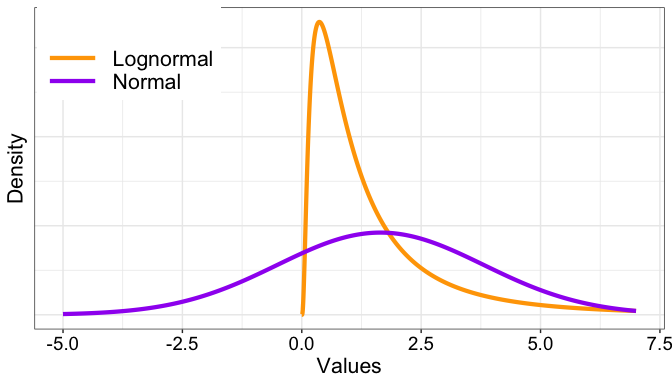<!-- -->

### Save figure

``` r
# save figure
ggsave(filename=('./figures/figure_lognormal_pop.pdf'),width=7,height=5)
ggsave(filename=('./figures/figure3.pdf'),width=7,height=5)
```

## Illustrate sampling distributions

We draw 50,000 samples for different sizes from our population. Each of
these samples is like an experiment. For each experiment, we compute a
statistics of interest, here the 20% trimmed mean. In each plot, the
vertical dashed line marks the population 20% trimmed mean that we are
trying to estimate.

### n = 20

``` r
# set.seed(777)
n <- 20 # sample size
nsamp <- 50000 # number of samples (experiments)
# sampling distribution of the mean
dist.samp <- apply(matrix(rlnorm(n*nsamp), nrow = nsamp), 1, mean, trim = 0.2)
v <- enframe(dist.samp, name = NULL) 

p <- ggplot(v, aes(x = value)) + theme_gar +
        geom_vline(xintercept = pop.tm, linetype = 'longdash', colour = "black") +
        geom_line(stat = 'density', size = 1) +  
  theme(plot.margin = unit(c(0, 0, 0.5, 0), "cm"),
        axis.text.y = element_blank(),
        axis.ticks.y = element_blank()) +
  labs(x = "Sample trimmed means", y = "Density") +
  ggtitle("Sampling distribution: n = 20") +
  coord_cartesian(xlim = c(0, 4))
p.sampdist1 <- p 
p
```

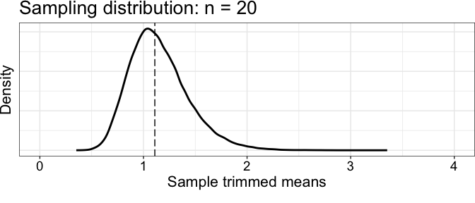<!-- -->

### n = 30

``` r
# set.seed(777)
n <- 30 # sample size
nsamp <- 50000 # number of samples (experiments)
# sampling distribution of the mean
dist.samp <- apply(matrix(rlnorm(n*nsamp), nrow = nsamp), 1, mean, trim = 0.2)
v <- enframe(dist.samp, name = NULL) 

p <- ggplot(v, aes(x = value)) + theme_gar +
        geom_vline(xintercept = pop.tm, linetype = 'longdash', colour = "black") +
        geom_line(stat = 'density', size = 1) +
  theme(plot.margin = unit(c(0, 0, 0.5, 0), "cm"),
        axis.text.y = element_blank(),
        axis.ticks.y = element_blank()) +
   labs(x = "Sample trimmed means", y = "Density") +
  coord_cartesian(xlim = c(0, 4)) +   
  ggtitle("Sampling distribution: n = 30")
p.sampdist2 <- p 
p
```

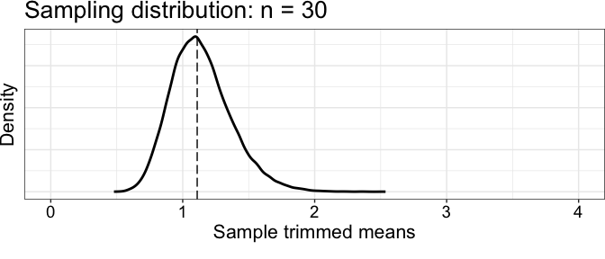<!-- -->

### n = 50

``` r
# set.seed(777)
n <- 50 # sample size
nsamp <- 50000 # number of samples (experiments)
# sampling distribution of the mean
dist.samp <- apply(matrix(rlnorm(n*nsamp), nrow = nsamp), 1, mean, trim = 0.2)
v <- enframe(dist.samp, name = NULL) 

p <- ggplot(v, aes(x = value)) + theme_gar +
        geom_vline(xintercept = pop.tm, linetype = 'longdash', colour = "black") +
        geom_line(stat = 'density', size = 1) +
  theme(plot.margin = unit(c(0, 0, 0.5, 0), "cm"),
        axis.text.y = element_blank(),
        axis.ticks.y = element_blank()) +
   labs(x = "Sample trimmed means", y = "Density") +
  coord_cartesian(xlim = c(0, 4)) +  
  ggtitle("Sampling distribution: n = 50")
p.sampdist3 <- p 
p
```

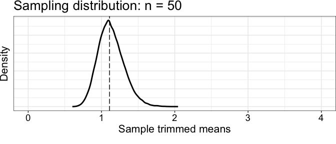<!-- -->

## Illustrate 4 samples

In each plot, the vertical dashed line marks the population 20% trimmed
mean, whereas the vertical continuous line marks the sample 20% trimmed
mean.

### Define function for horizontal jitter plot

``` r
samp_jitter <- function(df, samp.tm){
p <- ggplot(data = df, aes(x = res, y = cond)) + theme_gar +
  # scatterplots
    geom_jitter(height = .05, alpha = 0.5, 
                size = 3, shape = 21, fill = "grey", colour = "black") +
  theme(axis.ticks.y = element_blank(),
        axis.text.y = element_blank(),
        axis.title = element_blank(),
        panel.grid.minor.x = element_blank(),
        plot.margin = unit(c(0, 0, 0, 0), "cm")) +
  scale_x_continuous(breaks = seq(0,12,2)) +
  scale_y_continuous(breaks = 1) +
  coord_cartesian(xlim = c(0, 11)) +
  # sample trimmed mean
  geom_segment(aes(x = samp.tm, xend = samp.tm,
                   y = 0.9, yend = 1.1)) +
  # population trimmed mean
  geom_segment(aes(x = pop.tm, xend = pop.tm,
                   y = 0.9, yend = 1.1),
               linetype = 'longdash', lineend = 'round', colour = "black") +
  labs(x = "Values")
p
}
```

### n = 20

Generate all samples

``` r
# set.seed(777)
n <- 20 # sample size 
samp20 <- matrix(rlnorm(n*4), nrow = 4) # get sample 
samp20.tm <- apply(samp20, 1, mean, trim = 0.2)
```

Illustrate sample 1

``` r
set.seed(21) # reproducible jitter
S <- 1
df <- tibble(res = samp20[S,], cond = rep(1, n))
p <- samp_jitter(df, samp20.tm[S])
p.samp20_1 <- p
p
```

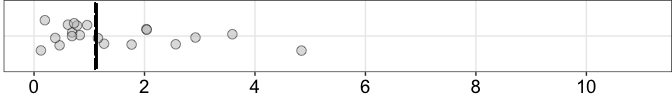<!-- -->

Illustrate sample 2

``` r
set.seed(21) # reproducible jitter
S <- 2
df <- tibble(res = samp20[S,], cond = rep(1, n))
p <- samp_jitter(df, samp20.tm[S])
p.samp20_2 <- p
p
```

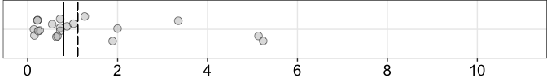<!-- -->

Illustrate sample 3

``` r
set.seed(21) # reproducible jitter
S <- 3
df <- tibble(res = samp20[S,], cond = rep(1, n))
p <- samp_jitter(df, samp20.tm[S])
p.samp20_3 <- p
p
```

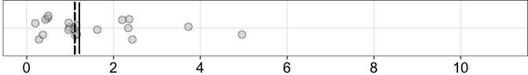<!-- -->

Illustrate sample 4

``` r
set.seed(21) # reproducible jitter
S <- 4
df <- tibble(res = samp20[S,], cond = rep(1, n))
p <- samp_jitter(df, samp20.tm[S])
p.samp20_4 <- p
p
```

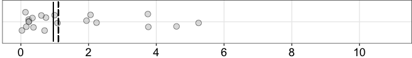<!-- -->

### n = 30

Generate all samples

``` r
# set.seed(777)
n <- 30 # sample size 
samp30 <- matrix(rlnorm(n*4), nrow = 4) # get sample 
samp30.tm <- apply(samp30, 1, mean, trim = 0.2)
```

Illustrate sample 1

``` r
set.seed(21) # reproducible jitter
S <- 1
df <- tibble(res = samp30[S,], cond = rep(1, n))
p <- samp_jitter(df, samp30.tm[S])
p.samp30_1 <- p
p
```

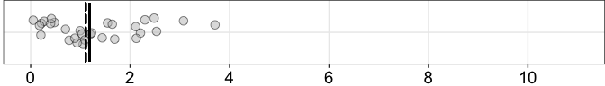<!-- -->

Illustrate sample 2

``` r
set.seed(21) # reproducible jitter
S <- 2
df <- tibble(res = samp30[S,], cond = rep(1, n))
p <- samp_jitter(df, samp30.tm[S])
p.samp30_2 <- p
p
```

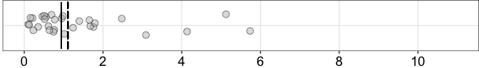<!-- -->

Illustrate sample 3

``` r
set.seed(21) # reproducible jitter
S <- 3
df <- tibble(res = samp30[S,], cond = rep(1, n))
p <- samp_jitter(df, samp30.tm[S])
p.samp30_3 <- p
p
```

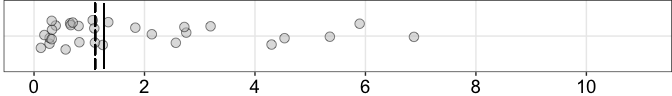<!-- -->

Illustrate sample 4

``` r
set.seed(21) # reproducible jitter
S <- 4
df <- tibble(res = samp30[S,], cond = rep(1, n))
p <- samp_jitter(df, samp30.tm[S])
p.samp30_4 <- p
p
```

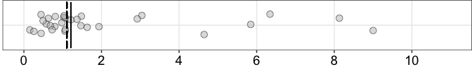<!-- -->

### n = 50

Generate all samples

``` r
# set.seed(777)
n <- 50 # sample size 
samp50 <- matrix(rlnorm(n*4), nrow = 4) # get sample 
samp50.tm <- apply(samp50, 1, mean, trim = 0.2)
```

Illustrate sample 1

``` r
set.seed(21) # reproducible jitter
S <- 1
df <- tibble(res = samp50[S,], cond = rep(1, n))
p <- samp_jitter(df, samp50.tm[S])
p.samp50_1 <- p
p
```

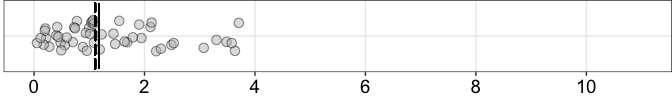<!-- -->

Illustrate sample 2

``` r
set.seed(21) # reproducible jitter
S <- 2
df <- tibble(res = samp50[S,], cond = rep(1, n))
p <- samp_jitter(df, samp50.tm[S])
p.samp50_2 <- p
p
```

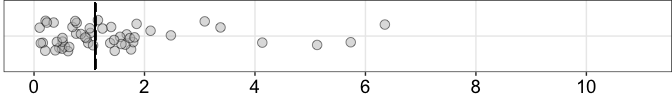<!-- -->

Illustrate sample 3

``` r
set.seed(21) # reproducible jitter
S <- 3
df <- tibble(res = samp50[S,], cond = rep(1, n))
p <- samp_jitter(df, samp50.tm[S])
p.samp50_3 <- p
p
```

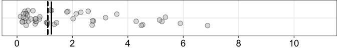<!-- -->

Illustrate sample 4

``` r
set.seed(21) # reproducible jitter
S <- 4
df <- tibble(res = samp50[S,], cond = rep(1, n))
p <- samp_jitter(df, samp50.tm[S])
p.samp50_4 <- p
p
```

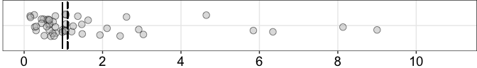<!-- -->

## Illustrate 4 bootstrap sampling distributions

We estimate the sampling distributions from the samples.

### Define density plot function

``` r
dens_plot <- function(dist.samp, samp.tm){
  v <- enframe(dist.samp, name = NULL) 
p <- ggplot(v, aes(x = value)) + theme_gar +
  geom_vline(xintercept = samp.tm, linetype = 'solid', colour = "black") +      
  geom_vline(xintercept = pop.tm, linetype = 'longdash', colour = "black") +
        geom_line(stat = 'density', size = 1) +   
  theme(axis.text.y = element_blank(),
        axis.title.y = element_blank(),
        axis.ticks.y = element_blank(),
        plot.margin = unit(c(0, 0, 0.5, 0), "cm")) +
  labs(x = "Bootstrap estimates") +
  # ggtitle("Sampling distribution: n = 20") +
  coord_cartesian(xlim = c(0, 4))
p
}
```

### n = 20

Sample 1

``` r
# set.seed(777)
S <- 1
n <- 20
nboot <- 5000 # number of bootstrap samples
# bootstrap distribution
boot.samp <- apply(matrix(sample(samp20[S,], n*nboot, replace = TRUE), nrow = nboot), 1, mean, trim = 0.2)
p <- dens_plot(boot.samp, samp20.tm[S])
p.boot20_1 <- p
p
```

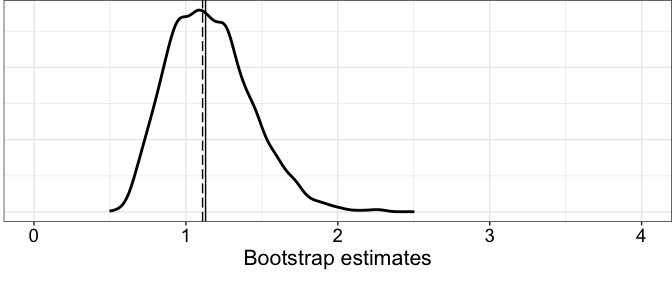<!-- -->

Sample 2

``` r
# set.seed(777)
S <- 2
n <- 20
nboot <- 5000 # number of bootstrap samples
# bootstrap distribution
boot.samp <- apply(matrix(sample(samp20[S,], n*nboot, replace = TRUE), nrow = nboot), 1, mean, trim = 0.2)
p <- dens_plot(boot.samp, samp20.tm[S])
p.boot20_2 <- p
p
```

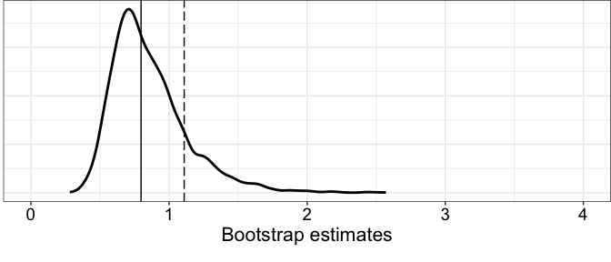<!-- -->

Sample 3

``` r
# set.seed(777)
S <- 3
n <- 20
nboot <- 5000 # number of bootstrap samples
# bootstrap distribution
boot.samp <- apply(matrix(sample(samp20[S,], n*nboot, replace = TRUE), nrow = nboot), 1, mean, trim = 0.2)
p <- dens_plot(boot.samp, samp20.tm[S])
p.boot20_3 <- p
p
```

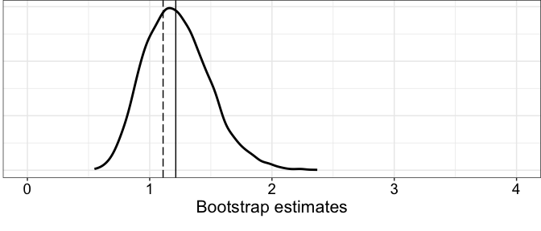<!-- -->

Sample 4

``` r
# set.seed(777)
S <- 4
n <- 20
nboot <- 5000 # number of bootstrap samples
# bootstrap distribution
boot.samp <- apply(matrix(sample(samp20[S,], n*nboot, replace = TRUE), nrow = nboot), 1, mean, trim = 0.2)
p <- dens_plot(boot.samp, samp20.tm[S])
p.boot20_4 <- p
p
```

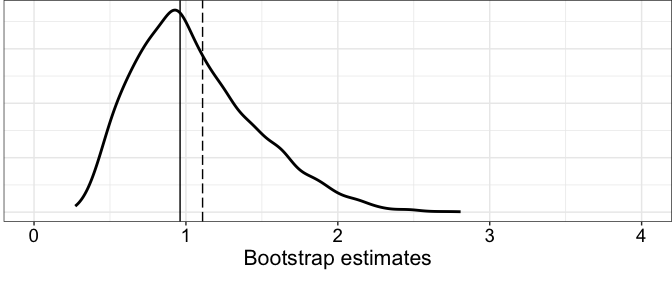<!-- -->

### n = 30

Sample 1

``` r
# set.seed(777)
S <- 1
n <- 30
nboot <- 5000 # number of bootstrap samples
# bootstrap distribution
boot.samp <- apply(matrix(sample(samp30[S,], n*nboot, replace = TRUE), nrow = nboot), 1, mean, trim = 0.2)
p <- dens_plot(boot.samp, samp30.tm[S])
p.boot30_1 <- p
p
```

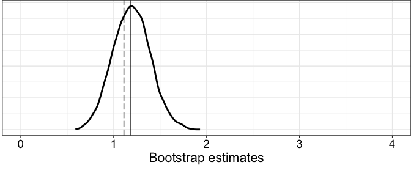<!-- -->

Sample 2

``` r
# set.seed(777)
S <- 2
nboot <- 5000 # number of bootstrap samples
# bootstrap distribution
boot.samp <- apply(matrix(sample(samp30[S,], n*nboot, replace = TRUE), nrow = nboot), 1, mean, trim = 0.2)
p <- dens_plot(boot.samp, samp30.tm[S])
p.boot30_2 <- p
p
```

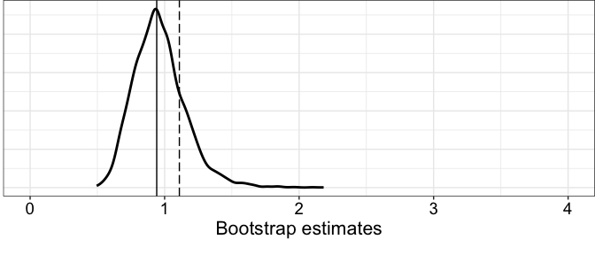<!-- -->

Sample 3

``` r
# set.seed(777)
S <- 3
nboot <- 5000 # number of bootstrap samples
# bootstrap distribution
boot.samp <- apply(matrix(sample(samp30[S,], n*nboot, replace = TRUE), nrow = nboot), 1, mean, trim = 0.2)
p <- dens_plot(boot.samp, samp30.tm[S])
p.boot30_3 <- p
p
```

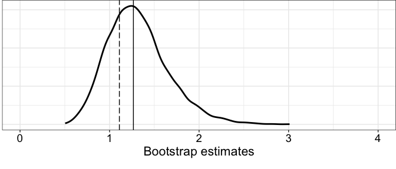<!-- -->

Sample 4

``` r
# set.seed(777)
S <- 4
nboot <- 5000 # number of bootstrap samples
# bootstrap distribution
boot.samp <- apply(matrix(sample(samp30[S,], n*nboot, replace = TRUE), nrow = nboot), 1, mean, trim = 0.2)
p <- dens_plot(boot.samp, samp30.tm[S])
p.boot30_4 <- p
p
```

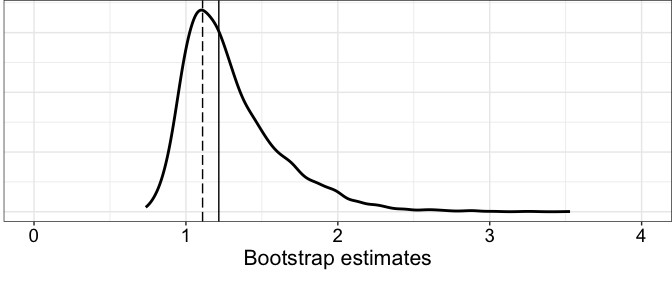<!-- -->

### n = 50

Sample 1

``` r
# set.seed(777)
S <- 1
n <- 50
nboot <- 5000 # number of bootstrap samples
# bootstrap distribution
boot.samp <- apply(matrix(sample(samp50[S,], n*nboot, replace = TRUE), nrow = nboot), 1, mean, trim = 0.2)
p <- dens_plot(boot.samp, samp50.tm[S])
p.boot50_1 <- p
p
```

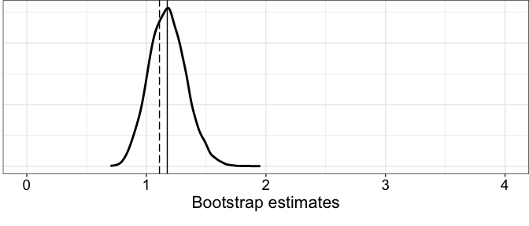<!-- -->

Sample 2

``` r
# set.seed(777)
S <- 2
nboot <- 5000 # number of bootstrap samples
# bootstrap distribution
boot.samp <- apply(matrix(sample(samp50[S,], n*nboot, replace = TRUE), nrow = nboot), 1, mean, trim = 0.2)
p <- dens_plot(boot.samp, samp50.tm[S])
p.boot50_2 <- p
p
```

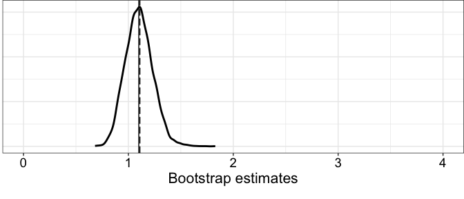<!-- -->

Sample 3

``` r
# set.seed(777)
S <- 3
nboot <- 5000 # number of bootstrap samples
# bootstrap distribution
boot.samp <- apply(matrix(sample(samp50[S,], n*nboot, replace = TRUE), nrow = nboot), 1, mean, trim = 0.2)
p <- dens_plot(boot.samp, samp50.tm[S])
p.boot50_3 <- p
p
```

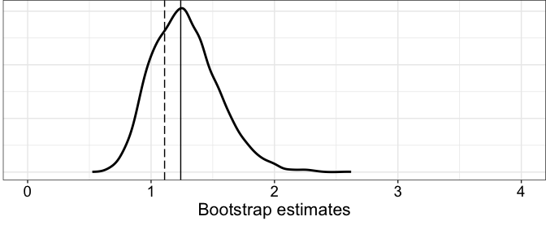<!-- -->

Sample 4

``` r
# set.seed(777)
S <- 4
nboot <- 5000 # number of bootstrap samples
# bootstrap distribution
boot.samp <- apply(matrix(sample(samp50[S,], n*nboot, replace = TRUE), nrow = nboot), 1, mean, trim = 0.2)
p <- dens_plot(boot.samp, samp50.tm[S])
p.boot50_4 <- p
p
```

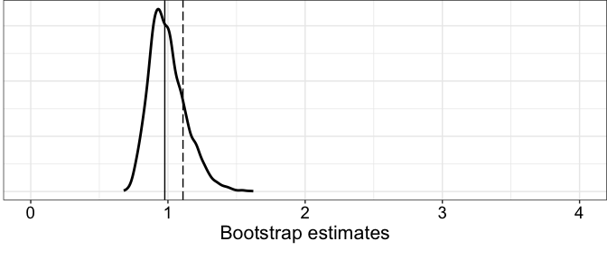<!-- -->

# Summary figure

``` r
# -------------------------------------------------
p2.1 <- cowplot::plot_grid(p.samp20_1, p.boot20_1 + theme(axis.title = element_blank()),
                    labels = c("1", "B"),
                    label_size = 18,
                    hjust = c(-0.5, 2.2),
                    vjust = c(1.5, -4.3),
                    ncol = 1, nrow = 2,
                    rel_heights = c(1.5, 3))

p2.2 <- cowplot::plot_grid(p.samp20_2, p.boot20_2 + theme(axis.title = element_blank()),
                    labels = c("2"),
                    label_size = 18,
                    ncol = 1, nrow = 2,
                    rel_heights = c(1.5, 3))

p2.3 <- cowplot::plot_grid(p.samp20_3, p.boot20_3 + theme(axis.title = element_blank()),
                    labels = c("3"),
                    label_size = 18,
                    ncol = 1, nrow = 2,
                    rel_heights = c(1.5, 3))

p2.4 <- cowplot::plot_grid(p.samp20_4, p.boot20_4,
                    labels = c("4"),
                    label_size = 18,
                    ncol = 1, nrow = 2,
                    rel_heights = c(1.5, 3))

p2 <- cowplot::plot_grid(p.sampdist1,
                         p2.1, p2.2, p2.3, p2.4,
                    labels = c("A"),
                    hjust = 0.7,
                    label_size = 18,
                    ncol = 1, 
                    nrow = 5,
                    align = "v",
                    axis = "l",
                    rel_heights = c(1, 1, 1, 1, 1))

# -------------------------------------------------
p3.1 <- cowplot::plot_grid(p.samp30_1, p.boot30_1 + theme(axis.title = element_blank()),
                    labels = c(""),
                    ncol = 1, nrow = 2,
                    rel_heights = c(1.5, 3))

p3.2 <- cowplot::plot_grid(p.samp30_2, p.boot30_2 + theme(axis.title = element_blank()),
                    labels = c(""),
                    ncol = 1, nrow = 2,
                    rel_heights = c(1.5, 3))

p3.3 <- cowplot::plot_grid(p.samp30_3, p.boot30_3 + theme(axis.title = element_blank()),
                    labels = c(""),
                    ncol = 1, nrow = 2,
                    rel_heights = c(1.5, 3))

p3.4 <- cowplot::plot_grid(p.samp30_4, p.boot30_4,
                    labels = c(""),
                    ncol = 1, nrow = 2,
                    rel_heights = c(1.5, 3))

p3 <- cowplot::plot_grid(p.sampdist2,
                         p3.1, p3.2, p3.3, p3.4,
                    labels = c(""),
                    ncol = 1,
                    nrow = 5,
                    align = "v",
                    axis = "l",
                    rel_heights = c(1, 1, 1, 1, 1))

# -------------------------------------------------
p4.1 <- cowplot::plot_grid(p.samp50_1, p.boot50_1 + theme(axis.title = element_blank()),
                    labels = c(""),
                    ncol = 1, nrow = 2,
                    rel_heights = c(1.5, 3))

p4.2 <- cowplot::plot_grid(p.samp50_2, p.boot50_2 + theme(axis.title = element_blank()),
                    labels = c(""),
                    ncol = 1, nrow = 2,
                    rel_heights = c(1.5, 3))

p4.3 <- cowplot::plot_grid(p.samp50_3, p.boot50_3 + theme(axis.title = element_blank()),
                    labels = c(""),
                    ncol = 1, nrow = 2,
                    rel_heights = c(1.5, 3))

p4.4 <- cowplot::plot_grid(p.samp50_4, p.boot50_4,
                    labels = c(""),
                    ncol = 1, nrow = 2,
                    rel_heights = c(1.5, 3))

p4 <- cowplot::plot_grid(p.sampdist3,
                         p4.1, p4.2, p4.3, p4.4,
                    labels = c(""),
                    ncol = 1,
                    nrow = 5,
                    align = "v",
                    axis = "l",
                    rel_heights = c(1, 1, 1, 1, 1))

cowplot::plot_grid(p2, p3, p4,
                    labels = c(""),
                    ncol = 3,
                    nrow = 1,
                    rel_widths = c(1, 1, 1), 
                    label_size = 20, 
                    hjust = -0.5, 
                    scale=.95,
                    align = "h")

# save figure
ggsave(filename=('./figures/figure_sampdist_lognormal.pdf'),width=20,height=15)
ggsave(filename=('./figures/figure4.pdf'),width=20,height=15)
```
